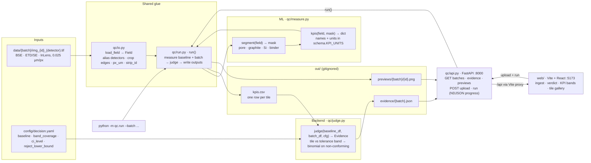

# Catalyst

**Team:** [Batch Size 2](https://github.com/batch-size-2)  
**Hackathon track:** [Polaron — Track 4](https://www.polaron.ai/) — batch QC for electrode microstructure

## What we're building

A decision layer on top of SEM microstructure analysis: compare incoming batches to an approved baseline, quantify differences with uncertainty, and output interpretable **accept / investigate / reject** verdicts for materials QC.

## Plan

Current plan: [docs/PLAN_v1.md](docs/PLAN_v1.md) (supersedes [PLAN_v0](docs/PLAN_v0.md)).

## Quickstart

```bash
brew install uv node@22  # once (web needs Node >= 20.19)
uv sync
uv run pytest            # contract tests, keep green
uv run python -m qc.run --batch data/Batch_1 data/Batch_2 data/Batch_3   # images -> out/kpis.csv -> out/evidence/<batch>.json
uv run python -m qc.judge tests/fixtures/kpis_fake.csv --baseline fake_baseline   # backend only, no images

# UI: two terminals
uv run uvicorn qc.api:app --reload     # API on :8000
cd web && npm install && npm run dev   # UI on :5173, proxies /api to :8000
```

Put the batches in `data/` (gitignored), e.g. `ln -s "../EXAMPLE BATCHES FOR LOCAL REFERENCE/Batch_1" data/Batch_1`.

Stack:
- **Pipeline:** Python 3.11 + uv · numpy / pandas / scipy / scikit-image / tifffile · pydantic
- **API:** FastAPI
- **UI:** Vite + React + TypeScript + Tailwind

## Architecture

> Keep this diagram in sync with the code. Any PR that adds, removes, renames or rewires a module, contract function, output file or data flow updates it in the same PR (see [AGENTS.md](AGENTS.md)).



`qc/schema.py` is the contract every Python box above imports: `Field`, `Phase` labels, `KPI_UNITS`, `KPI_TABLE_COLUMNS`, the `Evidence` model and the `out/` paths. `web/src/types.ts` mirrors `Evidence` for the UI. The API holds no QC logic: it reads `out/` and calls `run()`.

## Who owns what

| File | Owner |
|---|---|
| `qc/schema.py` | **Both.** The contract: `Field`, phase labels, KPI names + units, Evidence JSON, output paths |
| `qc/measure.py` (`segment`, `kpis`) | ML |
| `qc/judge.py` (`judge`), `config/decision.yaml` | Backend |
| `qc/api.py`, `web/` | Backend / UI |
| `qc/io.py`, `qc/run.py` | Shared glue |

The handoff is `out/kpis.csv`: one row per tile, columns `batch, image_id, strip_id, px_um, <KPIs>`. Backend can build against `tests/fixtures/kpis_fake.csv` without touching images.

Data layout: `data/<batch>/img_<image_id>_<detector>.tif`, 3 detectors per field (`BSE`, `ETD` or `SE`, `Inlens`). They're normalised to `BSE` / `ETD` / `InLens`. Pixel size is read from the TIFF resolution tags (0.025 µm/px). The baseline folder is set in `config/decision.yaml`.
