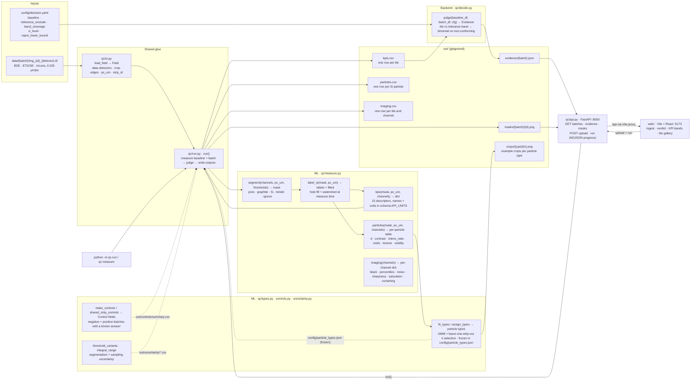

# Catalyst

**Team:** [Batch Size 2](https://github.com/batch-size-2) (ML: Pat · Software: Patrik)  
**Hackathon track:** [Polaron — Track 4](https://www.polaron.ai/) — batch QC for electrode microstructure

## What we're building

A decision layer on top of SEM microstructure analysis. Drop in a folder of microscope images for an incoming batch and get **accept / investigate / reject** against an approved baseline. The verdict comes with its evidence:
- which images look off;
- which measured property moved, and by how much;
- how sure we are;
- what to do next.

No model is trained. Measurements come from classic image processing, and the verdict from plain statistics.

## Plan

[docs/PLAN_v3.md](docs/PLAN_v3.md) is the source of truth for **what to build** (supersedes [PLAN_v2](docs/PLAN_v2.md), [PLAN_v1](docs/PLAN_v1.md) and [PLAN_v0](docs/PLAN_v0.md); §12 lists the evidence behind each decision). Section references to PLAN_v1 below describe the code as built. This README documents **what is built**. Where the code is still a stub, the sections below say so and point to the plan section that describes the target.

## Quickstart

```bash
brew install uv node@22  # once; the web UI needs Node >= 20.19
uv sync
uv run pytest            # contract tests, keep green

# put the batches in data/ (gitignored), e.g.
for b in Batch_1 Batch_2 Batch_3; do ln -s "../EXAMPLE BATCHES FOR LOCAL REFERENCE/$b" data/$b; done

uv run python -m qc.measure                                               # ML: all of data/ -> out/{kpis,particles,imaging}.csv + out/masks/
uv run python -m qc.run --batch data/Batch_2 data/Batch_3                 # end to end -> out/evidence/<batch>.json
uv run python -m qc.decide tests/fixtures/kpis_fake.csv --baseline fake_baseline   # backend only, no images
uv run python -m qc.types [--exclude Batch_2] [--porous-rule]             # fit particle types on out/particles.csv
uv run python -m qc.controls --baseline data/Batch_3                      # controls -> out/controls/summary.csv
uv run python -m qc.uncertainty --batch data/Batch_3                      # -> out/uncertainty/*.csv

# UI: two terminals
uv run uvicorn qc.api:app --reload     # API on :8000
cd web && npm install && npm run dev   # UI on :5173, proxies /api to :8000
```

## Architecture

> Keep this diagram in sync with the code. Any PR that adds, removes, renames or rewires a module, contract function, output file, endpoint or data flow updates it in the same PR (see [AGENTS.md](AGENTS.md)).



`qc/schema.py` is the contract every Python box imports: `Field`, the `Phase` labels, `KPI_UNITS`, `KPI_TABLE_COLUMNS`, `PARTICLE_COLUMNS`, `IMAGING_COLUMNS`, `Tables`, `Control`, the `Evidence` model and the `out/` paths. `web/src/types.ts` mirrors `Evidence` for the UI.

## Infrastructure

Everything runs **locally and offline**: no cloud, no database, no network calls in the verdict path (PLAN_v1 §1, rule 4). There are three processes.

| Process | Command | Port | Role |
|---|---|---|---|
| Pipeline (CLI) | `uv run python -m qc.run --batch …` | – | Measure → judge → write `out/`. This is what we freeze and run on the unseen batch |
| API | `uv run uvicorn qc.api:app --reload` | 8000 | Thin FastAPI wrapper: reads `out/`, saves uploads to `data/`, calls `run()`. No QC logic |
| Web UI | `cd web && npm run dev` | 5173 | Vite + React + TypeScript + Tailwind. Talks only to `/api` (proxied to :8000 by `web/vite.config.ts`) |

**Folders**

| Path | In git? | Contents |
|---|---|---|
| `data/<batch>/` | no | Input TIFFs (or symlinks to them). One folder per batch; the folder name is the batch name |
| `EXAMPLE BATCHES FOR LOCAL REFERENCE/` | no | The 1.6 GB of Polaron images. Don't upload anywhere without Polaron's OK (PLAN_v1 §1, rule 5) |
| `config/decision.yaml` | yes | Decision settings. Frozen with `git tag rules-frozen` before the unseen batch |
| `config/particle_types.json` | yes | Fitted particle-type model (GMM centres/covs, names, unassigned threshold). Frozen with `rules-frozen` |
| `config/kpi_dictionary.yaml` | yes | Plain-language meaning/causes/checks per descriptor for the explanations (draft; causes need mentor review) |
| `out/kpis.csv` | no | KPI table, one row per tile, all batches measured so far |
| `out/particles.csv` | no | One row per Si particle: size, contrast, inlens ratio, voids, texture, solidity, type |
| `out/imaging.csv` | no | One row per tile and channel: black level, percentiles, noise, sharpness, saturation, curtaining |
| `out/masks/<batch>/<image_id>.png` | no | BSE with phase overlay (4× downsampled), for eyeballing and the UI |
| `out/crops/<type>/<n>.png` | no | Example particle crops per type, for the UI gallery |
| `out/controls/summary.csv` | no | Measured KPI shifts for every control |
| `out/uncertainty/` | no | `threshold_variants.csv` (KPIs at thresholds ±5) and `integral_range.csv` (per image and phase) |
| `out/evidence/<batch>.json` | no | The verdict and everything behind it. The UI reads only this and the masks |
| `tests/fixtures/kpis_fake.csv` | yes | Hand-made KPI table, so the backend and UI can be built with no images |

**HTTP API** (`qc/api.py`, called from `web/src/api.ts`)

| Endpoint | Returns |
|---|---|
| `GET /api/config` | `config/decision.yaml` as JSON |
| `GET /api/batches` | `[{name, has_images, verdict}]`: folders in `data/` plus evidence in `out/` |
| `GET /api/evidence/{batch}` | `Evidence` |
| `GET /api/masks/{batch}/{image_id}.png` | Mask overlay |
| `POST /api/batches/{batch}/files` | Multipart upload of a folder's TIFFs into `data/{batch}/` |
| `POST /api/runs/{batch}` | NDJSON stream: one `{"type":"progress","done","total","tile"}` per measured tile, then `{"type":"done","evidence"}` or `{"type":"error","message"}` |

**Dependencies.**
- Python: `pyproject.toml` + `uv.lock`, Python 3.11.
- Web: `web/package.json` + `package-lock.json`.
- Supply-chain guard: `[tool.uv] exclude-newer` blocks Python packages published in the last week. For npm, install with `npm install --before=<date a week ago>`.

## Data pipeline

One command, `qc.run`, does steps 1–6 for the baseline plus each requested batch. `qc.measure` does steps 1–5 only.

| # | Step | Code | Output |
|---|---|---|---|
| 1 | **Find fields.** Group `img_<image_id>_<detector>.tif` by ID | `io.field_paths` | `{image_id: {detector: path}}` |
| 2 | **Load.** Take one channel of the RGB TIFF, crop 8 px off left and right (stitch borders), read pixel size and strip ID | `io.load_field` | `Field(batch, image_id, strip_id, channels, px_um)` |
| 3 | **Segment.** Black level off, 2× downsample, 3-class multi-Otsu, binder rims, small-Si cleanup, dim-object → BINDER rule (`SI_MIN_CONTRAST`), 5% IGNORE margins | `measure.segment(channels, px_um, thresholds)` | `uint8` mask with `Phase` codes |
| 4 | **Measure KPIs.** Includes `label_si` (hole fill + watershed) and the two-point correlation | `measure.kpis(mask, px_um, channels)` | `{kpi: value}` |
| 5 | **Particles.** Per-particle features at full res | `measure.particles(mask, px_um, channels)` | `particles.csv` rows |
| 6 | **Types.** If `config/particle_types.json` exists, assign each particle a type | `types.assign_types` | `type` column |
| 7 | **Imaging check.** Per-channel imaging descriptors | `measure.imaging(channels)` | `imaging.csv` rows |
| 8 | **Write.** One row per tile into the KPI table, plus a mask overlay | `run.measure_field`, `run.save_tables`, `run.save_overlay` | `out/kpis.csv`, `out/particles.csv`, `out/imaging.csv`, `out/masks/` |
| 9 | **Judge** each batch against the baseline | `decide.judge` | `out/evidence/<batch>.json` |

**Input details (step 2, from PLAN_v1 §2)**
- **Detectors** are normalised to `BSE` / `ETD` / `InLens`; `SE` is an alias for `ETD`. The `img_` prefix is dropped from IDs.
- **`px_um`** comes from the TIFF `XResolution` / `ResolutionUnit` tags (0.025 µm/px), or NaN if missing.
- **`strip_id`** is `"<height>_<round(XResolution)>"`, e.g. `2316_1015998`. It groups tiles cut from the same continuous strip. It is **provenance only, never a feature**, because 5 strips cross batch folders.

**Phase labels (`schema.Phase`)**

| Code | Phase | Look in BSE |
|---|---|---|
| 0 | `PORE` | black |
| 1 | `GRAPHITE` | dark grey flakes |
| 2 | `SI` | bright particles |
| 3 | `BINDER` | thin films at particle edges |
| 255 | `IGNORE` | excluded pixels (e.g. top and bottom margins) |

**Segmentation (step 3).**
- Per-channel black level (0.5th percentile) subtracted from BSE; 2× block-mean downsample; Gaussian σ = 1.
- 3-class multi-Otsu per image on the valid rows → pore / graphite / Si (percentile fallback if Otsu fails, e.g. uniform images). `thresholds` is an optional argument so the uncertainty step can rerun with offsets.
- Thin bright rims along graphite edges (removed by a 0.15 µm opening, adjacent to graphite) → `BINDER`; other opening losses → `GRAPHITE`. Si components < 0.25 µm² → `GRAPHITE`.
- Top and bottom 5% of rows → `IGNORE` (edge rows may carry FIB damage). Mask upsampled to full resolution.
- Hole filling and watershed splitting are **not** baked into the mask — they happen in `label_si` at measure time, so the mask stays pure phase codes and area fractions are unaffected by split lines.

**KPIs (step 4, definitions in PLAN_v3 §3.2)** — all implemented:

| KPI | Unit | Status |
|---|---|---|
| `si_area_frac` | fraction | **implemented**: Si px / non-ignored px |
| `porosity_apparent` | fraction | **implemented**: pore px / non-ignored px. Biased: open pores show their back wall |
| `si_graphite_ratio` | ratio | **implemented**: Si px / graphite px. The key descriptor — follows the recipe, porosity-invariant |
| `si_d50_um`, `si_d90_um` | µm | **implemented**: area-weighted equivalent diameter, non-border particles |
| `si_internal_void_frac` | fraction | **implemented**: non-Si px inside hole-filled Si / filled Si area |
| `si_contrast_ratio` | ratio | **implemented**: smoothed BSE mode of Si / graphite. Dropped for the verdict if imaging changed |
| `si_fragments_per_1e4um2` | count | **implemented**: 8-connected Si objects < 1 µm per 10⁴ µm² |
| `si_dispersion_cv` | ratio | **implemented**: CV of local Si fraction over ~20 µm windows |
| `si_agglomerate_frac` | fraction | **implemented**: share of Si px in domains > 5 µm (Si closed by 0.5 µm) |
| `si_corr_length_um` | µm | **implemented**: first r where the Si two-point correlation ≤ 1/e |
| `graphite_chord_um` | µm | **implemented**: mean horizontal graphite run length (edge runs excluded) |
| `graphite_anisotropy` | ratio | **implemented**: horizontal / vertical graphite chord |
| `pore_chord_um` | µm | **implemented**: mean horizontal pore run length |
| `pore_connectivity` | fraction | **implemented**: largest 4-connected pore component / all pore area |

A KPI that isn't computed, or a tile whose segmentation crashes, is written as **NaN**: the run never stops on one bad tile. Columns of `out/kpis.csv` are `batch, image_id, strip_id, px_um, <15 KPIs>`.

**Particles (step 5).** `particles()` returns one row per watershed-labelled Si particle: `d_um`, `area_um2` (filled), `contrast_ratio` (median black-subtracted BSE over its Si px / image graphite mode), `inlens_ratio` (mean black-subtracted InLens over the particle, saturated px excluded, / same for graphite in a 1–3 µm ring — cancels the InLens shading), `void_frac`, `texture` (std/mean of BSE inside), `solidity`, `border`, `y_px`/`x_px` (full-res centroid). `run` adds `batch`, `image_id`, `strip_id`, `type`.

**Particle types (step 6, `qc/types.py`).** `fit_types` standardises `log_d, contrast_ratio, inlens_ratio, void_frac, texture, solidity`, fits `GaussianMixture` for k = 2, 3, 4 and picks k by leave-one-strip-out stability (ARI against the full fit, preferring smaller k within 0.02), merges types that differ only in size (< 0.5 z on every feature but `log_d`), and names each type from its features in units. `assign_types` assigns the nearest type by Mahalanobis distance; beyond the 99th percentile of training distances → `unassigned`; with `--porous-rule`, `void_frac > 0.1` → `porous`. `uv run python -m qc.types` fits on `out/particles.csv` (optionally excluding batches), writes `config/particle_types.json`, rewrites the `type` column and saves example crops to `out/crops/`.

**Controls (`qc/controls.py`, PLAN_v3 §3.7 + §3.13).** `make_controls` builds negative controls (brightness/contrast ±20%, black +20, noise σ5, synthetic curtaining) and positive controls (donor Si pasted to +50%/+100%, voids punched into 30% of particles, non-border Si scaled 1.5× with 1/2.25 thinning to hold Si amount constant) from a random choice of reference strips. `shared_strip_controls` splits reference strips between a test batch and the reference (`kept_in_reference` holds the image_ids that stay) to test both readings of shared strips. `uv run python -m qc.controls` measures every control against its untransformed originals and writes `out/controls/summary.csv`.

**Uncertainty (`qc/uncertainty.py`, PLAN_v3 §3.6).** `threshold_variants` re-runs segment+kpis at thresholds ±5 grey levels; `integral_range` estimates the phase-fraction SD for a given imaged area (and the area for a target SD) from the two-point correlation — the "how many images are enough" number. CLI writes `out/uncertainty/`.

## Decision algorithm (`qc/decide.py`)

Pure statistics on KPI tables; it never sees an image. It follows PLAN_v1 §3.5.

**1. Reference set.** Baseline = every tile in the `baseline` folder, minus `reference_exclude`. A KPI is used only if at least 2 baseline tiles have a value for it.

**2. Tolerance band per KPI.** A prediction interval for one new tile drawn from the baseline:

```
band = mean ± t(1 − α/2, n − 1) · sd · √(1 + 1/n),   α = (1 − band_coverage) / K
```

Here `n` is the number of baseline tiles and `K` the number of KPIs in use. `K` spreads the false-alarm budget over all KPIs (Bonferroni), so a clean tile is flagged at most ~5% of the time across all KPIs together. With `n = 7`, the band is ±2.6 sd for `K = 1`, ±3.2 sd for `K = 2` (the current stub) and ±4.4 sd for all 8.

**3. Tile status**

| Status | Rule now | Planned (PLAN_v1 §3.5) |
|---|---|---|
| `NON_CONFORMING` | any KPI outside its band | …and the imaging check passed, with the KPI's own uncertainty entirely outside the band |
| `SUSPECT` | any KPI is NaN | …or a KPI's uncertainty straddles the band edge, the anomaly map fires alone, or the imaging check fails |
| `CONFORMING` | otherwise | |

**4. Batch verdict.**
- `x` = non-conforming tiles, `n` = tiles in the batch.
- Exact Clopper–Pearson interval at `ci_level` (90%, i.e. 95% one-sided at each end):

| Verdict | Rule |
|---|---|
| **REJECT** | lower bound > `reject_lower_bound` (5%) |
| **ACCEPT** | `x = 0` and no `SUSPECT` tiles. Always printed with the rate it cannot rule out |
| **INVESTIGATE** | everything else |

What that means at our sample sizes:

| Observed | Interval | Verdict |
|---|---|---|
| 0 / 7 | 0 – 34.8% | ACCEPT, "7 clean tiles cannot rule out a non-conforming rate up to 35%" |
| 1 / 7 | 0.7 – 52.1% | INVESTIGATE |
| 2 / 7 | 5.3 – 65.9% | REJECT |
| 0 / 17 | 0 – 16.2% | ACCEPT |
| 2 / 17 | 2.1 – 32.6% | INVESTIGATE |

**Superseded by the plan:** after the mentor feedback, PLAN_v1 §3.5 replaces this per-image rule with a batch-against-reference comparison, with Batch_3 as the reference. The code below is what runs today.

**5. Next action**, computed rather than templated:
- **REJECT:** "Quarantine the lot…".
- **ACCEPT:** "Release…" with the bound.
- **INVESTIGATE:**
  - "Image ~N more fields…", where N is the smallest number of extra fields at the observed rate that would push the lower bound past the reject threshold;
  - or "Review N SUSPECT tile(s)" when nothing is non-conforming.

**Config (`config/decision.yaml`)**

| Key | Default | Meaning |
|---|---|---|
| `version` | `v1-draft` | Written into every evidence file |
| `data_dir` | `data` | Where batch folders live |
| `baseline` | `Batch_1` | Baseline folder. **Unconfirmed**: ask the mentors (PLAN_v1 §9) |
| `reference_exclude` | `[]` | Baseline `image_id`s to drop from the reference (e.g. the P2316 strip if it isn't "approved") |
| `band_coverage` | `0.95` | Coverage of the tolerance band, across all KPIs together |
| `ci_level` | `0.90` | Confidence level of the interval on the non-conforming rate |
| `reject_lower_bound` | `0.05` | REJECT when the interval's lower bound exceeds this |

**Not built yet** (all additive to `Evidence`):
- imaging check (§3.3)
- anomaly map (§3.4)
- per-KPI uncertainty by source (§3.6)
- strip instead of tile as the counting unit
- baseline audit, i.e. leave-one-strip-out on the baseline
- controls (§3.7)

**First run on the real data** (stub segmentation, baseline `Batch_1`):

| Batch | Verdict | Non-conforming | Flagged tiles |
|---|---|---|---|
| Batch_1 | ACCEPT | 0/7 | – |
| Batch_2 | ACCEPT | 0/7 | – |
| Batch_3 | INVESTIGATE | 2/17 | `0grcilhi`, `hzumfsms`: apparent porosity 0.145 and 0.154, above the band (0.038–0.136) |

**Caveat: the Si band is useless with this baseline.** The `si_area_frac` band comes out as −0.10 to 0.30, because Batch_1's two P2316 tiles have Si fractions around 0.19–0.20 while the rest sit near 0.06. That is the bimodal-baseline problem in PLAN_v1 §2. If the mentors confirm P2316 isn't "approved", list its tiles (`4ih2ggld`, `5n1q8atc`) in `reference_exclude`.

### Evidence JSON (`schema.Evidence`)

```json
{
  "batch": "Batch_3", "baseline": "Batch_1", "verdict": "INVESTIGATE",
  "next_action": "Image ~22 more fields to resolve 2/17 non-conforming tiles.",
  "nonconforming": {"x": 2, "n": 17, "ci": [0.021, 0.326], "unit": "tile"},
  "kpis": [{"name": "porosity_apparent", "unit": "fraction", "band": [0.0378, 0.1358],
            "baseline_mean": 0.0868, "batch_mean": 0.1071, "n_outside": 2}],
  "tiles": [{"image_id": "0grcilhi", "strip_id": "1904_1015978", "status": "NON_CONFORMING",
             "kpis": {"si_area_frac": 0.0675, "porosity_apparent": 0.1447},
             "reasons": ["porosity_apparent = 0.145 outside [0.0378, 0.136]"]}],
  "n_images": {"baseline": 7, "batch": 17},
  "config_version": "v1-draft"
}
```

## Who owns what

| File | Owner |
|---|---|
| `qc/schema.py`, `tests/test_contract.py`, `tests/fixtures/kpis_fake.csv` | **Both.** The contract: changes need both of us |
| `qc/measure.py` (`segment`, `kpis`, `particles`, `imaging`, `label_si`, `two_point`) | ML (Pat) |
| `qc/types.py`, `qc/controls.py`, `qc/uncertainty.py`, `config/kpi_dictionary.yaml`, `tests/test_ml.py` | ML (Pat) |
| `config/particle_types.json` | ML (Pat), **frozen at `rules-frozen`** |
| `qc/decide.py` (`judge`), `config/decision.yaml` | Software (Patrik) |
| `qc/api.py`, `web/` | Software (Patrik) |
| `qc/io.py`, `qc/run.py` | Shared glue |

## Deviations from PLAN_v3

1. **Hole filling and watershed splitting happen in `label_si()` at measure time**, not baked into the mask. The mask stays pure phase codes, so area fractions aren't altered by split lines.
2. **Black level is computed inside `qc/measure.py`** (0.5th percentile per channel, identical to the planned `Field.black_level`), so the ML side doesn't depend on `qc/io.py` changes.
3. **`Control.kept_in_reference` holds image_ids**, not strip ids — with strip ids, a split strip's test images would be re-added to the reference.
4. **`pos_si_scale150` thins scaled particles to 1/2.25** of the eligible set, so it tests *size*, not Si amount (otherwise `si_graphite_ratio` would be the top driver).
5. **The "curtaining high → run-length descriptors NaN" rule is not applied in `kpis()`**: the threshold will be set from the real `curtaining_index` distribution; compare/run can apply it from `imaging.csv`.
6. **`particles.csv` has extra `y_px, x_px` columns** (full-res centroid), used for example crops and the UI.
7. **The integral range is computed as the angular integral** `2π·∫r·C̄(r)dr` of the count-weighted radial C(r) — mathematically identical to the 2D sum but far less noisy — and truncated at the first zero crossing. The literal uniform-weighted 2D sum is badly biased by the large-lag tail (it goes negative even for a random medium).
8. **Si objects with median BSE < 1.5× the graphite mode are relabelled BINDER.** Not in PLAN_v3; added after the P2316 overlays showed carbon-binder and through-pore surfaces (1.3–1.5× graphite) labelled as Si. Real Si measured 1.6–2.4×. Knob: `SI_MIN_CONTRAST`.
