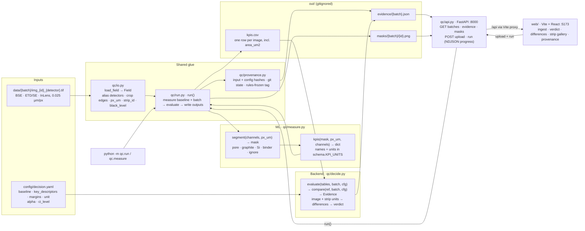

# Catalyst

**Team:** [Batch Size 2](https://github.com/batch-size-2) (ML: Pat · Software: Patrik)  
**Hackathon track:** [Polaron — Track 4](https://www.polaron.ai/) — batch QC for electrode microstructure

## What we're building

A decision layer on top of SEM microstructure analysis. Drop in a folder of microscope images for an incoming batch and get **accept / investigate / reject** against an approved baseline. The verdict comes with its evidence:
- which images look off;
- which measured property moved, and by how much;
- how sure we are;
- what to do next.

No model is trained. Measurements come from classic image processing, and the verdict from plain statistics.

## Plan

[docs/PLAN_v3.md](docs/PLAN_v3.md) is the source of truth for **what to build** (supersedes [PLAN_v2](docs/PLAN_v2.md), [PLAN_v1](docs/PLAN_v1.md) and [PLAN_v0](docs/PLAN_v0.md); §12 lists the evidence behind each decision). Section references to PLAN_v1 below describe the code as built. This README documents **what is built**. Where the code is still a stub, the sections below say so and point to the plan section that describes the target.

## Quickstart

```bash
brew install uv node@22  # once; the web UI needs Node >= 20.19
uv sync
uv run pytest            # contract tests, keep green

# put the batches in data/ (gitignored), e.g.
for b in Batch_1 Batch_2 Batch_3; do ln -s "../EXAMPLE BATCHES FOR LOCAL REFERENCE/$b" data/$b; done

uv run python -m qc.measure                                               # ML: all of data/ -> out/kpis.csv + out/masks/
uv run python -m qc.run --batch data/Batch_2 data/Batch_3                 # end to end -> out/evidence/<batch>.json
uv run python -m qc.decide tests/fixtures/kpis_fake.csv --baseline fake_baseline   # backend only, no images

# UI: two terminals
uv run uvicorn qc.api:app --reload     # API on :8000
cd web && npm install && npm run dev   # UI on :5173, proxies /api to :8000
```

## Architecture

> Keep this diagram in sync with the code. Any PR that adds, removes, renames or rewires a module, contract function, output file, endpoint or data flow updates it in the same PR (see [AGENTS.md](AGENTS.md)).



`qc/schema.py` is the contract every Python box imports: `Field`, the `Phase` labels, `KPI_UNITS`, `KPI_TABLE_COLUMNS` / `PARTICLE_COLUMNS` / `IMAGING_COLUMNS`, the `Tables`/`Segment`/`Evidence` models and the `out/` paths. `web/src/types.ts` mirrors `Evidence` for the UI.

## Infrastructure

Everything runs **locally and offline**: no cloud, no database, no network calls in the verdict path (PLAN_v1 §1, rule 4). There are three processes.

| Process | Command | Port | Role |
|---|---|---|---|
| Pipeline (CLI) | `uv run python -m qc.run --batch …` | – | Measure → compare → write `out/`. This is what we freeze and run on the unseen batch |
| API | `uv run uvicorn qc.api:app --reload` | 8000 | Thin FastAPI wrapper: reads `out/`, saves uploads to `data/`, calls `run()`. No QC logic |
| Web UI | `cd web && npm run dev` | 5173 | Vite + React + TypeScript + Tailwind. Talks only to `/api` (proxied to :8000 by `web/vite.config.ts`) |

**Folders**

| Path | In git? | Contents |
|---|---|---|
| `data/<batch>/` | no | Input TIFFs (or symlinks to them). One folder per batch; the folder name is the batch name |
| `EXAMPLE BATCHES FOR LOCAL REFERENCE/` | no | The 1.6 GB of Polaron images. Don't upload anywhere without Polaron's OK (PLAN_v1 §1, rule 5) |
| `config/decision.yaml` | yes | Decision settings. Frozen with `git tag rules-frozen` before the unseen batch |
| `out/kpis.csv` | no | KPI table, one row per image (incl. `area_um2`, the analysed area), all batches measured so far |
| `out/particles.csv`, `out/imaging.csv` | no | Planned (§3.1): one row per Si particle, and per image and channel |
| `out/masks/<batch>/<image_id>.png` | no | BSE with phase overlay (4× downsampled), for eyeballing and the UI |
| `out/evidence/<batch>.json` | no | The verdict and everything behind it. The UI reads only this and the masks |
| `tests/fixtures/kpis_fake.csv` | yes | Synthetic KPI table (`tests/synth.py`), so the backend and UI can be built with no images |
| `tests/fixtures/evidence_example.json` | yes | Hand-made, fully populated Evidence. To view it in the UI: `cp tests/fixtures/evidence_example.json out/evidence/example.json` and select `example` |

**HTTP API** (`qc/api.py`, called from `web/src/api.ts`)

| Endpoint | Returns |
|---|---|
| `GET /api/config` | `config/decision.yaml` as JSON |
| `GET /api/batches` | `[{name, has_images, verdict}]`: folders in `data/` plus evidence in `out/` |
| `GET /api/evidence/{batch}` | `Evidence` |
| `GET /api/masks/{batch}/{image_id}.png` | Mask overlay |
| `POST /api/batches/{batch}/files` | Multipart upload of a folder's TIFFs into `data/{batch}/` |
| `POST /api/runs/{batch}` | NDJSON stream: one `{"type":"progress","done","total","tile"}` per measured tile, then `{"type":"done","evidence"}` or `{"type":"error","message"}` |

**Dependencies.**
- Python: `pyproject.toml` + `uv.lock`, Python 3.11.
- Web: `web/package.json` + `package-lock.json`.
- Supply-chain guard: `[tool.uv] exclude-newer` blocks Python packages published in the last week. For npm, install with `npm install --before=<date a week ago>`.

## Data pipeline

One command, `qc.run`, does steps 1–6 for the baseline plus each requested batch. `qc.measure` does steps 1–5 only.

| # | Step | Code | Output |
|---|---|---|---|
| 1 | **Find fields.** Group `img_<image_id>_<detector>.tif` by ID | `io.field_paths` | `{image_id: {detector: path}}` |
| 2 | **Load.** Take one channel of the RGB TIFF, crop 8 px off left and right (stitch borders), read pixel size, strip ID and the per-channel black level | `io.load_field` | `Field(batch, image_id, strip_id, channels, px_um, black_level)` |
| 3 | **Segment** | `measure.segment(channels, px_um)` | `uint8` mask with `Phase` codes |
| 4 | **Measure KPIs** | `measure.kpis(mask, px_um, channels)` | `{kpi: value}` |
| 5 | **Write.** One row per image into the KPI table (incl. `area_um2`, the analysed area), plus a mask overlay | `run.measure_field`, `run.save_overlay` | `out/kpis.csv`, `out/masks/` |
| 6 | **Compare** each batch against the baseline and record provenance | `decide.split_tables`, `decide.evaluate`, `provenance.provenance` | `out/evidence/<batch>.json` |

**Input details (step 2, from PLAN_v1 §2)**
- **Detectors** are normalised to `BSE` / `ETD` / `InLens`; `SE` is an alias for `ETD`. The `img_` prefix is dropped from IDs.
- **`px_um`** comes from the TIFF `XResolution` / `ResolutionUnit` tags (0.025 µm/px), or NaN if missing.
- **`strip_id`** is `"<height>_<round(XResolution)>"`, e.g. `2316_1015998`. It groups images cut from one strip; used for the strip-level view and the gallery. The image is the unit of the verdict.
- **`black_level`** is the 0.5th percentile per channel, read off a 256-bin histogram (cheap on ~12 MP fields). Channels stay raw; subtracting it is `segment()`'s job (§3.2).

**Phase labels (`schema.Phase`)**

| Code | Phase | Look in BSE |
|---|---|---|
| 0 | `PORE` | black |
| 1 | `GRAPHITE` | dark grey flakes |
| 2 | `SI` | bright particles |
| 3 | `BINDER` | thin films at particle edges |
| 255 | `IGNORE` | excluded pixels (e.g. top and bottom margins) |

**Segmentation (step 3).**
- **Now (stub):** Gaussian blur σ = 2 px on BSE, then 3-class multi-Otsu (thresholds fitted on a 4× subsample). The classes are pore / graphite / Si.
- **Known gap:** bright binder fringes currently land in `SI`.
- **Target (PLAN_v1 §5, Pat step 3):** black-level subtraction, Si mask clean-up (opening, ≥ 0.25 µm²), top and bottom 5% marked `IGNORE`, and optionally a scribble-trained random forest for cracks.

**KPIs (step 4, definitions in PLAN_v1 §3.2)**

| KPI | Unit | Status |
|---|---|---|
| `si_area_frac` | fraction | **implemented**: Si px / non-ignored px |
| `porosity_apparent` | fraction | **implemented**: pore px / non-ignored px. Biased: open pores show their back wall |
| `si_d50_um`, `si_d90_um` | µm | planned: area-weighted equivalent diameter |
| `si_internal_void_frac` | fraction | planned: dark px inside filled Si particles |
| `si_contrast_ratio` | ratio | planned: (Si mode − black level) / (graphite mode − black level). Valid only after the imaging check |
| `si_fragments_per_1e4um2` | count | planned: Si objects < 1 µm per 10⁴ µm² |
| `si_dispersion_cv` | ratio | planned: CV of local Si fraction over 20 µm windows |

A KPI that isn't computed, or an image whose segmentation crashes, is written as **NaN**: the run never stops on one bad image. Columns of `out/kpis.csv` are `batch, image_id, strip_id, px_um, area_um2, <KPIs>`.

## Decision algorithm (`qc/decide.py`)

Pure statistics on KPI tables; it never sees an image. It follows PLAN_v3 §3.5, with the deviations listed below.

**1. Tables and units.** `split_tables` groups `out/kpis.csv` into one `Tables` per batch (`kpis` now, `particles`/`imaging` once they exist). `compare(ref, batch, cfg)` builds both image units (one per image) and strip units (one per `strip_id`, with a value area-weighted over its images; equal weights where area is missing). `unit` selects which view drives the verdict; the other is reported alongside it. An image with a missing `strip_id` uses its `image_id` as the strip id.

**2. Quantities.** `key_descriptors` in config order, then `KPI_UNITS`, then any other numeric column. `key` = counts towards the verdict; `used` = key and measured on both sides (`note: "not measured"` otherwise).

**3. Units.** `unit` is `image` or `strip` (default `image`). `analyze` runs at both units with nothing dropped; `Evidence.other_unit` holds the other unit's power and used-key statuses. A used key quantity that is DIFFERENT at one unit and SIMILAR at the other is a contradiction: INVESTIGATE, not REJECT, because images from one strip are correlated and an image-level p can be too small.

**4. Difference per quantity.** `reference`/`batch` = unweighted means over the driving-unit values; `difference` = batch − reference. `interval` = `ci_level` t-interval on the difference with pooled SD `sp` and n1 + n2 − 2 degrees of freedom. `margin` δ = `margins[name]` if set, else `similar_margin` × SD (ddof 1) of the baseline's image values; the same δ is used at both units.

**5. Family-wise p, status, drivers.** Labels are shuffled over driving-unit values (the units are values for ≥ 1 used key quantity): all C(n1 + n2, n1) arrangements when ≤ `n_resamples`, else `n_resamples` seeded draws; the observed arrangement always counts. `p` = share of arrangements whose **max-|T| over the used key quantities** reaches the observed |T| (single-step Westfall–Young: the same p protects all key quantities at once). Status for a used key quantity: DIFFERENT when `p < alpha` and |difference| > δ; SIMILAR when the interval lies inside ±δ; else UNCLEAR. Non-key or unused-but-measured quantities get a descriptive status from the interval alone — it never affects the verdict. `drivers` ranks the used key quantities by |difference| / δ.

**6. Power.** `power.n_arrangements` = C(n1 + n2, n1) on the driving unit counts; `min_p` = 2/N for equal counts else 1/N; `limited` when `min_p ≥ alpha`; `extra_needed` = the extra batch units that would lift the limit (≤ 20).

**7. Odd units, verdict, next action.** `odd_units` flags batch images or strips outside the baseline mean ± `odd_sd` × SD of baseline values at that unit (at least 3 baseline values); `odd_images` and `odd_strips` are both reported, but only the driving unit's list triggers the verdict. The verdict follows the precedence in the deviations below (controls → new type → DIFFERENT not contradicted by the other unit → imaging → odd units → contradictions → power → UNCLEAR → controls missing → nothing measured), with `reasons` listing every trigger that fired. `next_action` is computed from the first trigger: quarantine/check-supplier on REJECT, more units on power limit, `units_to_settle` (the extra units that push the top UNCLEAR quantity's interval fully inside or outside ±δ) on UNCLEAR, "Release the batch" on ACCEPT.

**8. Fingerprint and provenance.** `fingerprint.segments` stays at strip level for the image gallery; each descriptor's value and t-interval use the driving unit, with `by_strip` values from the strip segments. `type_shares`, `imaging`, `controls` and `explanations` remain available. Nearest batch, image groups and variance split were dropped: batch attribution (Pat's `qc/attribute.py`) replaces them. `qc/provenance.py` fills `provenance` (§3.11): SHA-256 per input TIFF, git commit + dirty flag, a canonical hash of the config plus hashes of `config/particle_types.json`/`config/kpi_dictionary.yaml` when present, the `rules-frozen` tag if it exists, and a timestamp — the only field that differs between identical runs.

### Deviations from PLAN_v3

Decided by Patrik on 3 Oct after checking §3.5 against the real strip layout; implemented in `qc/decide.py`.

> **Mentor update (3 Oct), implemented here.** The image is the unit of the verdict, the strip view is computed alongside, and shared-strip logic is removed. Sorting images into batches is Pat's `qc/attribute.py`; the software side wraps it (see [docs/HANDOFF.md](docs/HANDOFF.md)).

- **SIMILAR uses a t-interval, not the two-level bootstrap (§3.5).** 90% interval on driving-unit values with pooled SD and n1 + n2 − 2 degrees of freedom, as in the FDA tier-1 method the plan cites [R7]. The margin δ is `similar_margin` × the baseline image SD, used at both units, and can be fixed per key quantity in `margins` at Sync 2.
- **Consequence: INVESTIGATE is the normal answer for the strip view.** With 3–7 strips SIMILAR is rare. Per image there are 7–17 units. The next action says how many more units would settle it. The Sync 1 self-split check passes when at most `alpha` of the splits come out DIFFERENT, and each negative control (§3.7) passes when it is not DIFFERENT: no false REJECT. Neither needs SIMILAR.
- **Power limit.** A comparison is power-limited when the smallest achievable p ≥ `alpha`: 2/N for equal unit counts (an arrangement and its mirror give the same |T|), else 1/N, where N is the number of arrangements. The plan's "N < 1/alpha" misses e.g. a 3 vs 3 strip comparison, N = 20, smallest p = 0.10.
- **The image is the unit of the verdict (§3.5 says strip segment).** Mentors (3 Oct): batches are synthetic morphology groupings, so strips don't matter. The strip view is computed alongside; a DIFFERENT-vs-SIMILAR split between units → INVESTIGATE because images of one strip are correlated and an image-level p can be too small.
- **Shared-strip variants removed (§3.5, §3.13).**
- **Nearest batch, image groups and variance split dropped (§3.5):** batch attribution replaces them.
- **Odd check (new), at both units.** A batch image or strip outside baseline mean ± `odd_sd` × the baseline SD at that unit, on a used key quantity, is listed and triggers INVESTIGATE only at the driving unit: the FDA tier-2 quality range from the same framework [R7]. `odd_sd: null` turns it off.
- **Verdict precedence (not specified in the plan).** Controls failed → INVESTIGATE. New particle type → REJECT, or INVESTIGATE if imaging changed (type features are brightness-based). A key quantity DIFFERENT and not contradicted by the other unit → REJECT. Any UNCLEAR, power limit, imaging change, odd unit or unit contradiction → INVESTIGATE. Otherwise ACCEPT. `reasons` lists every trigger that fired.
- **Structure.** `compare(ref, batch, cfg)` stays a two-sample comparison; provenance lives in `qc/provenance.py` instead of `qc/run.py`. `kpis.csv` gains `area_um2` (analysed area) so strip values can be area-weighted.

**Config (`config/decision.yaml`)**

| Key | Default | Meaning |
|---|---|---|
| `version` | `v3-draft` | Written into every evidence file |
| `data_dir` | `data` | Where batch folders live |
| `baseline` | `Batch_3` | The approved reference batch |
| `reference_exclude` | `[]` | Baseline `image_id`s to drop from the reference |
| `unit` | `image` | Unit that drives the verdict: `image` or `strip`; the other is reported in `other_unit` |
| `key_descriptors` | 5 items | Quantities that count towards the verdict |
| `key_type_shares` | `true` | Particle-type shares count as key quantities (§3.4) |
| `imaging_sensitive` | `si_contrast_ratio`, `porosity_apparent` | Reported but unused if imaging changed (§3.3) |
| `ci_level` | `0.90` | Level of the t-intervals |
| `alpha` | `0.10` | Family-wise threshold for DIFFERENT |
| `similar_margin` | `1.5` | δ = this × baseline image SD (FDA tier-1) |
| `margins` | `{}` | Per-quantity δ overrides, fixed at Sync 2 |
| `new_type_share` | `0.05` | Unassigned Si share that means a new particle type |
| `n_resamples`, `seed` | `5000`, `0` | Resampling budget and seed |
| `odd_sd` | `3.0` | Odd range = baseline mean ± this × baseline SD at each unit; `null` turns it off |

**Not built yet** (next pieces): particle-based quantities (pooled D50, type shares, new-type detection, §3.4), the imaging check (§3.3), the batch-attribution views, controls (§3.7) and explanations (§3.8). The verdict logic already reacts to `new_type_share`, `imaging.changed` and `controls` once they are filled.

**Held-out protocol** (for batch attribution):
1. Put the new images in their own folders under `data/`, never inside the known batch folders.
2. Freeze the model, then `git tag rules-frozen`.
3. Predict once.
4. Commit the output unchanged.

### Evidence JSON (`schema.Evidence`)

```json
{
  "batch": "fake_shift", "baseline": "fake_baseline", "verdict": "REJECT",
  "reasons": ["si_graphite_ratio differs from the reference: 0.129 vs 0.0889 (difference 0.0401, margin ±0.0121, p = 0.000200).",
              "Image fake_shift_S1_0 (strip S1) is outside the reference range on si_graphite_ratio: 0.142 vs 0.0647–0.113."],
  "next_action": "Hold the batch. Top driver: si_graphite_ratio (0.129 vs 0.0889). Check it at the supplier.",
  "unit": "image",
  "differences": [{"name": "si_graphite_ratio", "unit": "", "key": true, "used": true,
                   "reference": 0.0889, "batch": 0.129, "difference": 0.0401,
                   "interval": [0.0323, 0.0479], "margin": 0.0121, "p": 0.000200,
                   "status": "DIFFERENT", "n_segments": [8, 17]}],
  "drivers": ["si_graphite_ratio", "si_contrast_ratio", "porosity_apparent", "..."],
  "power": {"n_segments": [8, 17], "n_arrangements": 1081575, "min_p": 9.25e-07,
            "limited": false, "extra_needed": 0},
  "other_unit": {"unit": "strip", "power": {"n_segments": [6, 7], "n_arrangements": 1716,
                 "min_p": 0.000583, "limited": false, "extra_needed": 0},
                 "statuses": {"si_graphite_ratio": "DIFFERENT", "si_d50_um": "SIMILAR",
                              "si_internal_void_frac": "SIMILAR", "si_contrast_ratio": "UNCLEAR",
                              "porosity_apparent": "SIMILAR"}, "contradictions": []},
  "odd_images": [{"strip_id": "S1", "image_ids": ["fake_shift_S1_0"], "quantity": "si_graphite_ratio",
                  "value": 0.142, "range": [0.0647, 0.113]}, "..."],
  "odd_strips": [{"strip_id": "S1", "image_ids": ["fake_shift_S1_0", "fake_shift_S1_1"],
                  "quantity": "si_graphite_ratio", "value": 0.140, "range": [0.0652, 0.112]}, "..."],
  "n_images": {"batch": 8, "baseline": 17},
  "config_version": "v3-draft"
}
```

`tests/fixtures/evidence_example.json` is a fully populated example (stats, controls, fingerprint, provenance) for the UI and for reading the contract.

## Who owns what

| File | Owner |
|---|---|
| `qc/schema.py`, `tests/test_contract.py`, `tests/fixtures/kpis_fake.csv`, `tests/fixtures/evidence_example.json` | **Both.** The contract: changes need both of us |
| `qc/measure.py` (`segment`, `kpis`) | ML (Pat) |
| `qc/decide.py` (`compare`, `evaluate`, `power`), `qc/provenance.py`, `config/decision.yaml`, `tests/synth.py` | Software (Patrik) |
| `qc/api.py`, `web/` | Software (Patrik) |
| `qc/io.py`, `qc/run.py` | Shared glue |
