# Catalyst

Quality control for battery electrode material, from electron-microscope images.

- **Team:** [Batch Size 2](https://github.com/batch-size-2). ML: Pat. Software: Patrik.
- **Hackathon track:** [Polaron, Track 4](https://www.polaron.ai/): batch QC for electrode microstructure.
- **Submission write-up and our answers for the held-back images:** [docs/SUBMISSION.md](docs/SUBMISSION.md).


## Contents

1. [What it does](#what-it-does)
2. [Results in short](#results-in-short)
3. [Quickstart](#quickstart)
4. [Reproduce the results](#reproduce-the-results)
5. [Commands](#commands)
6. [The app](#the-app)
7. [Architecture](#architecture)
8. [Infrastructure](#infrastructure)
9. [Data pipeline](#data-pipeline)
10. [Batch attribution](#batch-attribution-qcattributepy)
11. [Decision algorithm](#decision-algorithm-qcdecidepy)
12. [Explanations](#explanations-qcexplainpy-qcguidepy)
13. [Experimental pages](#experimental-pages)
14. [Where the code differs from the plan](#where-the-code-differs-from-the-plan)
15. [Known limits](#known-limits)
16. [Documents](#documents)
17. [Who owns what](#who-owns-what)

## What it does

A battery maker buys anode material (graphite with a little silicon) from a supplier. `Batch_3` is the baseline: the material the supplier promised. `Batch_1` and `Batch_2` arrived later and show the kinds of variation a quality check must pick up. They are *different*, not *worse*.

Give Catalyst a folder of FIB-SEM cross-section images (three detector files per sample: BSE, ETD or SE, InLens). It answers four questions and keeps them apart:

| # | Question | Answer | Code |
|---|---|---|---|
| A | **What is different** from the baseline? | Per measured property: the difference in units, an interval, a p-value, the direction, a ranking of the drivers | `qc/decide.py` |
| B | **Which known batch** does an unseen image look like? | Always a batch, with probabilities, a confidence tier with its track record, a prediction set and reasons in plain language | `qc/attribute.py` |
| C | **Is it inside the baseline's range at all?** | Two-sided z-scores against `Batch_3`, a distance, an *unfamiliar* flag | `qc/attribute.py` |
| D | **Accept, investigate or reject** the batch? | A verdict from plain statistics and a tolerance, with the next action, explained for an operator, an engineer, a scientist and a manager | `qc/decide.py`, `qc/explain.py` |

How it gets there:

- **Measurements** come from classic image processing: brightness thresholds split each image into pore, graphite, silicon and binder, and every silicon particle is measured.
- **The verdict (D)** is plain statistics on those measurements. No trained model is involved.
- **The only trained piece is the attribution model (B, C):** two small logistic regressions, one on 180 named measurements and one on frozen DINOv2 image features. It is scored only on image strips it never saw, saved as readable JSON, and it never feeds the verdict.
- **Everything runs locally and offline.** The one optional network call is a Claude summary on the Compare page, which cannot change any number or the verdict.

## Results in short

The attribution model, version v4.2 (`config/attribution_model.json`). Full write-up: [docs/MODEL.md](docs/MODEL.md).

| Check | Result |
|---|---|
| 31 known images, whole strips held out | 22 of 31 right. Balanced accuracy 0.66 (chance 0.33; 95th percentile with shuffled labels 0.51) |
| "Batch_3 or not" | 26 of 31 right. **Established** |
| "Batch_1 or Batch_2" | 8 of 12 right (p = 0.19 against guessing). **Not established**: every such call is reported as a lean, at low confidence, with both batches in its prediction set |
| Rehearsal: 30 draws of 9 unseen images | 0.66 on average; single draws range from 3 of 9 to 8 of 9 |
| Confidence, held out | Calls stated at 75% or more: 9 of 9 right. 50–75%: 5 of 7. Below 50%: 8 of 15 |
| Test folder (3 samples, truth given after our calls) | 1 of 3 exact, 3 of 3 on "Batch_3 or not", 3 of 3 inside the prediction set |
| Eval folder (6 samples, our submitted answers) | 2 called `Batch_3` at high confidence (86%); 4 called "not `Batch_3`" (82–89%), "Batch_1 or Batch_2" at low confidence |

The scored outputs are committed unchanged in [`results/`](results/). The answer sheet as submitted is [results/Hackathon-Polaron-eval.answers.pdf](results/Hackathon-Polaron-eval.answers.pdf).

## Quickstart

### 1. Install

Needs [uv](https://docs.astral.sh/uv/) (it installs Python 3.11 itself) and Node 20.19 or newer for the web UI.

```bash
brew install uv node@22   # macOS, once
export PATH="$(brew --prefix node@22)/bin:$PATH"   # node@22 is keg-only
uv sync                   # Python packages, including CPU torch for the DINOv2 features
uv run pytest             # 151 tests, about 2 minutes; no images needed (one test needs Node)
```

### 2. Add the images

The images are not in this repository (1.6 GB of TIFFs). Put each batch in its own folder under `data/`. The folder name is the batch name.

```text
data/
  Batch_1/   img_<id>_BSE.tif  img_<id>_ETD.tif  img_<id>_InLens.tif  ...
  Batch_2/
  Batch_3/                     # the baseline
  Hackathon-Polaron-test/      # held-back folders: never mix them into the batch folders
  Hackathon-Polaron-eval/
```

Symlinks work too:

```bash
mkdir -p data
for b in Batch_1 Batch_2 Batch_3; do ln -s "/path/to/EXAMPLE BATCHES FOR LOCAL REFERENCE/$b" "data/$b"; done
```

### 3. Download the DINOv2 weights once

The attribution model needs the pinned `facebook/dinov2-small` weights. They are downloaded to the Hugging Face cache; after that everything runs offline.

```bash
uv run python -c "from transformers import AutoModel; from qc.deep import MODEL_ID, MODEL_REVISION; AutoModel.from_pretrained(MODEL_ID, revision=MODEL_REVISION)"
```

### 4. Run the app

Two terminals:

```bash
HF_HUB_OFFLINE=1 uv run uvicorn qc.api:app --reload   # API on http://localhost:8000
```

```bash
cd web && npm install && npm run dev                  # UI on http://localhost:5173
```

- Open <http://localhost:5173>.
- **Identify tile:** drop the three TIFFs of one sample. The answer comes in under 20 seconds.
- **Compare batch:** pick a batch and press "Run again", or "Upload a new batch". A run measures every image of the batch and of the baseline.
- `curl -s localhost:8000/api/health` says whether Identify can run offline (model file, torch, cached weights). More: [docs/RUNBOOK_DROP.md](docs/RUNBOOK_DROP.md).
- Optional: `export ANTHROPIC_API_KEY=...` before starting the API to enable "Ask Claude" on the Compare page.
- If the UI should reach an API on another port: `CATALYST_API=http://localhost:<port> npm run dev`.

### No images? Preview the UI with fixtures

```bash
mkdir -p out/evidence/example_reference out/attribution
cp tests/fixtures/evidence_example.json out/evidence/example_reference/example_batch.json   # shows in the Audit log
cp tests/fixtures/attribution_example.json out/attribution/example_drop.json                # open #/identify/example_drop
cp tests/fixtures/attribution_evaluation_example.json out/attribution/evaluation.json
```

Then start the API and the UI as above. The statistics can also be run with no images at all:

```bash
uv run python -m qc.decide tests/fixtures/kpis_fake.csv --baseline fake_baseline
```

## Reproduce the results

Needs steps 1–3 of the Quickstart. Everything runs on a laptop CPU; the timings are from an Apple-silicon laptop.

### A. The submitted answers (no fitting)

This scores the held-back folders with the committed model. Nothing is refit.

```bash
export HF_HUB_OFFLINE=1
uv run python -m qc.attribute --images data/Hackathon-Polaron-eval   # 6 samples, about 13 s each
uv run python -m qc.attribute --images data/Hackathon-Polaron-test   # 3 samples
```

Check against the committed outputs. `cmp` prints nothing when the files are identical:

```bash
cmp out/attribution/Hackathon-Polaron-eval.json results/Hackathon-Polaron-eval.json
cmp out/attribution/Hackathon-Polaron-test.json results/Hackathon-Polaron-test.stage-records.json
```

Expected answers for the eval folder:

| Sample | Answer | Confidence | Batch_1 | Batch_2 | Batch_3 |
|---|---|---|---|---|---|
| `0eryguqq` | Batch_3 | high | 6.4% | 7.3% | 86.3% |
| `fhwrjtet` | Batch_3 | high | 6.6% | 7.1% | 86.3% |
| `4hq27w4c` | Batch_1 or Batch_2 (leans Batch_1) | low | 45.2% | 43.9% | 10.9% |
| `y59rxmxl` | Batch_1 or Batch_2 (leans Batch_1) | low | 46.0% | 43.1% | 10.9% |
| `fspqbkxl` | Batch_1 or Batch_2 (leans Batch_2) | low | 42.3% | 46.8% | 10.9% |
| `soo2ax3r` | Batch_1 or Batch_2 (leans Batch_2) | low | 40.2% | 41.7% | 18.0% |

### B. The model, from the raw images

```bash
export HF_HUB_OFFLINE=1
uv run python -m qc.features data/Batch_1 data/Batch_2 data/Batch_3     # 180 named features + imaging, 31 images, about 6 min
uv run python -m qc.deep data/Batch_1 data/Batch_2 data/Batch_3         # DINOv2 features on CPU, about 2 min
uv run python -m qc.attribute --evaluate                                # each feature family against its null
uv run python -m qc.attribute --dry-run --repeats 30 --staged reg,edge,tex,par,kpi:deep   # rehearsal on unseen draws
uv run python -m qc.attribute --fit --staged reg,edge,tex,par,kpi:deep  # writes config/attribution_model.json
```

- **Name the three batch folders.** Without arguments, `qc.features` and `qc.deep` take every folder in `data/`, and a held-back folder would become a training batch.
- **Expected:**
  - `out/features.csv`: 31 rows, 204 named columns and 1,536 `deep_` columns. A rebuild in a clean checkout matched the previous table exactly.
  - `--evaluate`: the DINOv2 family is the only single family above its null (0.64 against 0.54).
  - `--dry-run --repeats 30`: balanced accuracy 0.66 on average.
  - `--fit` prints `LOSO balanced accuracy 0.66`.
- **`--fit` rewrites the committed model file.** The coefficients come out identical; `fitted_at` and the stored tier record change (see [Known limits](#known-limits)). To go back to the committed file: `git checkout config/attribution_model.json`.

### C. The batch verdicts

```bash
uv run python -m qc.run --batch data/Batch_1 data/Batch_2   # measures Batch_3 too; writes out/evidence/Batch_3/<batch>.json
uv run python -m qc.control_check                           # known-answer controls -> out/controls.json
uv run python -m qc.run --batch data/Batch_1 data/Batch_2   # again: ACCEPT is only possible once the controls passed
```

Open the Compare page, or read `verdict`, `reasons` and `next_action` in the evidence file.

### D. The experiments behind the model choices

```bash
PYTHONPATH=. uv run python scripts/experiments/T14_adoption.py       # the calibration check, about 2 min (docs/experiments/T14.md)
PYTHONPATH=. uv run python scripts/experiments/T18_tiles.py          # tile embeddings for 34 images, about 6 min
PYTHONPATH=. uv run python scripts/experiments/T18_ground_truth.py   # the test-sample analysis, about 4 min (docs/experiments/T18.md)
```

### What is committed in `results/`

| File | What |
|---|---|
| `Hackathon-Polaron-eval.json` | The 6 eval samples, scored once with model v4.2. Our submitted answers |
| `Hackathon-Polaron-eval.answers.pdf` | The same answers as the one-page sheet we handed in, with the explanation per sample |
| `Hackathon-Polaron-test.json` | The 3 test samples, scored once with the first model (tag `rules-frozen`), before the truth was known |
| `Hackathon-Polaron-test.refit.json` | The same samples with model v4.2: same three bets |
| `Hackathon-Polaron-test.stage-records.json` | The same numbers, with the record of each stage |
| `Hackathon-Polaron-test.ground-truth.json` | The true batches, and each file above scored against them |

## Commands

| Command | What it does | Writes |
|---|---|---|
| `uv run pytest` | All tests. Must pass before every PR | – |
| `uv run python -m qc.measure [data/<batch> ...]` | Segment and measure (no comparison). Without arguments: every folder in `data/` | `out/kpis.csv`, `out/particles.csv`, `out/imaging.csv`, `out/masks/` |
| `uv run python -m qc.run --batch data/<batch> [...]` | Measure the baseline and each batch, compare, explain | the tables above, `out/evidence/<baseline>/<batch>.json` |
| `uv run python -m qc.decide [<kpis.csv>] [--baseline <name>]` | The comparison alone, for every batch in an existing KPI table (default `out/kpis.csv`) | `out/evidence/<baseline>/<batch>.json` |
| `uv run python -m qc.control_check` | Run the known-answer controls through the comparison | `out/controls.json` |
| `uv run python -m qc.controls --baseline data/Batch_3` | Measure every control against its original (KPI shifts only) | `out/controls/summary.csv` |
| `uv run python -m qc.uncertainty --batch data/Batch_3` | Threshold and sampling uncertainty per image | `out/uncertainty/*.csv` |
| `uv run python -m qc.types [--exclude <batch>] [--porous-rule]` | Refit the particle types on `out/particles.csv` | `config/particle_types.json`, `out/crops/` |
| `uv run python -m qc.features data/Batch_1 data/Batch_2 data/Batch_3` | Per-image feature table | `out/features.csv` |
| `uv run python -m qc.deep data/Batch_1 data/Batch_2 data/Batch_3` | DINOv2 columns, merged into the feature table | `out/features.csv` |
| `uv run python -m qc.attribute --evaluate` | Each feature family held out, against its null | `out/attribution/evaluation.json`, `feature_ranking.csv` |
| `uv run python -m qc.attribute --dry-run --repeats 30 --staged reg,edge,tex,par,kpi:deep` | Rehearsal on held-out draws | prints JSON |
| `uv run python -m qc.attribute --fit --staged reg,edge,tex,par,kpi:deep` | Fit the model | `config/attribution_model.json` |
| `uv run python -m qc.attribute --images data/<folder> [--balanced k]` | Attribute unseen images with the saved model | `out/attribution/<folder>.json` |
| `uv run python -m qc.impact --batch <name>` | Experimental: indicative cell impact | `out/impact/<baseline>/<batch>.json` |
| `uv run uvicorn qc.api:app --reload` | API on :8000 | – |
| `cd web && npm run dev` | UI on :5173 | – |
| `cd web && npm run build` | Typecheck and build. Must pass before every PR that touches `web/` | `web/dist/` |

## The app

Desktop only (1280–1920 px wide). Seven pages in the sidebar:

| Page | Route | What it shows | Screenshot |
|---|---|---|---|
| Identify tile | `#/identify[/<drop>[/<image_id>]]` | Drop one sample: the batch it looks like, how sure, why, and what the model leans on overall | [answer](docs/screenshots/identify-answer.png), [empty](docs/screenshots/identify-empty.png), [what the model leans on](docs/screenshots/identify-importance.png) |
| Compare batch | `#/compare/<batch>[/<baseline>]` | The verdict, what moved, the tiles behind it, next steps, four audience readings, run details | – |
| Library | `#/library[/<batch>[/<image_id>]]` | Every image, with a viewer: detectors and phase layers | [library](docs/screenshots/library.png), [viewer](docs/screenshots/viewer.png) |
| Audit log | `#/audit` | Every comparison on disk, with input hashes, config hashes and a re-verify button | [audit](docs/screenshots/audit.png) |
| Settings | `#/settings` | The default baseline (locked once rules are frozen) and the Claude status | [settings](docs/screenshots/settings.png) |
| Wear & impact (experimental) | `#/impact/<batch>[/<baseline>]` | What a measured difference could mean for the cell, from textbook relations | [cards](docs/screenshots/impact-cards.png) |
| Anode lab (experimental) | `#/anode` | A 3D illustration of the measured microstructure inside a cell | [section](docs/screenshots/slab-section.png), [fast charge](docs/screenshots/slab-fast-charge.png), [aged](docs/screenshots/slab-aged.png) |

## Architecture

> Keep this diagram in sync with the code. Any PR that adds, removes, renames or rewires a module, contract function, output file, endpoint or data flow updates it in the same PR (see [AGENTS.md](AGENTS.md)).

```mermaid
flowchart LR
  subgraph IN["Inputs"]
    D["data/{batch}/img_{id}_{detector}.tif<br/>BSE · ETD/SE · InLens, 0.025 µm/px"]
    CFG["config/decision.yaml<br/>baseline · key_descriptors · margins · unit<br/>alpha · ci_level"]
    DICT["config/kpi_dictionary.yaml<br/>plain-language dictionary per property"]
  end

  subgraph GLUE["Shared glue"]
    IO["qc/io.py<br/>load_field → Field<br/>alias detectors · crop edges · px_um · strip_id · black_level"]
    RUN["qc/run.py · run() / attribute()<br/>measure + evaluate · explain before writing"]
    PROV["qc/provenance.py<br/>input + config hashes · git state · rules-frozen tag"]
  end

  subgraph ML["ML · qc/measure.py"]
    SEG["segment(channels, px_um, thresholds) → mask<br/>pore · graphite · Si · binder · ignore"]
    LBL["label_si(mask, px_um) → labels + filled<br/>hole fill + watershed at measure time"]
    KPI["kpis(mask, px_um, channels) → dict<br/>15 descriptors, names + units in schema.KPI_UNITS"]
    PAR["particles(mask, px_um, channels) → per-particle table<br/>d · contrast · inlens_ratio · voids · texture · solidity"]
    IMG["imaging(channels) → per-channel dict<br/>black · percentiles · noise · sharpness · saturation · curtaining"]
  end

  subgraph TYPES["ML · qc/types.py · controls.py · uncertainty.py"]
    TYP["fit_types / assign_types → particle types<br/>GMM + leave-one-strip-out k selection · frozen in config/particle_types.json"]
    CTL["make_controls / shared_strip_controls → Control fields<br/>negative + positive batches with a known answer"]
    CHK["qc/control_check.py · run_controls<br/>iter_controls, one at a time → Controls"]
    UNC["threshold_variants · integral_range<br/>segmentation + sampling uncertainty"]
  end

  subgraph ATTR["ML · qc/features.py · qc/deep.py · qc/attribute.py"]
    FEAT["image_features(field, mask) → one row per image<br/>reg_ regional tiles · edge_ · tex_ LBP/GLCM · par_ · kpi_ · img_<br/>assert_no_leakage: no strip_id / size / px_um"]
    EVAL["loso_cv · permutation_null · shared_strip_check · rank_features<br/>leave-one-strip-out, segment-shuffled null"]
    FIT["fit_model → config/attribution_model.json<br/>standardised L2 logistic regression (flat or staged) · nested C<br/>Venn-Abers calibration · batch_stats · explain tables + importance"]
    PRED["predict(model, features) → always a batch · p_Batch_1/2/3<br/>confidence tier · stages with interval and held-out record (established?) · prediction_set · readable reasons<br/>baseline_distance · unfamiliar · balanced_assignment"]
  end

  subgraph BE["Backend · qc/decide.py"]
    J["evaluate(tables, batch, cfg, controls) → compare → Evidence<br/>image + strip units → differences → verdict"]
    EXPLAIN["qc/explain.py · explain(evidence, dictionary) → Explanations<br/>answer sentence · rules fired · next steps · 4 audiences"]
  end

  subgraph GUIDE["After the output · qc/guide.py (optional)"]
    GD["guide(evidence) → summary + walkthrough + 4 audiences<br/>fixed template, or one Claude call with {slots} Catalyst fills in<br/>house-rule checks · what-if: odd tiles left out"]
  end

  SLAB["qc/slab.py · build(batch) → indicative 3D slab<br/>packing at the measured fractions · textbook charge, plating, wear curves<br/>illustration only, never read by the verdict"]

  subgraph OUT["out/ (gitignored)"]
    T["kpis.csv<br/>one row per image, incl. area_um2"]
    PT["particles.csv<br/>one row per Si particle"]
    IT["imaging.csv<br/>one row per image and channel"]
    E["evidence/{baseline}/{batch}.json"]
    GC["guide/{baseline}/{batch}.json<br/>Claude's checked output, cached"]
    FT["features.csv<br/>one row per image, 6 feature families (+ optional deep_)"]
    AT["attribution/evaluation.json · feature_ranking.csv<br/>attribution/{run}.json"]
    P["masks/{batch}/{id}.png"]
    CR["crops/{type}/{n}.png<br/>example crops per particle type"]
    CJ["controls.json<br/>pass/fail per control, baseline + config hash"]
  end

  API["qc/api.py · FastAPI :8000<br/>GET health · config · settings · batches · evidence · guide · tiles · images · kpis · masks · attribution · attribution-model · attribution-evaluation · slab<br/>GET particles · layers · POST upload · run (?baseline one-off) · measure · attribution · guide · verify (NDJSON progress) · PUT settings/baseline"]
  CLAUDE["Claude API<br/>reads evidence + dictionary, never images"]
  WEB["web/ · Vite + React :5173 · Catalyst design<br/>identify tile (stage progress, region peek, result URLs) · compare batch (focus + walkthrough) · library + viewer (phase layers) · audit log + batch passport + parody lawsuit button · settings<br/>wear & impact · anode lab (Experimental, three.js, lazy-loaded)"]
  CLI["python -m qc.run / qc.control_check / qc.measure / qc.features / qc.attribute"]
  IMPACT["qc/impact.py · impact_report(kpis, particles, batch, baseline)<br/>Experimental: indicative cell impact + worst cases · config/impact.yaml<br/>never feeds the verdict"]

  D --> IO --> RUN
  RUN --> SEG --> LBL --> KPI --> RUN
  LBL --> PAR --> TYP
  TYP -. "config/particle_types.json (frozen)" .-> RUN
  RUN -. "attribute() → attribute_images()" .-> PRED
  RUN --> T --> J
  RUN --> PT --> J
  RUN --> IT --> J
  CTL --> CHK --> CJ --> RUN
  CTL -. "out/controls/summary.csv" .-> RUN
  UNC -. "out/uncertainty/*.csv" .-> RUN
  CFG --> J
  RUN --> EXPLAIN
  J --> EXPLAIN
  DICT --> EXPLAIN
  EXPLAIN --> E
  RUN --> P
  RUN --> PROV --> E
  TYP --> CR
  J --> E
  SEG --> FEAT
  PAR --> FEAT
  KPI --> FEAT
  IMG --> FEAT
  FEAT --> FT --> EVAL --> AT
  FT --> FIT
  FIT -. "config/attribution_model.json (frozen)" .-> PRED
  FT --> PRED --> AT
  T --> SLAB
  PT --> SLAB
  SLAB --> API
  E --> API
  E --> GD
  DICT --> GD
  T -. "what-if recompute" .-> GD
  GD <-. "only with ANTHROPIC_API_KEY" .-> CLAUDE
  GD --> GC
  GD --> API
  API -- "PUT settings/baseline (409 once frozen)" --> CFG
  AT --> API
  P --> API
  API -- "/api via Vite proxy" --> WEB
  WEB -- "upload + run" --> API
  API -- "run()" --> RUN
  API -- "attribute()" --> RUN
  CLI --> RUN
  T --> IMPACT
  PT --> IMPACT
  IMPACT -- "GET /api/impact" --> API
```



`qc/schema.py` is the contract every Python box imports:

- `Field`, the `Phase` labels, `KPI_UNITS`, `KPI_TABLE_COLUMNS`, `PARTICLE_COLUMNS`, `IMAGING_COLUMNS`, `Control`;
- the `Tables`, `Segment` and `Evidence` models;
- the `out/` paths (`FEATURE_TABLE`, `ATTRIBUTION_DIR`, `ATTRIBUTION_MODEL_PATH`, `attribution_path()`).

The attribution JSON is not part of `Evidence`: the API serves `out/attribution/<run>.json` as written. `web/src/types.ts` mirrors `Evidence` for the UI.

## Infrastructure

No cloud, no database, no network call in the verdict path. Three processes:

| Process | Command | Port | Role |
|---|---|---|---|
| Pipeline (CLI) | `uv run python -m qc.run --batch …` | – | Measure → compare → write `out/` |
| API | `uv run uvicorn qc.api:app --reload` | 8000 | Thin FastAPI wrapper: reads `out/`, saves uploads to `data/`, calls `run()` and `attribute()`. No QC logic |
| Web UI | `cd web && npm run dev` | 5173 | Vite + React + TypeScript + Tailwind. Talks only to `/api` (proxied to :8000 by `web/vite.config.ts`) |

### Folders

**Inputs and settings**

| Path | In git? | Contents |
|---|---|---|
| `data/<batch>/` | no | Input TIFFs (or symlinks). One folder per batch; the folder name is the batch name |
| `EXAMPLE BATCHES FOR LOCAL REFERENCE/` | no | The 1.6 GB of Polaron images. Too big for git; screenshots of them are fine |
| `config/decision.yaml` | yes | Decision settings (table under [Decision algorithm](#decision-algorithm-qcdecidepy)). Locked by the `rules-frozen` tag |
| `config/particle_types.json` | yes | Fitted particle-type model: Gaussian-mixture centres and covariances, names, the unassigned threshold. Locked by `rules-frozen` |
| `config/attribution_model.json` | yes | The attribution model: feature names, means, SDs, coefficients, `C`, training image ids, its held-out record (`loso`, `calibration` with the Venn–Abers points), the per-batch statistics behind the unfamiliar flag, and `explain` (reason tables and `importance`). Hashed into provenance |
| `config/kpi_dictionary.yaml` | yes | Plain-language meaning, possible causes and supplier checks per property. Read by `explain()` and hashed into provenance. A draft: the causes have not been reviewed by a materials expert |
| `config/impact.yaml` | yes | Wear & impact page: textbook constants and ranges, wording, worst-case chains, references. Not part of the verdict, not locked by `rules-frozen` |

**Outputs (`out/`, never committed)**

| Path | Contents |
|---|---|
| `out/kpis.csv` | One row per image: `batch, image_id, strip_id, px_um, area_um2`, the 15 KPIs, and the sampling SDs `si_area_frac_sd`, `porosity_apparent_sd` |
| `out/particles.csv` | One row per silicon particle: size, contrast, InLens ratio, voids, texture, solidity, type, centroid |
| `out/imaging.csv` | One row per image and channel: black level, percentiles, noise, sharpness, saturation, curtaining |
| `out/masks/<batch>/<image_id>.png` | BSE with the phase overlay (4× downsampled) |
| `out/masks/<batch>/<image_id>.phases.png` | The mask as `Phase` codes, plus cached transparent layers `<image_id>.<silicon\|pore\|binder>.png` |
| `out/previews/<batch>/<image_id>_<detector>_<size>.png` | Cached detector previews (512 or 2048 px) |
| `out/evidence/<baseline>/<batch>.json` | The verdict and everything behind it. One file per batch and baseline, so a one-off baseline never overwrites the default comparison |
| `out/guide/<baseline>/<batch>.json` | Claude's checked summary, walkthrough and audience readings for one comparison (cache) |
| `out/controls.json` | Pass or fail per control, with the baseline name and the decision-config hash. Used only while both still match |
| `out/controls/summary.csv` | Measured KPI shifts for every control |
| `out/uncertainty/` | `threshold_variants.csv` (KPIs at thresholds ±5) and `integral_range.csv` (per image and phase) |
| `out/crops/<type>/<n>.png` | Example particle crops per type |
| `out/features.csv` | One row per image: `batch, image_id, strip_id` and the `reg_`, `edge_`, `tex_`, `par_`, `kpi_`, `img_` features, plus the `deep_` columns. Never a strip, size or pixel-size column |
| `out/attribution/evaluation.json`, `feature_ranking.csv` | Per feature family: held-out balanced accuracy, confusion, permutation null, shared-strip check; and a ranking of single features |
| `out/attribution/<run>.json` | The model summary and one record per image (fields under [Batch attribution](#batch-attribution-qcattributepy)) |
| `out/impact/<baseline>/<batch>.json` | `python -m qc.impact` output |
| `out/experiments/<ticket>/` | Raw outputs of the experiment scripts |

**Tracked fixtures, results and assets**

| Path | Contents |
|---|---|
| `results/` | Scored held-back folders, committed unchanged (see [Reproduce the results](#reproduce-the-results)) |
| `tests/fixtures/kpis_fake.csv` | Synthetic KPI table (from `tests/synth.py`), so the backend and UI can be built with no images |
| `tests/fixtures/evidence_example.json` | A fully populated `Evidence` |
| `tests/fixtures/attribution_example.json`, `attribution_evaluation_example.json` | Fixtures in the attribution output format |
| `scripts/experiments/<ticket>_<slug>.py` | One script per experiment ticket. Never imported by `qc/` |
| `assets/` | Brand assets: Catalyst the cat and the logo. See `assets/README.md` |
| `design/` | Design system: `tokens.css`, logo, screen designs. See `design/README.md` |
| `demo_video/PROMPT.md` | The brief for the 2-minute demo video |

### HTTP API

`qc/api.py`, called from `web/src/api.ts`.

| Endpoint | Returns |
|---|---|
| `GET /api/health` | `{ok, model_present, deep_importable, dinov2_cached, message}`: whether Identify can run a drop offline (model file, `qc.deep` import, cached DINOv2 weights). The Identify screen blocks upload while `ok` is false |
| `GET /api/config` | `config/decision.yaml` as JSON |
| `GET /api/settings` | `{baseline, rules_frozen_commit, rules_frozen_date, rules_frozen_config, claude: {available, model, reason}}`; `rules_frozen_config` has each frozen file's sha256 under the tag and now, so a change since the freeze shows in the Audit banner |
| `PUT /api/settings/baseline` | Body `{baseline}`: writes the default `baseline` line of `config/decision.yaml`. 409 once the `rules-frozen` tag exists, 404 for a missing folder |
| `GET /api/batches` | `[{name, has_images, verdict}]`: folders in `data/` plus evidence against the default baseline |
| `GET /api/evidence` | `[{batch, baseline, verdict, created_at}]`: every comparison on disk, newest first (the audit log) |
| `GET /api/evidence/{batch}?baseline=` | `Evidence`; `baseline` omitted = the default. A file from before the plain-word texts gets them written on load from its own numbers (`qc.run.load_evidence`) |
| `GET /api/guide/{batch}?baseline=&source=template\|claude` | Summary, walkthrough and `audiences` (`qc/guide.py`): `{source, model, fallback_reason, summary, steps, audiences, slots, checks}`. `audiences` is `{operator, engineer, scientist, manager}`, each `{source, sentences}`. Free: the template, or Claude's cached version with `source=claude` (else the template with `fallback_reason`) |
| `POST /api/guide/{batch}?baseline=` | Ask Claude once for the summary, the walkthrough and the four audience readings (a paid call, cached per evidence in `out/guide/`). Only the "Ask Claude" button calls it. The verdict does not read this |
| `GET /api/attribution` | Sorted attribution run names |
| `GET /api/attribution/{name}` | `Attribution` |
| `GET /api/attribution-model` | The model `POST /api/attribution` will use: kind, families, fit time, held-out record (`calibration`), `importance` (what each stage leans on), sha256, and `matches_frozen` (the file is the one under `rules-frozen`) |
| `GET /api/attribution-evaluation` | The feature-family evaluation report |
| `GET /api/masks/{batch}/{image_id}.png` | Mask overlay |
| `GET /api/tiles` | `[{batch, image_id, strip_id, detectors, kpis, has_mask, has_layers}]`: every image in `data/` joined with `out/kpis.csv` |
| `GET /api/images/{batch}/{image_id}/{detector}?size=512\|2048` | Percentile-stretched PNG preview, cached in `out/previews/` |
| `GET /api/kpis` | `config/kpi_dictionary.yaml` as JSON, plus a name for each fitted particle type it doesn't describe yet (from `config/particle_types.json`) |
| `GET /api/slab/{batch}?image={id}` | Indicative 3D slab for the anode lab (`qc/slab.py`): particle packing, pore mask, charge / fast-charge / ageing curves, indicators with per-image ranges, assumptions. Batch median, or one image with `image`. Cached in memory |
| `GET /api/layers/{batch}/{image_id}/{silicon\|pore\|binder}` | One segmentation phase as a transparent PNG, to lay over any detector in the peek and inspector; 404 until the tile is measured |
| `GET /api/particles/{batch}/{image_id}?top=8` | `{width, height, px_um, particles: [{x, y, d_um, type}]}` from `qc.run.tile_particles`: the tile's size (cropped, full-res px) and its largest non-edge Si particles from `out/particles.csv`, for the region peek |
| `POST /api/verify/{batch}?baseline=` | Re-hash the evidence's provenance inputs and config files (with its own baseline) → `{ok, files, config_ok}` |
| `POST /api/batches/{batch}/files` | Multipart upload of a folder's TIFFs into `data/{batch}/`. Folder and file names: letters, digits, `_ . -` only (400 otherwise; the UI slugifies folder names) |
| `POST /api/runs/{batch}?baseline=` | NDJSON stream: one `{"type":"progress","done","total","tile"}` per measured tile, then `{"type":"done","evidence"}` or `{"type":"error","message"}`. `baseline` runs a one-off comparison with `cfg \| {baseline}`; the default doesn't move |
| `POST /api/measure/{batch}` | NDJSON stream: measure one folder (e.g. an Identify drop) into `out/kpis.csv` and masks, without comparing it |
| `POST /api/attribution/{name}?balanced={k}` | NDJSON stream: `{"type":"progress","stage":"features"\|"deep"\|"predict","done","total","tile"}` while `attribute_images` runs, then `{"type":"done","attribution"}`; `balanced` is optional, 501 if `qc.attribute` is unavailable |
| `GET /api/impact/{batch}?baseline=` | Experimental: `qc.impact.Report` from `out/kpis.csv` + `particles.csv` (404 if either batch is unmeasured, 422 if the table is unusable) |

### Dependencies

- Python: `pyproject.toml` + `uv.lock`, Python 3.11.
- Web: `web/package.json` + `package-lock.json`.
- Supply-chain guard: `[tool.uv] exclude-newer` blocks Python packages published in the last week. For npm, install with `npm install --before=<date a week ago>`.

## Data pipeline

`qc.run` does steps 1–9 for the baseline and each requested batch. `qc.measure` does steps 1–8.

| # | Step | Code | Output |
|---|---|---|---|
| 1 | **Find fields.** Group `img_<image_id>_<detector>.tif` by id | `io.field_paths` | `{image_id: {detector: path}}` |
| 2 | **Load.** One channel of the RGB TIFF, 8 px cropped left and right (stitch borders), pixel size, strip id, black level per channel | `io.load_field` | `Field(batch, image_id, strip_id, channels, px_um, black_level)` |
| 3 | **Segment** into pore, graphite, silicon, binder | `measure.segment(channels, px_um, thresholds)` | `uint8` mask with `Phase` codes |
| 4 | **Measure KPIs**, including `label_si` (hole fill + watershed) and the two-point correlation | `measure.kpis(mask, px_um, channels)` | `{kpi: value}` |
| 5 | **Particles.** Per-particle features at full resolution | `measure.particles(mask, px_um, channels)` | `particles.csv` rows |
| 6 | **Types.** Assign each particle a type from `config/particle_types.json` | `types.assign_types` | `type` column |
| 7 | **Imaging check.** Per-channel imaging descriptors | `measure.imaging(channels)` | `imaging.csv` rows |
| 8 | **Write** the three tables and a mask overlay | `run.measure_field`, `run.save_tables`, `run.save_overlay` | `out/kpis.csv`, `out/particles.csv`, `out/imaging.csv`, `out/masks/` |
| 9 | **Compare** each batch with the baseline and record provenance | `decide.split_tables`, `decide.evaluate`, `provenance.provenance` | `out/evidence/<baseline>/<batch>.json` |

A KPI that cannot be computed, or an image whose segmentation crashes, is written as NaN: the run never stops on one bad image.

### Input (step 2)

- **Detectors** are normalised to `BSE`, `ETD`, `InLens`. `SE` is an alias for `ETD`. The `img_` prefix is dropped from ids.
- **`px_um`** comes from the TIFF `XResolution` and `ResolutionUnit` tags (0.025 µm per pixel), or NaN if missing.
- **`strip_id`** is `"<height>_<round(XResolution)>"`, for example `2316_1015998`. It groups images cut from one long strip. It is used to hold out whole strips in evaluation, for the strip view and for the gallery. It is never a model feature.
- **`black_level`** is the 0.5th percentile per channel. Channels stay raw; `segment()` subtracts it.

### Phase labels (`schema.Phase`)

| Code | Phase | Look in BSE |
|---|---|---|
| 0 | `PORE` | black |
| 1 | `GRAPHITE` | dark grey flakes |
| 2 | `SI` | bright particles |
| 3 | `BINDER` | thin films at particle edges |
| 255 | `IGNORE` | excluded pixels (top and bottom margins) |

### Segmentation (step 3)

1. Subtract the black level from BSE, average 2×2 pixels, smooth (Gaussian σ = 1).
2. 3-class multi-Otsu per image on the valid rows → pore, graphite, silicon. A percentile fallback covers images where Otsu fails. `thresholds` is an optional argument so the uncertainty step can rerun with offsets.
3. Thin bright rims along graphite edges (removed by a 0.15 µm opening, next to graphite) → `BINDER`. Other opening losses → `GRAPHITE`. Silicon components under 0.25 µm² → `GRAPHITE`.
4. Silicon objects whose median BSE is under 1.5× the graphite mode → `BINDER` (`SI_MIN_CONTRAST`). Carbon-binder and through-pore surfaces measure 1.3–1.5×; real silicon 1.6–2.4×.
5. Top and bottom 5% of rows → `IGNORE` (they may carry FIB damage). The mask is upsampled to full resolution.

Hole filling and watershed splitting are not baked into the mask. They happen in `label_si` at measure time, so the mask stays pure phase codes and area fractions are not changed by split lines.

### KPIs (step 4)

All 15 are implemented. Names and units live in `schema.KPI_UNITS`.

| KPI | Unit | Definition |
|---|---|---|
| `si_area_frac` | fraction | Silicon px / non-ignored px |
| `porosity_apparent` | fraction | Pore px / non-ignored px. Biased: open pores show their back wall |
| `si_graphite_ratio` | ratio | Silicon px / graphite px. The key property: it follows the recipe and does not depend on porosity |
| `si_d50_um`, `si_d90_um` | µm | Area-weighted equivalent diameter, particles off the border |
| `si_internal_void_frac` | fraction | Non-silicon px inside hole-filled silicon / filled silicon area |
| `si_contrast_ratio` | ratio | Smoothed BSE mode of silicon / graphite. Not used for the verdict when imaging changed |
| `si_fragments_per_1e4um2` | count | 8-connected silicon objects under 1 µm per 10⁴ µm² |
| `si_dispersion_cv` | ratio | CV of the local silicon fraction over ~20 µm windows |
| `si_agglomerate_frac` | fraction | Share of silicon px in domains over 5 µm (silicon closed by 0.5 µm) |
| `si_corr_length_um` | µm | First r where the silicon two-point correlation ≤ 1/e |
| `graphite_chord_um` | µm | Mean horizontal graphite run length (edge runs excluded) |
| `graphite_anisotropy` | ratio | Horizontal / vertical graphite chord |
| `pore_chord_um` | µm | Mean horizontal pore run length |
| `pore_connectivity` | fraction | Largest 4-connected pore component / all pore area |

### Particles and particle types (steps 5–6)

- **`particles()`** returns one row per watershed-labelled silicon particle:
  - `d_um`, `area_um2` (filled), `void_frac`, `solidity`, `border`, `y_px` / `x_px` (full-resolution centroid);
  - `contrast_ratio`: median black-subtracted BSE over its silicon px / the image's graphite mode;
  - `inlens_ratio`: mean black-subtracted InLens over the particle (saturated px excluded) / the same for graphite in a 1–3 µm ring, which cancels the InLens shading;
  - `texture`: SD / mean of BSE inside.
  - `run` adds `batch`, `image_id`, `strip_id`, `type`.
- **`fit_types`** (`qc/types.py`) standardises `log_d, contrast_ratio, inlens_ratio, void_frac, texture, solidity` and fits a Gaussian mixture for k = 2, 3, 4.
  - k is picked by leave-one-strip-out stability (ARI against the full fit, preferring the smaller k within 0.02).
  - Types that differ only in size (under 0.5 z on every feature but `log_d`) are merged.
  - Each type is named from its features in units.
- **`assign_types`** gives each particle the nearest type by Mahalanobis distance. Beyond the 99th percentile of the training distances → `unassigned`. With `--porous-rule`, `void_frac > 0.1` → `porous`.

### Controls (`qc/controls.py`, `qc/control_check.py`)

Synthetic batches with a known answer, built from baseline images:

- **Negative controls** (must not come out DIFFERENT): brightness and contrast ±20%, black level +20, noise σ = 5, synthetic curtaining.
- **Positive controls** (must come out DIFFERENT, with the expected top driver): donor silicon pasted in to +50% and +100%; voids punched into 30% of particles; silicon particles off the border scaled 1.5× and thinned to 1/2.25 of the eligible set, so the control tests size and not silicon amount.
- **How it runs:** `qc.control_check` takes the controls one at a time, measures each, and compares it with the baseline minus that control's source strips (`Control.kept_in_reference` holds the image ids that stay).
- **Effect:** the result is `out/controls.json` with the baseline name and the hash of the decision config. `run()` passes it to the comparison only while both still match. Otherwise controls count as not run, and ACCEPT stays closed.
- `shared_strip_controls` (strips split between a test batch and the baseline) exists for diagnostics and is not part of the verdict.

### Features for attribution (`qc/features.py`, `qc/deep.py`)

`image_features(field)` returns one row per image, in six named families:

| Family | Contents |
|---|---|
| `reg_` | Regional descriptors per ~15 µm tile, summarised over tiles: mean, SD, CV, p10 / p50 / p90, normalised depth slope, top / bottom ratio |
| `edge_` | The ignored top and bottom 5% bands, measured separately |
| `tex_` | Uniform-LBP histograms per channel (and BSE inside graphite and inside silicon), GLCM statistics at 0.05 and 0.2 µm |
| `par_` | Image-level particle aggregates, including type shares |
| `kpi_` | The 15 KPIs |
| `img_` | The imaging descriptors. Reported apart: this is acquisition, not material |

- **No leakage.** `assert_no_leakage()` refuses any column whose name mentions strip, height, width, `px_um`, xres or shape.
- **`deep_` family** (`qc/deep.py`): the InLens channel through the public `facebook/dinov2-small` at a pinned revision, no fine-tuning, on CPU.
  - Valid rows, 1st–99th percentile stretch, 2×2 binning, 224 px tiles.
  - CLS token and mean patch token per tile; mean and SD over tiles → 1,536 `deep_inlens_s2_*` columns.
  - Images never leave the machine.
- `python -m qc.deep` merges its columns into `out/features.csv`. Rerun it after `qc.features` rewrites a batch. `qc.attribute --images` computes both automatically for unseen images.

### Uncertainty (`qc/uncertainty.py`)

- **Threshold uncertainty:** `threshold_variants` reruns segmentation and KPIs at thresholds ±5 grey levels.
- **Sampling uncertainty:** `integral_range` estimates the SD of a phase fraction for a given imaged area (and the area needed for a target SD) from the two-point correlation. It is the angular integral `2π·∫r·C̄(r)dr` of the count-weighted radial correlation, cut at the first zero crossing.
- `measure_field` stores `si_area_frac_sd`, `porosity_apparent_sd` and the two integral ranges per image in the KPI table. A 95% band is the value ± 1.96 × SD, clipped to [0, 1].
- These columns are not in `KPI_UNITS`, so they are neither model features nor verdict inputs.
- `compare` copies them to `Evidence.image_uncertainty` and `Evidence.sampling_check`: the observed image-to-image SD divided by the RMS of the per-image SDs. Near 1 means the spread is what one image's sampling allows; much larger means the batch is uneven. This is report-only.
- Identify and the Library show `± pp` on the silicon-content and apparent-porosity rows of the open tile.

## Batch attribution (`qc/attribute.py`)

Full write-up: [docs/MODEL.md](docs/MODEL.md). In short:

### The model

- **Staged.** Stage 1 decides "baseline or not" on the 180 named material features (`reg, edge, tex, par, kpi`). Stage 2 decides "which variation" on 10 principal components of the `deep_` columns. The two are multiplied. CLI: `--staged reg,edge,tex,par,kpi:deep`.
- **Each stage** is a standardised, L2-regularised logistic regression. `C` is picked from {0.01 … 1} by an inner leave-one-strip-out.
- **Readable.** `fit_model` saves everything as JSON: coefficients, scalers, the PCA mean, SD and components. Reasons name `deep_pc01…10`.

### How it is scored

- `loso_cv`: every fold holds out all images of one physical strip, in every folder. Scaling, the principal components and `C` are fitted inside the fold.
- `permutation_null`: the same pipeline with batch labels shuffled across strip segments (at least 200 times). A score counts only above the 95th percentile of that null.
- `shared_strip_check`: were images of strips that appear in two folders attributed to their own folder?
- `rank_features`: each feature alone, on strip-segment means.
- `dry_run` / `dry_runs` (`--dry-run --repeats N`): hold out 3 images per batch (whole strips), refit, predict; repeated draws give the spread, the per-tier record and the coverage of the prediction sets.

### Always a bet, with a checked confidence

Every image gets a batch. Nothing in the output is a non-answer.

- **The call** follows the two questions: the baseline if it is at least as likely as not, else the leading variation.
- **Calibration** (`calibrate`, `venn_abers`): "baseline or not" is calibrated with class-balanced Venn–Abers (isotonic regression) on the model's own out-of-fold probabilities. It gives a probability and the interval those points allow. The other batches share the rest in their raw proportions. Why this variant: [docs/experiments/T14.md](docs/experiments/T14.md), "Adoption".
- **Held-out record,** stored in the model, with every strip calibrated on the other strips' points only: accuracy and log loss, how often calls in each tier were right (high ≥ 0.75, medium ≥ 0.5, low), right / n per stage, and the conformal `qhat` behind `prediction_set` (α = 0.2) with its coverage and mean size.
- **Established or not** (`stage_record`): each stage carries its right / n, a one-sided binomial p-value against guessing, and `established` if p < 0.05 (`ESTABLISHED_P`). A stage that is not established:
  - still makes its call, with a `note` saying it is a lean;
  - keeps every option it cannot tell apart in `prediction_set`;
  - is never shown above the low tier;
  - is explained by the established stage's reasons only.
- **Today:** "baseline or not" is established (26 of 31). "Which variation" is not (8 of 12, p = 0.19; 0 of 2 on the test samples, [docs/experiments/T18.md](docs/experiments/T18.md)).

### Output per image (`out/attribution/<run>.json`)

| Field | Meaning |
|---|---|
| `p_Batch_1`, `p_Batch_2`, `p_Batch_3`, `predicted` | Probabilities and the bet |
| `confidence`, `confidence_raw` | Calibrated probability of the bet; the classifier's own value |
| `confidence_tier`, `confidence_record` | high / medium / low, and how often held-out calls in that tier were right |
| `stage_baseline` | "Different from the baseline?": call, confidence, Venn–Abers `interval`, held-out `record` |
| `stage_variation` | "In what way?": call, confidence, `record`, and a `note` when not established |
| `prediction_set` | The bet first, then every batch that cannot be ruled out |
| `reasons` | The five largest `coefficient × z` contributions, each with a plain-language `text`, e.g. "InLens texture smoothness at 0.05 um: 2.1 SD above Batch_3". A `deep_pcNN` reason names the material features it moves with on the training rows (\|r\| ≥ 0.5, at most three) |
| `baseline_distance`, `baseline_threshold`, `outside_baseline`, `deviations` | Two-sided RMS z distance to the `Batch_3` strip segments. The threshold is the baseline's own largest held-out distance |
| `predicted_distance`, `predicted_threshold`, `unfamiliar` | The same test against the batch it was assigned to |
| `assigned` | Only with `--balanced k`: the Hungarian assignment of exactly k images per batch |
| `model` (once per file) | `calibration` (the record behind tiers, stages and sets) and `importance`: per stage, each feature's mean \|coefficient × z\| as a share of the total, summed per family, with the eight largest listed |

### In the app

- **Wrapper only.** The software reads this output as written and defines no classifier of its own. `qc.run.attribute()` calls `load_model()` and `attribute_images()`, and turns NaN into JSON null.
- **Health gate.** `GET /api/health` reports whether a drop can run offline. Identify shows a banner and does not upload while it is false.
- **The Identify result:**
  - the answer card: the bet, the probability bar, "when it's this sure, it was right n of m times", the range of "baseline or not", "can't rule out …", "Which variation: not established", familiar or unfamiliar, held-out accuracy next to chance;
  - when the prediction set holds more than one batch, the headline is those batches ("Batch 1 or 2");
  - the tile, with its largest silicon particles marked at their real centroids. Hover peeks a magnified crop with a scale bar; a click pins an inspector (detector switch, silicon and pore layers);
  - "Look here first": up to three reasons, each against the baseline's ±1σ / ±2σ band;
  - folded rows: all reasons, "What the model leans on overall", the tile's KPIs against the baseline, "Model and run".
- A result has its own URL, so reload, back and links keep it. The browser checks a drop (each id needs BSE, ETD or SE, and InLens) before uploading.
- The accuracy panel and the sidebar's "model differs from the frozen one" notice read `GET /api/attribution-model`, so they describe the model file in use.

### Scoring a new held-back folder

1. Put the new images in their own folder under `data/`, never inside the known batch folders.
2. Change nothing in `config/`. Run once: `HF_HUB_OFFLINE=1 uv run python -m qc.attribute --images data/<folder>`.
3. Copy `out/attribution/<folder>.json` to `results/` and commit it unchanged.
4. Add `--balanced k` only if the split per batch is confirmed.

### Model version and the `rules-frozen` tag

- The git tag `rules-frozen` (3 Oct 2026, 22:10) marks the first model. It scored the test folder before its truth was known: `results/Hackathon-Polaron-test.json`. The same three samples had been uploaded through the app about 20 minutes before the tag, with the same model file and identical calls.
- The model in `config/` is **v4.2** (fitted 4 Oct 2026). The two logistic regressions are identical to the tagged ones. Only the confidence changed: class-balanced Venn–Abers and the staged call replaced temperature scaling and "largest probability wins". Over 30 rehearsal draws the accuracy rose from 0.57 to 0.66.
- The tag has not been moved. It also locks `config/decision.yaml` and the default baseline, so moving it needs both owners. Until then the app says "model differs from the frozen one", which is correct.

## Decision algorithm (`qc/decide.py`)

Pure statistics on the KPI, particle and imaging tables. It never sees image pixels and never uses the attribution model.

### Steps

1. **Tables and units.** `split_tables` groups the tables per batch. `compare(ref, batch, cfg)` builds image units (one per image) and strip units (one per `strip_id`, area-weighted over its images). `unit` in the config selects which one drives the verdict; the other is reported in `Evidence.other_unit`. An image without a `strip_id` uses its `image_id`.
2. **Quantities.** `key_descriptors` in config order, then type shares, then the other KPIs, then other numeric columns. A quantity is *used* when it is a key and measured on both sides.
3. **Particle-type shares.** Per image, `type_share:<type>` = silicon area of that type / all typed silicon area. `new_type_share` pools the unassigned share over the batch. Type shares are keys when `key_type_shares` is true. A strip's share is the area-weighted mean of its images' shares.
4. **Imaging check.**
   - Baseline images whose black level differs from the channel median by more than `imaging_black_outlier` are left out of the range.
   - Each metric is compared with the baseline's min–max range, widened by `imaging_widen` and by at least `imaging_min_pad`.
   - A metric is outside when the batch median is outside, or at least two images are.
   - Only acquisition metrics (`black_level`, `p50`, `noise`, per channel) set `imaging.changed`. That pauses the `imaging_sensitive` keys: they are reported, not used. Other metrics go to `imaging.report_metrics`.
   - When `curtaining_max` is set, a BSE `curtaining_index` above it blanks the `curtaining_sensitive` descriptors on both sides.
5. **Difference per quantity.**
   - `difference` = batch mean − reference mean, over the driving unit's values.
   - `interval` = t-interval at `ci_level` with pooled SD and n1 + n2 − 2 degrees of freedom.
   - `margin` δ = `margins[name]` if set, else `similar_margin` × the SD of the baseline's image values. The same δ is used at both units.
6. **Family-wise p.** Labels are shuffled over the driving units: every arrangement when there are at most `n_resamples`, else `n_resamples` seeded draws. `p` is the share of arrangements whose largest |T| over the used key quantities reaches the observed |T| (single-step Westfall–Young), so one p protects all key quantities at once.
7. **Status.**
   - `DIFFERENT`: p < `alpha` and |difference| > δ.
   - `SIMILAR`: the interval lies inside ±δ.
   - `UNCLEAR`: anything else.
   - Quantities that are not used get a descriptive status from the interval alone. It never affects the verdict.
   - `drivers` ranks the used key quantities by |difference| / δ.
8. **Power.** N = the number of arrangements. The smallest achievable p is 2/N for equal unit counts (an arrangement and its mirror give the same |T|), else 1/N. A comparison is power-limited when that is ≥ `alpha`; for example 3 strips against 3 gives N = 20 and a smallest p of 0.10. `extra_needed` is the number of extra batch units that would lift the limit (at most 20).
9. **Odd units.** A batch image or strip outside the baseline mean ± `odd_sd` × SD at that unit, on a used key quantity (needs at least 3 baseline values). Both lists are reported; only the driving unit's list affects the verdict.
10. **Contradictions.** A used key quantity that is DIFFERENT at one unit and SIMILAR at the other. Images of one strip are correlated, so an image-level p can be too small.

### Verdict

| Verdict | When |
|---|---|
| **REJECT** | A particle type not seen before (`new_type_share` above its limit) while imaging is unchanged; or a used key quantity is DIFFERENT and not contradicted by the other unit |
| **INVESTIGATE** | Any of: a new type while imaging changed, imaging changed, an odd unit, a contradiction, a power limit, an UNCLEAR key quantity, controls failed or not run, no key quantity measured on both sides |
| **ACCEPT** | None of the above: every key quantity is within ±δ and the controls ran and passed |

- `reasons` lists every trigger that fired, in the order above.
- Failed controls and controls that never ran are the same gate: they block ACCEPT and change nothing else.
- With 3–7 strips, SIMILAR is rare, so INVESTIGATE is the normal answer in the strip view. Per image there are 7–17 units.
- `next_action` comes from the first trigger: hold and check at the supplier on REJECT, more units on a power limit, `units_to_settle` on UNCLEAR (the extra units that would push the top unclear quantity fully inside or outside ±δ), "Release the batch" on ACCEPT.

### Fingerprint and provenance

- `fingerprint.segments` stays at strip level for the image gallery. Each descriptor's value and interval use the driving unit, with `by_strip` values beside them. Type shares are in `fingerprint.type_shares`.
- `qc/provenance.py` fills `provenance`: SHA-256 per input TIFF, git commit and dirty flag, a canonical hash of the config, hashes of `config/particle_types.json`, `config/kpi_dictionary.yaml` and the attribution model, the `rules-frozen` tag, and a timestamp. The timestamp is the only field that differs between identical runs.

### Config (`config/decision.yaml`)

Do not edit this file after the `rules-frozen` tag.

| Key | Default | Meaning |
|---|---|---|
| `version` | `v3-draft` | Written into every evidence file |
| `data_dir` | `data` | Where batch folders live |
| `baseline` | `Batch_3` | The approved reference batch: the material the supplier promised |
| `reference_exclude` | `[]` | Baseline `image_id`s to drop from the reference |
| `unit` | `image` | Unit that drives the verdict: `image` or `strip`; the other is reported in `other_unit` |
| `key_descriptors` | 5 items | Quantities that count towards the verdict |
| `key_type_shares` | `true` | Particle-type shares count as key quantities |
| `imaging_sensitive` | `si_contrast_ratio`, `porosity_apparent` | Reported but not used if imaging changed |
| `imaging_black_outlier` | `10` | Exclude a baseline image from the imaging range if any channel's black level differs from its baseline median by more than this |
| `imaging_widen` | `0.1` | Widen each baseline metric range by this fraction of its width on both sides |
| `imaging_min_pad` | `{black_level: 2, p1: 2, p50: 2, p99: 2, saturated_frac: 0.001}` | Minimum padding on each side of the listed imaging metric ranges |
| `curtaining_max` | `null` | BSE `curtaining_index` above this blanks run-length descriptors; `null` (off) until the threshold is calibrated on real images |
| `curtaining_sensitive` | `[graphite_chord_um, pore_chord_um, graphite_anisotropy]` | Descriptors set to NaN on curtained images |
| `ci_level` | `0.90` | Level of the t-intervals |
| `alpha` | `0.10` | Family-wise threshold for DIFFERENT |
| `similar_margin` | `1.5` | δ = this × the baseline's image SD |
| `margins` | `{}` | Per-quantity δ overrides |
| `new_type_share` | `0.05` | Unassigned Si share that means a new particle type |
| `n_resamples`, `seed` | `5000`, `0` | Resampling budget and seed |
| `odd_sd` | `3.0` | Odd range = baseline mean ± this × baseline SD at each unit; `null` turns it off |

### Evidence JSON (`schema.Evidence`)

```json
{
  "batch": "fake_shift", "baseline": "fake_baseline", "verdict": "REJECT",
  "reasons": ["si_graphite_ratio differs from the reference: 0.129 vs 0.0889 (difference 0.0401, margin ±0.0121, p = 0.000200).",
              "Image fake_shift_S1_0 (strip S1) is outside the reference range on si_graphite_ratio: 0.142 vs 0.0647–0.113."],
  "next_action": "Hold the batch. Top driver: si_graphite_ratio (0.129 vs 0.0889). Check it at the supplier.",
  "unit": "image",
  "differences": [{"name": "si_graphite_ratio", "unit": "", "key": true, "used": true,
                   "reference": 0.0889, "batch": 0.129, "difference": 0.0401,
                   "interval": [0.0323, 0.0479], "margin": 0.0121, "p": 0.000200,
                   "status": "DIFFERENT", "n_segments": [8, 17]}],
  "drivers": ["si_graphite_ratio", "si_contrast_ratio", "porosity_apparent", "..."],
  "power": {"n_segments": [8, 17], "n_arrangements": 1081575, "min_p": 9.25e-07,
            "limited": false, "extra_needed": 0},
  "other_unit": {"unit": "strip", "power": {"n_segments": [6, 7], "n_arrangements": 1716,
                 "min_p": 0.000583, "limited": false, "extra_needed": 0},
                 "statuses": {"si_graphite_ratio": "DIFFERENT", "si_d50_um": "SIMILAR",
                              "si_internal_void_frac": "SIMILAR", "si_contrast_ratio": "UNCLEAR",
                              "porosity_apparent": "SIMILAR"}, "contradictions": []},
  "odd_images": [{"strip_id": "S1", "image_ids": ["fake_shift_S1_0"], "quantity": "si_graphite_ratio",
                  "value": 0.142, "range": [0.0647, 0.113]}, "..."],
  "odd_strips": [{"strip_id": "S1", "image_ids": ["fake_shift_S1_0", "fake_shift_S1_1"],
                  "quantity": "si_graphite_ratio", "value": 0.140, "range": [0.0652, 0.112]}, "..."],
  "n_images": {"batch": 8, "baseline": 17},
  "config_version": "v3-draft"
}
```

`tests/fixtures/evidence_example.json` is a fully populated example (stats, controls, fingerprint, provenance).

## Explanations (`qc/explain.py`, `qc/guide.py`)

### Fixed templates (`explain`)

`explain(evidence, dictionary)` fills `Evidence.explanations` with no language model:

- `summary`: the answer in one plain sentence, with no code names;
- `rules`: the verdict rules that fired, in words;
- `next_steps`: the next action, then the odd tiles not named yet, then the top driver's supplier check;
- `ranked` (the "What moved" order, at most four rows), `twin` (a type share that mirrors another, shown once) and `within_tolerance`, so the UI does not re-derive them;
- four audience texts, each a list of sentences:

| Audience | Gets |
|---|---|
| Operator | Verdict headline and the release or hold action |
| Engineer | Top quantities, possible causes to check, supplier checks, odd images and strips, imaging flags, next action |
| Scientist | Unit counts, p-values, intervals, other-unit statuses, unused quantities, imaging and controls |
| Manager | Main driver, how certain the decision is, why the property matters, indicative consequences |

- All numbers come from the evidence or from the stated formulas. Causes are worded "possible causes to check".
- `config/kpi_dictionary.yaml` has one entry per property (`name`, `unit`, `key`, `meaning`, `why_it_matters`, `if_higher`, `if_lower`, `supplier_check`) and `particle_types` entries keyed by type id.
- **Indicative consequences** (textbook ranges, not predictions). For a silicon-to-graphite ratio r:
  - silicon share `s = r / (1 + r)`;
  - theoretical capacity `cap(s, C) = s·C + (1 − s)·372`, as a relative change over C = 1,500 (SiOx) to 3,600 mAh/g (Si);
  - swelling as the ratio of the silicon shares (silicon expands about 2.8× on full lithiation, graphite about 0.1×);
  - for apparent porosity p, the ion-transport change `(p_batch / p_reference)^1.5 − 1` (Bruggeman).

### Summary and walkthrough (`guide`)

On Compare, "Walk me through it" opens `guide(evidence)`: the fixed template, or Claude's cached version when one exists. Catalyst decides; Claude only points and explains.

- **In:** the evidence in plain fields, the dictionary entries it touches and a list of slots. Never images.
- **Out** (structured JSON): `summary` (≤ 3 sentences), `steps` (≤ 4, each pointing at `verdict`, `moved`, `tiles` or `next`) and `audiences` (2 or 3 sentences per reader).
- **Numbers are slots** (`{diff:q}`, `{shift:q}`, `{interval:q}`, `{tile:id.q}`, `{range:q}`, `{whatif:n}`, `{count:…}`). Catalyst fills them from the evidence and renders them as chips with their source.
- **Checks** (`problem()`). Each of these drops the sentence:
  - an unknown slot, or a digit or number word outside a slot;
  - a verdict or disposition word (accept, reject, investigate, release, ship, approve, safe, fine, …), so Claude cannot contradict or restate the call;
  - a status phrase that does not match the property it is about;
  - a what-if slot without exactly its tiles; a banned word ("significant", "crucial", "notable", "defect…"); more than 28 words.
- **Fallbacks:** two drops in the summary or the steps, no key, or any error → the fixed template for everything. An audience with fewer than 2 sentences left falls back to its `explain()` text. Operator sentences must quote `next_steps`. An engineer sentence that states a cause must repeat a dictionary entry.
- **What-if:** per property with odd tiles, the batch re-compared without exactly those tiles (`decide.compare` on `out/kpis.csv`).
- **Cost:** reading the page never calls Claude. Only the "Ask Claude" button does (`POST /api/guide`), once per evidence, for the summary, the walkthrough and all four audiences. The checked answer is cached in `out/guide/`. The verdict never reads it.
- **Settings:** `ANTHROPIC_API_KEY` (off without it; `ANTHROPIC_AUTH_TOKEN` or an `ant auth login` profile also work), `CATALYST_CLAUDE_MODEL` (default `claude-opus-5-5`), `output_config.effort` `high`. A refusal is cached as the template. Evidence text is passed as data, never as instructions.

## Experimental pages

Both are on by default, listed under **Experimental** in the sidebar, and can be hidden with `?flags=-impact` or `?flags=-anode` (stored in localStorage; `?flags=` clears it) or at build time with `VITE_FLAGS` (`web/src/flags.ts`). Neither feeds the verdict.

### Wear & impact (`qc/impact.py`)

"What could this batch mean for the cell?", from textbook relations on the measured KPIs.

- **Inputs:** per-batch means of `si_area_frac`, the graphite share, `porosity_apparent`, the Sauter diameter `D32 = Σd³/Σd²` of particles off the border (falls back to `si_d50_um`), `si_d90_um`, `si_internal_void_frac`, `si_agglomerate_frac`.
- **Intervals:** a hierarchical bootstrap (strips, then images in a strip; 2,000 resamples, 90%). Constants that are not known (Si or SiOx, the Bruggeman exponent) are evaluated at each end, and the interval is the widest one. Intervals hold sampling noise only.

| Property | Relation | Higher is |
|---|---|---|
| Capacity | `Q = w·Q_Si + (1 − w)·372`, `w` = Si weight share from area share and densities; Si 3,579 / SiOx 1,500 mAh/g | better |
| Swelling | `ΔV/V = φ_Si·e_Si + φ_C·0.10`, `e_Si` 2.8 (Si) / 1.2 (SiOx); against pore volume; thickness bounds `[max(ΔV − ε, 0), ΔV]` | worse |
| Fast charging | `D_eff/D = ε^α`, α 1.5–2.5 (relative change only) | better |
| Lithium lost to SEI | `S = 6·φ_Si / D32`, geometric lower bound (relative change only) | worse |
| Particle cracking | crack driving force ∝ size: D90, against 150 nm (crystalline) / 870 nm (amorphous) critical sizes | worse |
| Hot spots | `si_agglomerate_frac` directly, direction only | worse |

- **Effect per property:** "about the same" if the whole relative-change interval is within ±5%; "better" or "worse in these images" if it excludes 0; else "not settled". Every effect is "not settled" below 3 strips.
- **Wear scenario:** an SEI-limited `1 − k√n` fade scaled by the silicon surface or amount × D90 ratio (a modelling choice, labelled), headlined as a fade-rate ratio.
- **Worst cases** (`worst_case` in `config/impact.yaml`): for a property that moves the adverse way, or whose interval cannot rule it out, a textbook failure chain with a severity, how likely it is and what rules it out. The page says these are not forecasts.
- `Report` lives in `qc/impact.py`, not in `qc/schema.py`: it is not part of the ML ↔ backend contract.

### Anode lab (`qc/slab.py`, `web/src/slab/`)

A rotatable 60 × 50 × 30 µm block of anode between a copper collector and a separator, the baseline beside a chosen batch, with sliders for state of charge, C-rate, cycles and a FIB slice. It is an illustration driven by measured statistics. It is not a 3D reconstruction and not a cell simulation, and the page says so.

- **Packing.** Silicon sizes are drawn from the batch's measured particles with a first-order Wicksell correction, placed with the measured agglomerated share, and trimmed to the measured silicon share. Graphite flakes are added until the pore fraction is reached. The achieved fractions stay within about 0.3 points of the targets (`test_packing_hits_target_fractions`).
- **True porosity.** The 2D apparent porosity (~10%) under-counts pores, so the baseline is anchored at 30% and each batch keeps its measured ratio to the baseline. This is the largest assumption and it is listed on the page.
- **Physics** (backend only; the page interpolates): textbook lithiation curves, silicon swelling 280% and graphite 10%, Bruggeman transport, a through-thickness gradient under CC-CV charging at N/P 1.1, a plating flag, cracking above the 870 nm fracture size, capacity fade as a scenario band.
- **Faces** are true sections of the packing. "SEM image on the cut" puts the batch's most typical BSE image on half of the front face.
- The page and three.js are lazy-loaded. URL parameters before the hash set the start state, e.g. `/?soc=0.75&c=5#/anode` (`soc`, `c`, `cycles`, `milled`, `section=1`, `ions=0`).

## Where the code differs from the plan

[docs/PLAN.md](docs/PLAN.md) records the plan as agreed on 3 Oct 2026. The code differs from it in these places:

| Plan | Code |
|---|---|
| §3.15: confidence by temperature scaling, split conformal sets, the largest probability wins | Class-balanced Venn–Abers on "baseline or not", a staged call, conformal sets with a held-out record, stages marked established or not |
| §12.3: the model frozen on 3 Oct is final | Refitted on 4 Oct as v4.2 with identical coefficients; the `rules-frozen` tag still marks the 3 Oct file |
| §3.1: evidence at `out/evidence/<batch>.json` | `out/evidence/<baseline>/<batch>.json`. Files at the old path are still read |
| §3.10: an optional Claude review, not in the demo | A summary and walkthrough on Compare, shown in the app, off without a key, never an input to the verdict |
| §3.8: no cell simulation | The Anode lab shows qualitative relations with stated constants as indicative ranges. No model is fitted to data |

## Known limits

- **31 images.** `Batch_1` and `Batch_2` have 7 each, from 6 strips. Every number moves by several points if one image changes sides.
- **`Batch_1` against `Batch_2` is not established.** Five strips hold images of both, sometimes on neighbouring fields of one continuous cross-section. No feature we built separates them in a way that holds up ([docs/experiments/T18.md](docs/experiments/T18.md)).
- **Microscope or material.** `Batch_3` was imaged with a different InLens black level, and stage 2 tracks brightness. Part of the signal may be acquisition.
- **Segmentation is not validated** against hand labels. Differences from the baseline cancel a constant bias only if imaging is the same across batches.
- **The tier record stored in the model file predates the low-confidence cap.** It reads medium 7 of 11 and low 6 of 11; the same held-out probabilities with the cap give 5 of 7 and 8 of 15. Run outputs show the stored values until the next fit. Calls and probabilities do not depend on it.
- **`tests/fixtures/attribution_example.json` predates the stage records,** so the fixture preview never shows "Which variation: not established".
- **Name the three batch folders** for `qc.features` and `qc.deep`. Without arguments they take every folder in `data/`, and a held-back folder would become a training batch.
- **A refit changes `fitted_at`,** so every saved run then shows "Made by an earlier model" in the app.

More: [docs/MODEL.md](docs/MODEL.md) §11.

## Documents

| Document | What it is |
|---|---|
| [docs/SUBMISSION.md](docs/SUBMISSION.md) | The submission write-up: problem, approach, model, what did not work, results, our answers for the eval folder |
| [docs/MODEL.md](docs/MODEL.md) | The attribution model end to end: input, preprocessing, architecture, output, results, explainability, limits |
| [docs/PLAN.md](docs/PLAN.md) | The team plan (3 Oct 2026): what the organisers said, the rules, the design of each part, first results, references `[R…]` |
| [docs/MODEL_LITERATURE_REVIEW.md](docs/MODEL_LITERATURE_REVIEW.md) | Literature behind the model choices, references `[L…]` |
| [docs/TICKETS.md](docs/TICKETS.md) | The experiment tickets T1–T15 and their one-line results |
| [docs/experiments/](docs/experiments/) | Experiment records on `main`: T14 (confidence methods, adopted) and T18 (ground truth of the test samples). The other tickets' records are on their `pat/T*` branches |
| [docs/APP.md](docs/APP.md) | The app's features: goal, core challenge and quality bar of each |
| [docs/RUNBOOK_DROP.md](docs/RUNBOOK_DROP.md) | Checklist before a live Identify drop with the network off |
| [AGENTS.md](AGENTS.md) | Rules and commands for coding agents |
| [design/README.md](design/README.md), [assets/README.md](assets/README.md) | Design system and brand assets |

## Who owns what

| File | Owner |
|---|---|
| `qc/schema.py` | **Both.** The contract: additive changes are fine; renaming, removing or changing a unit needs both |
| `tests/test_contract.py`, `tests/fixtures/kpis_fake.csv`, `tests/fixtures/evidence_example.json` | **Both** |
| `docs/PLAN.md`, `README.md`, `AGENTS.md` | **Both** |
| `qc/io.py`, `qc/run.py` | Shared glue |
| `qc/measure.py`, `qc/types.py`, `qc/controls.py`, `qc/uncertainty.py`, `qc/features.py`, `qc/deep.py`, `qc/attribute.py` | ML (Pat) |
| `config/particle_types.json`, `config/attribution_model.json`, `config/kpi_dictionary.yaml` | ML (Pat) |
| `tests/test_ml.py`, `tests/test_attribute.py`, `scripts/experiments/`, `results/` | ML (Pat) |
| `docs/SUBMISSION.md`, `docs/MODEL.md`, `docs/MODEL_LITERATURE_REVIEW.md`, `docs/TICKETS.md`, `docs/experiments/` | ML (Pat) |
| `qc/decide.py`, `qc/control_check.py`, `qc/explain.py`, `qc/guide.py`, `qc/provenance.py`, `config/decision.yaml` | Software (Patrik). `control_check` calls `iter_controls` and does not change `qc/controls.py` |
| `qc/api.py`, `web/`, `design/`, `assets/`, `demo_video/` | Software (Patrik) |
| `qc/impact.py`, `config/impact.yaml`, `qc/slab.py`, `web/src/slab/` (experimental) | Software (Patrik). Deleting `qc/slab.py`, `web/src/slab/`, the `/api/slab` route and the `anode` flag, route and nav item removes the Anode lab |
| `tests/synth.py`, `tests/test_compare.py`, `tests/test_explain.py`, `tests/test_guide.py`, `tests/test_impact.py`, `tests/test_slab.py`, the attribution fixtures | Software (Patrik) |
| `docs/APP.md`, `docs/RUNBOOK_DROP.md` | Software (Patrik) |
