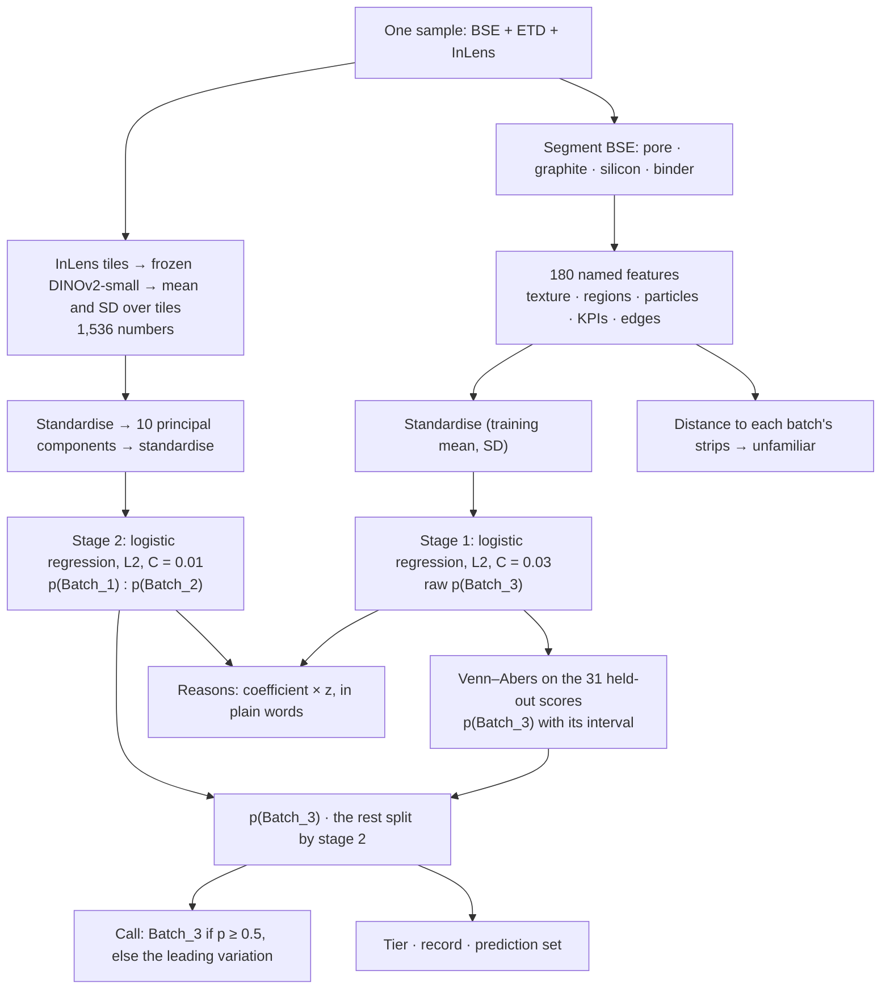
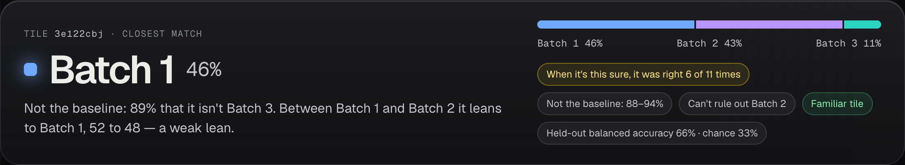
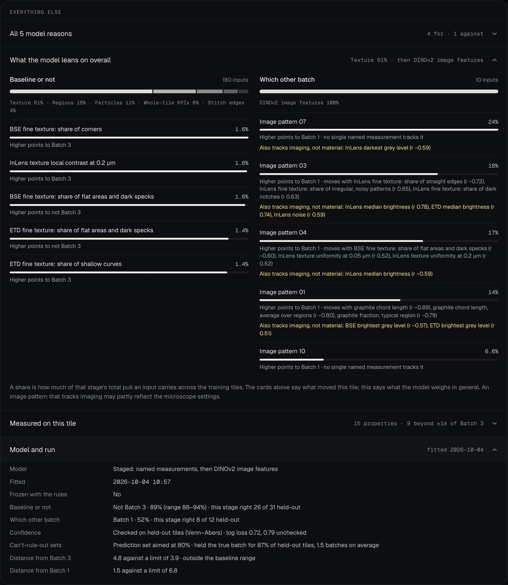

# The attribution model: input, preprocessing, architecture, output, results

Written 4 Oct 2026, after the model was unfrozen to adopt the T14 confidence methods and refitted (version v4.2). This is the full write-up of the model that sorts an unseen SEM image into Batch_1, Batch_2 or Batch_3 and says why. Every number here was reproduced on 4 Oct from the raw images; the commands are in §10.

The accept / investigate / reject verdict of the Compare page is a separate, purely statistical path (`qc/decide.py`). It does not use this model.

## 1. In short

- **Question.** "Is this image different from the baseline (Batch_3), and if so, in what way (Batch_1 or Batch_2)?" Every image always gets a batch.
- **Model.** Two small logistic regressions in sequence. Stage 1 decides "Batch_3 or not" from 180 named measurements. Stage 2 decides "Batch_1 or Batch_2" from 10 principal components of frozen DINOv2 image features. Nothing is fine-tuned; the only fitted numbers are 190 coefficients, their scalers and one projection.
- **Performance.** With whole strips held out: 22 of 31 images right, balanced accuracy 0.66 (chance 0.33, shuffled-label 95th percentile 0.51). "Batch_3 or not" is right for 26 of 31. "Batch_1 or Batch_2" is right for 8 of 12 and is not reliably separable. On 30 rehearsal draws of 9 unseen images: 0.66 on average, from 3 of 9 to 8 of 9.
- **Confidence.** Checked on held-out images: calls stated at 75% or more were right 9 of 9 times; 50–75%: 7 of 11; below 50%: 6 of 11. The model never says more than about 90%, because 31 images cannot support more.
- **What matters most.** For "Batch_3 or not": fine texture (61% of the weight), spread over many small inputs. For "Batch_1 or Batch_2": four image patterns carry 74% of the weight, and all four also track an imaging descriptor (brightness or black level), so part of that signal may be the microscope and not the material.
- **Changed on 4 Oct.** Only the confidence and the call rule. The classifier's coefficients are identical to the model frozen on 3 Oct (§8).
- **Ground truth of the 3 test samples (§12).** 1 of 3 exact, 3 of 3 on "Batch_3 or not", 3 of 3 inside the prediction set. Both misses were "Batch_1 or Batch_2" coin flips (52:48, 51:49), and both test images sit edge to edge between images of the other label on one continuous cross-section. No feature we built, including new ones, tells Batch_1 from Batch_2 in a way that holds up, so every "which variation" call is now marked **not established** and keeps both variations in its prediction set.

## 2. Input

| What | Detail |
|---|---|
| One sample | Three 8-bit TIFFs of the same field: `img_<id>_BSE.tif`, `img_<id>_ETD.tif` (or `_SE`), `img_<id>_InLens.tif`. They are loaded together and get one call |
| Size | About 7,000 px wide and 1,612 to 2,316 px tall, at 25 nm per pixel (from the TIFF `XResolution` tag): about 175 µm × 40–58 µm of electrode cross-section |
| What the detectors show | BSE: composition, silicon is bright. ETD: topography and edges. InLens: surface detail |
| Training set | 31 samples: Batch_1 7, Batch_2 7, Batch_3 17 (the baseline), cut from 13 physical strips. Strips 2080, 2148 and 2156 appear in more than one batch folder |
| Unseen so far | `Hackathon-Polaron-test`: 3 samples, true batches now known (§12). `Hackathon-Polaron-eval`: 6 samples, scored in §13 |
| Never an input | Strip id, image height or width, pixel size. `assert_no_leakage()` refuses any column whose name mentions them. The strip is only used to build held-out folds |

## 3. Preprocessing

Done per sample, with no parameter learned from other images.

| Step | What happens | Where |
|---|---|---|
| 1. Load | The RGB TIFF is reduced to its first channel. 8 columns are cropped on each side (stitch borders). The pixel size is read from the header | `qc/io.py` `load_image` |
| 2. Valid rows | The top and bottom 5% of rows are excluded from measurements (edge artefacts). They are measured apart as the `edge_` features | `qc/measure.py` `valid_rows` |
| 3. For segmentation (BSE) | Subtract the black level (0.5th percentile), clip at 0, average 2×2 pixels, Gaussian blur σ = 1 | `preprocess` |
| 4. For texture (all three detectors) | Every second pixel (50 nm), black level subtracted, valid rows only | `qc/features.py` `_work_channel` |
| 5. For DINOv2 (InLens only) | Stretch the 1st to 99th percentile to 0..1 (removes black-level and contrast differences between imaging sessions), average 2×2 pixels, cut into non-overlapping 224 px tiles (11.2 µm), repeat the grey image on three channels, apply the ImageNet mean and SD | `qc/deep.py` `stretch`, `tiles` |

There is no normalisation between images beyond steps 3 and 5, and no augmentation.

## 4. From image to model inputs

### 4.1 Segmentation (`qc/measure.py` `segment`)

1. Three-class multi-Otsu on the preprocessed BSE image, thresholds chosen per image: pore, graphite, silicon.
2. Thin bright rims along graphite edges (under 0.15 µm wide) are relabelled binder.
3. Silicon objects under 0.25 µm² become graphite.
4. Bright objects dimmer than 1.5× the graphite brightness become binder.
5. Silicon particles are split by a watershed at measure time (`label_si`); the mask itself stays pure phase codes.

Output: one phase mask per image (pore, graphite, silicon, binder, ignore). The segmentation has no hand labels to be scored against. It is checked for consistency: synthetic controls with a known answer (`qc/controls.py`) and threshold sensitivity (`qc/uncertainty.py`).

### 4.2 Named features: 180 inputs for stage 1 (`qc/features.py`)

| Family | Count | What it measures |
|---|---|---|
| `tex_` texture | 86 | Local binary patterns (8 neighbours, radius 1, 10 pattern classes) on each detector, and for BSE also inside graphite and inside silicon. Grey-level co-occurrence statistics (contrast, smoothness, uniformity, pattern regularity) at 0.05 and 0.2 µm, and horizontal against vertical |
| `reg_` regions | 52 | The image cut into about 15 µm tiles. Per tile: silicon, pore, graphite and binder fraction, silicon/graphite ratio, graphite and pore chord length. Summarised over tiles: mean, SD, CV, p10, p50, p90, top-to-bottom trend |
| `par_` particles | 21 | Silicon particle aggregates: size quantiles, brightness against graphite, internal voids, shape, particle-type shares |
| `kpi_` whole image | 15 | Silicon area fraction, D50, D90, internal void fraction, contrast ratio, fragment density, dispersion, apparent porosity, silicon/graphite ratio, agglomerate fraction, correlation length, graphite chord and anisotropy, pore chord and connectivity |
| `edge_` | 6 | Silicon fraction, pore fraction and brightness in the top and bottom 5% bands |

A sixth family, `img_` (24 imaging descriptors: black level, noise, sharpness, saturation, curtaining per detector), is computed but **kept out of the model**: it describes the microscope, not the material.

### 4.3 Deep features: 1,536 numbers for stage 2 (`qc/deep.py`)

1. Each InLens tile (45 to 60 per image) goes through `facebook/dinov2-small`, a ViT-S/14 with about 22 million weights, pinned to one revision, run on CPU. The weights are used as published.
2. Per tile: the CLS token (384 numbers) and the mean of the 256 patch tokens (384 numbers), concatenated to 768.
3. Per image: the mean and the SD of those 768 numbers over all tiles: 1,536 `deep_inlens_s2_*` columns.

## 5. The model, step by step (`qc/attribute.py`)



| Step | What | Detail |
|---|---|---|
| 1 | Usable inputs | A feature is kept if at least 80% of its values are finite and it varies |
| 2 | Standardise | Subtract the training mean, divide by the training SD. A missing value becomes 0 (the training mean) |
| 3 | **Stage 1: Batch_3 or not** | Logistic regression on the 180 named features, all 31 images, L2 penalty, classes weighted equally (`class_weight="balanced"`). Output: raw p(Batch_3) |
| 4 | Reduce the deep features | Standardise the 1,536 columns, project on the first 10 principal components (fitted on the 14 Batch_1 and Batch_2 images; they hold 89% of the variance), standardise again. The projection is stored in the model file |
| 5 | **Stage 2: Batch_1 or Batch_2** | Logistic regression on the 10 components, fitted on the 14 non-baseline images only, same penalty type and weighting. Output: p(Batch_1) against p(Batch_2) |
| 6 | Strength of the penalty | `C` is chosen per stage from {0.01, 0.03, 0.1, 0.3, 1} by an inner leave-one-strip-out loop; ties go to the stronger penalty. Chosen: 0.03 and 0.01, so both stages are heavily shrunk |
| 7 | **Calibrate stage 1** | Venn–Abers: isotonic regression of "is Batch_3" on the 31 held-out raw scores, with the two labels weighted equally. It is refitted with the new image added once as Batch_3 and once as not, which gives a range [p0, p1]; the stated probability is p1 / (1 − p0 + p1) |
| 8 | Combine | p(Batch_3) is the calibrated value. Batch_1 and Batch_2 share 1 − p(Batch_3) in the proportions of stage 2. No temperature |
| 9 | **The call** | Batch_3 if p(Batch_3) ≥ 0.5, else the more likely of Batch_1 and Batch_2 |
| 10 | Tier and record | high (≥ 0.75), medium (≥ 0.5), low, by the probability of the call. Each tier carries how often held-out calls in it were right |
| 10b | Is each stage established? | Each stage call carries its held-out `record` (right / n) and a one-sided binomial `p_value` against guessing; `established` if p < 0.05 (`ESTABLISHED_P`). "Batch_3 or not": 26 of 31, p = 0.0001, established. "Which variation": 8 of 12, p = 0.19, **not established**: the call gets a `note` saying it is a lean, not a finding, its tier is always low (in `predict` and in the held-out record `calibrate` stores), and its reasons are the "Batch_3 or not" stage's only: a coin flip is not given causes |
| 11 | Prediction set | The call plus every batch with p ≥ 1 − q̂; q̂ = 0.67 from the held-out scores, aimed at holding the true batch 8 times in 10. When "which variation" is not established, every variation is added: the model cannot rule out what it cannot tell apart |
| 12 | Familiarity | Root-mean-square z of the 180 named features against the strip means of the assigned batch. `unfamiliar` if it exceeds the largest distance that batch's own held-out images showed (Batch_1 6.8, Batch_2 1.8, Batch_3 3.9) |
| 13 | Reasons | Per stage, the largest coefficient × z contributions, each as a sentence |

The whole model is `config/attribution_model.json`: plain numbers, readable and hashed into provenance. Nothing is refit when an image is scored.

## 6. Output

One record per image in `out/attribution/<folder>.json`, served unchanged by the API and shown on the Identify page.

| Field | Meaning | Example (test sample `3e122cbj`) |
|---|---|---|
| `predicted` | The bet. Never empty | `Batch_1` |
| `p_Batch_1`, `p_Batch_2`, `p_Batch_3` | Calibrated probabilities | 0.46, 0.43, 0.11 |
| `confidence`, `confidence_raw` | Probability of the bet; the classifier's own value before calibration | 0.46, 0.51 |
| `confidence_tier`, `confidence_record` | Tier, and how often held-out calls in that tier were right | low, 6 of 11 |
| `stage_baseline` | "Different from the baseline?" with its confidence and the range the held-out images allow | not Batch_3, 0.89, range 0.89–0.94 |
| `stage_variation` | "In what way?" among the other batches, with its `record` and, when not established, a `note` | Batch_1, 0.52; 8 of 12, p = 0.19, not established |
| `prediction_set` | Batches that cannot be ruled out, the bet first | Batch_1, Batch_2 |
| `reasons` | Up to five, each with `feature`, `z`, `contribution`, `stage`, and a sentence in `text` | "BSE texture local contrast at 0.05 um: 5.6 SD above Batch_3" |
| `baseline_distance`, `outside_baseline`, `deviations` | Distance from Batch_3 and the features furthest from it | 4.8 against a limit of 3.9: outside |
| `predicted_distance`, `unfamiliar` | The same against the assigned batch | 1.5 against 6.8: familiar |

The file's `model` block repeats what a reader needs to judge the call: the held-out record (`calibration`) and what the model leans on overall (`importance`).

The three test samples, scored with this model (`results/Hackathon-Polaron-test.refit.json`):

| Sample | Bet | Confidence, tier (record) | Batch_3 or not (range) | Which variation | Cannot rule out | Unfamiliar | **Truth** |
|---|---|---|---|---|---|---|---|
| `3e122cbj` | Batch_1 | 0.46, low (6 of 11) | not Batch_3, 0.89 (0.89–0.94) | Batch_1, 52 to 48, not established | Batch_2 | no | **Batch_2** |
| `fn0mhxef` | Batch_2 | 0.46, low (6 of 11) | not Batch_3, 0.89 (0.89–0.94) | Batch_2, 51 to 49, not established | Batch_1 | yes | **Batch_1** |
| `xrv9xvzb` | Batch_3 | 0.91, high (9 of 9) | Batch_3, 0.91 (0.91–1.00) | – | – | no | Batch_3 |

The bets are the same as with the model frozen on 3 Oct (`results/Hackathon-Polaron-test.json`). The stated confidence is lower: 0.91 instead of 0.99, and 0.89 instead of 0.93–0.97 for "not Batch_3". The truth was given after the calls were committed; it is scored in §12 and `results/Hackathon-Polaron-test.ground-truth.json`. `results/Hackathon-Polaron-test.stage-records.json` is the same run with the stage records added (every number identical).

## 7. Results

### 7.1 How it is scored

- **Leave-one-strip-out.** Every fold holds out all images of one physical strip, in every batch folder. Scaling, the principal components and `C` are fitted inside the fold.
- **Null.** The same pipeline with batch labels shuffled across strip segments, 200 times. A score counts only above the 95th percentile of that null.
- **Calibration is held out too.** For the confidence record, each strip's images are calibrated with the other strips' points only.
- **Rehearsal.** 30 draws: hold out 9 images (3 per batch, whole strips where possible), refit everything on the other 22, score the 9.
- Balanced accuracy is the mean of the per-batch hit rates. Chance is 0.33.

### 7.2 Which inputs separate the batches (leave-one-strip-out, 31 images)

| Inputs | Balanced accuracy | Null, 95th percentile | Above the null |
|---|---|---|---|
| Whole-image KPIs (15) | 0.35 | 0.51 | no |
| Particles (21) | 0.23 | 0.55 | no |
| Regions (52) | 0.31 | 0.47 | no |
| Texture (86) | 0.45 | 0.51 | no |
| Edges (6) | 0.55 | 0.54 | barely |
| All named material features (180) | 0.45 | 0.49 | no |
| Imaging descriptors (24, not in the model) | 0.49 | 0.55 | no |
| DINOv2, one three-way model | 0.64 | 0.54 | yes |
| Texture, then DINOv2 (staged) | 0.63 | 0.49 | yes |
| **Named material, then DINOv2 (staged): the model** | **0.66** | **0.51** | **yes** |

Reading: silicon amount, particle sizes and porosity do not sort the three batches. The named features are useful for one question only, "Batch_3 or not". The pretrained image features are the only family above its null for the three-way question.

### 7.3 The model, held out

| | Batch_1 | Batch_2 | Batch_3 | Together |
|---|---|---|---|---|
| Right, 31 known images with strips held out | 3 of 7 | 5 of 7 | 14 of 17 | 22 of 31, balanced 0.66 |
| Right, rehearsal on unseen draws | 47% | 61% | 90% | 178 of 270, balanced 0.66 (SD 0.16, from 0.33 to 0.89) |

| Question | Right, held out |
|---|---|
| Batch_3 or not | 26 of 31 |
| Batch_1 or Batch_2, among true variations called a variation | 8 of 12 |

Confusion with strips held out (rows: true batch):

| | called Batch_1 | called Batch_2 | called Batch_3 |
|---|---|---|---|
| Batch_1 | 3 | 4 | 0 |
| Batch_2 | 0 | 5 | 2 |
| Batch_3 | 0 | 3 | 14 |

One rehearsal of nine images means little: single draws range from 3 of 9 to 8 of 9.

### 7.4 Confidence

| | 31 known images, held out | Rehearsal, 270 unseen calls |
|---|---|---|
| High tier (≥ 0.75) right | 9 of 9 | 56 of 58 |
| Medium tier (0.5–0.75) right | 7 of 11 | 25 of 52 |
| Low tier (< 0.5) right | 6 of 11 | 97 of 160 |
| Log loss, three-way (uncalibrated in brackets) | 0.72 (0.79) | 0.84 (0.77) |
| Prediction set holds the true batch | 87%, 1.5 batches on average | 95%, 2.1 batches on average |
| Mean width of the "Batch_3 or not" range | 0.20 | – |

Reading:

- A high-tier call can be trusted. All high-tier calls are Batch_3 calls.
- Medium and low do not separate in the rehearsal. There, medium is the weak Batch_3 calls and low is every Batch_1 or Batch_2 call, which is close to a coin flip with a lean.
- The prediction sets hold their promise (at least 80%) in both views.
- The stated probabilities stop near 0.9 (0.91 with all 31 points). With so few calibration points, nothing higher can be supported.

## 8. What changed on 4 Oct: unfreeze and T14

The classifier is unchanged: both logistic regressions have the same `C` and coefficients as the file under the `rules-frozen` tag (largest difference 0.0). What changed is how its output is turned into a call and a confidence.

| | Frozen 3 Oct | Now (v4.2) |
|---|---|---|
| Calibration | One temperature (1.42) on all three probabilities, fitted and reported on the same 31 points | Venn–Abers on "Batch_3 or not", labels weighted equally, with its interval. No temperature |
| Call | The largest of the three probabilities | Batch_3 if at least as likely as not, else the leading variation |
| Records (tiers, stages, sets) | In-sample | Held out: each strip calibrated by the other strips |
| Prediction-set coverage | Not reported | 87% held out, 1.5 batches |
| Model file | – | Adds the calibration points, `explain.importance`, `loso.classifier_balanced_accuracy` |

Why this variant, in numbers (`scripts/experiments/T14_adoption.py`; full table in [experiments/T14.md](experiments/T14.md), "Adoption"):

| | Known 31, held out | Rehearsal, 270 unseen calls |
|---|---|---|
| Frozen 3 Oct | 22 of 31, log loss 0.95 | 153, balanced 0.57, log loss 0.79 |
| T14 as recorded (Venn–Abers, unweighted) with the old call rule | 20 of 31, log loss 0.74 | 135, balanced 0.50, log loss 0.92 |
| **Adopted** | 22 of 31, log loss 0.72 | 178, balanced 0.66, log loss 0.84 |

What the check found, beyond the T14 record:

1. **Dropping the temperature is right** in both views.
2. **Venn–Abers as recorded would have hurt.** It was tested by holding out one image and never on unseen images. On unseen draws it called middling images Batch_3 and was wrong three times in four, because it carries the training mix (mostly Batch_3) into every call. Weighting the two labels equally repairs most of that.
3. **Calibrated probabilities need the staged call rule.** Most of the rehearsal gain (0.57 to 0.66) comes from this rule, not from the calibration.
4. **Costs.** On unseen draws the log loss is a little worse than with no calibration at all (0.84 against 0.77), because clear calls are capped near 0.9. The medium tier is weak in the rehearsal (25 of 52).
5. **Selection caveat.** Six variants were compared on the same 31 images. One or two images either way is noise; the rehearsal difference is the result that carries the decision.

Not adopted from T14: the MAP prior in place of the `C` grid. It needs a temperature, and it would change the classifier itself.

**The `rules-frozen` tag has not been moved.** It also locks `config/decision.yaml` and the default baseline in the app, so moving it needs both owners. Until it moves, the app correctly says "model differs from the frozen one". To refreeze: `git tag -f rules-frozen <commit of the new model> && git push -f origin rules-frozen`.

## 9. Explainability

### 9.1 What every call explains (per image)

| What | Where in the app (Identify) |
|---|---|
| The two questions, each with its own confidence, and the range of the first | Answer card: sentence and "Not the baseline: 88–94%" chip |
| How far to trust it: "when it's this sure, it was right n of m times" | Answer card chip |
| What cannot be ruled out | Answer card chip, with the held-out coverage on hover |
| Familiar or unfamiliar, with distance and limit | Answer card chip and warning banner |
| Up to three reasons, each against Batch_3's ±1σ and ±2σ band | "Look here first" cards |
| All reasons with their weight, for and against; image patterns translated into the named measurements they move with | "All model reasons" |
| The 15 measured properties of the tile against the baseline | "Measured on this tile" |
| The largest silicon particles at their real positions, with a magnified crop | Spots on the image |

A reason is exact, not an approximation: the model is linear, so coefficient × z is the feature's contribution to the log-odds of its stage.



### 9.2 What the model leans on overall (new on 4 Oct)

`explain.importance` in the model file, shown as "What the model leans on overall": per input, its mean |coefficient × z| over the stage's training images as a share of the stage's total.



**Stage 1, Batch_3 or not (180 inputs).**

| Family | Share of the weight |
|---|---|
| Texture | 61% |
| Regions | 18% |
| Particles | 11% |
| Whole-image KPIs | 6% |
| Edges | 4% |

No single input carries more than 1.6%. The eight heaviest:

| Input | Share | A higher value points to |
|---|---|---|
| BSE fine texture: share of corners | 1.6% | Batch_3 |
| InLens texture local contrast at 0.2 µm | 1.6% | Batch_3 |
| BSE fine texture: share of flat areas and dark specks | 1.6% | not Batch_3 |
| ETD fine texture: share of flat areas and dark specks | 1.4% | not Batch_3 |
| ETD fine texture: share of shallow curves | 1.4% | Batch_3 |
| Binder fraction, top-to-bottom trend | 1.4% | not Batch_3 |
| BSE fine texture: share of dark notches | 1.4% | Batch_3 |
| InLens texture uniformity, horizontal against vertical | 1.4% | not Batch_3 |

**Stage 2, Batch_1 or Batch_2 (10 image patterns).**

| Image pattern | Share | Higher points to | Named measurements it moves with (r) | Imaging it also tracks (r) |
|---|---|---|---|---|
| 07 | 24% | Batch_1 | none | InLens darkest grey level (−0.59) |
| 03 | 18% | Batch_1 | InLens straight edges (−0.72), noisy patterns (0.65), dark notches (0.63) | InLens median brightness (0.78), ETD median brightness (0.74), InLens noise (0.59) |
| 04 | 17% | Batch_1 | BSE flat areas and dark specks (−0.60), InLens uniformity at 0.05 and 0.2 µm (0.52) | InLens median brightness (−0.59) |
| 01 | 14% | Batch_1 | Graphite chord length (−0.89), graphite fraction (−0.79) | BSE and ETD brightest grey level (−0.57, 0.51) |
| 10 | 7% | Batch_1 | none | none |
| 05 | 6% | Batch_1 | none | InLens saturated share (−0.59) |
| 02 | 6% | Batch_2 | Pore chord length (0.70) | none |
| 08, 06, 09 | 7% together | – | – | – |

Reading:

- 56% of stage 2's weight is on patterns that can be named in material terms (01, 02, 03, 04, 09). The rest, led by pattern 07, has no named translation.
- Five of the six heaviest patterns also move with an imaging descriptor (brightness, black level, saturation). The percentile stretch before DINOv2 reduces such differences but does not remove them. A Batch_1 or Batch_2 call is therefore a lean, and it is stated as one.

### 9.3 Which single features separate the batches best

Each feature alone, on strip means, with one strip held out (`rank_features`, in `out/attribution/feature_ranking.csv`):

| Feature | Held-out accuracy alone | Batch_1 | Batch_2 | Batch_3 |
|---|---|---|---|---|
| ETD fine texture: share of shallow curves | 0.79 | 0.059 | 0.059 | 0.062 |
| BSE fine texture: share of shallow curves | 0.74 | 0.053 | 0.054 | 0.055 |
| ETD texture uniformity at 0.05 µm | 0.69 | 0.122 | 0.124 | 0.131 |
| ETD texture uniformity at 0.2 µm | 0.64 | 0.112 | 0.114 | 0.120 |
| ETD texture smoothness at 0.05 µm | 0.64 | 0.437 | 0.446 | 0.475 |
| InLens texture uniformity at 0.2 µm | 0.64 | 0.089 | 0.087 | 0.130 |
| ETD fine texture: share of soft corners | 0.64 | 0.063 | 0.065 | 0.070 |

All of the top twelve are texture features, and in most of them Batch_3 stands apart while Batch_1 and Batch_2 sit together. That is the same picture as the model: Batch_3 has a smoother, more uniform fine texture; nothing named separates Batch_1 from Batch_2.

For the materials reading, the whole-image means differ less than the texture does: silicon area 8.3 / 5.7 / 6.2%, silicon D50 4.4 / 4.0 / 3.7 µm, apparent porosity 8.8 / 9.9 / 10.7% (Batch_1 / Batch_2 / Batch_3).

### 9.4 What is not explained yet

- **Where in the image.** There is no heatmap. The reasons are about the whole image. Tile-level maps exist only in the open experiment branches (T11, T12).
- **Pattern 07 and the other untranslated patterns** (44% of stage 2) read "no single named measurement tracks it".
- **Per-reason imaging caveats.** The imaging note is shown in the overall panel, not yet on each reason card. The open T4 branch adds that wording.

## 10. Running it end to end

```bash
uv sync
uv run python -m qc.features data/Batch_1 data/Batch_2 data/Batch_3     # 31 images, about 5.5 min
uv run python -m qc.deep data/Batch_1 data/Batch_2 data/Batch_3         # DINOv2 on CPU, about 1.5 min
uv run python -m qc.attribute --evaluate                                # families against their nulls
uv run python -m qc.attribute --dry-run --repeats 30 --staged reg,edge,tex,par,kpi:deep   # rehearsal, about 2 min
uv run python -m qc.attribute --fit --staged reg,edge,tex,par,kpi:deep  # writes config/attribution_model.json
uv run python -m qc.attribute --images data/<folder>                    # about 13 s per sample
PYTHONPATH=. uv run python scripts/experiments/T14_adoption.py          # the calibration check of §8, about 2 min
uv run uvicorn qc.api:app --reload                                      # API
cd web && npm run dev                                                   # app: Identify tile
```

Name the three known batch folders when building the feature table: a bare `qc.features` takes every folder in `data/`, including the test folder.

Checked on 4 Oct, from the raw images:

| Check | Result |
|---|---|
| Feature table rebuilt from the TIFFs | Matches the 3 Oct table to 5 × 10⁻⁶ |
| Refit | Coefficients identical to the frozen file; only calibration and explain blocks differ |
| `uv run pytest` | Passes |
| `cd web && npm run build` | Passes |
| App, Identify: upload three TIFFs of one sample | Result in 17 s; answer, reasons, overall panel, model fold all render |
| App, Compare (Batch_1 against Batch_3) | Unaffected; renders from freshly measured evidence |
| Three test samples | Same bets as on 3 Oct |

## 11. Limits

- **31 images.** Batch_1 and Batch_2 have 7 each, from 6 strips. Every number above moves by several points if one image changes sides.
- **Batch_1 against Batch_2 is not established.** 8 of 12 held out (p = 0.19 against guessing), 0 of 2 on the test samples. Five strips hold both labels, sometimes on neighbouring fields of one continuous cross-section (§12), so the batches may not differ in anything these images show. The app says so on every such call.
- **Batch_1 is the weak class** (3 of 7). Strip 2316 looks like nothing else, and it holds a Batch_2 image too (§12).
- **Microscope or material.** Batch_3 was imaged with a different InLens black level, and the image patterns of stage 2 track brightness (§9.2). Open experiment branches (T1, T9) report that the attribution signal is sensitive to imaging differences. Treat "why" statements about stage 2 with that in mind.
- **Segmentation is unvalidated** against hand labels. Deviations from the baseline cancel a constant bias, but only if imaging is the same across batches.
- **The calibration was chosen on the data it is scored on** (§8).
- **Class mix.** The calibration assumes an unseen image is as likely to be the baseline as not. If the unseen images are mostly one batch, the probabilities shift, the ranking does not.

## 12. Ground truth of the three test samples (4 Oct, afternoon)

The organisers gave the true batches after the calls were committed. Full analysis: [experiments/T18.md](experiments/T18.md). Not pre-registered; the classifier was not changed.

| | Right |
|---|---|
| Exact batch | 1 of 3 (`xrv9xvzb`) |
| Batch_3 or not | 3 of 3 |
| Truth inside the prediction set | 3 of 3 |
| Batch_1 or Batch_2 | 0 of 2: both swapped, both called at 52:48 and 51:49, both low tier |

**Why the two misses.** Each test image shares height, pixel size and continuous edge content with a known strip ([T18_strips.png](experiments/T18_strips.png)). `3e122cbj` (Batch_2) sits between two Batch_1 images on strip 2316; `fn0mhxef` (Batch_1) sits next to a Batch_2 image on strip 2048. In training each of those strips carried one label, and stage 2 reads the look of the strip, so it called each tile by its strip. Five strips now hold both Batch_1 and Batch_2.

**Is there a better feature?** Tried on the 34 labelled images (T18 §3–4): DINOv2 on BSE and ETD tiles, tile quantiles, a 7-octave power spectrum on all three detectors, acquisition forensics, and the existing families, each across strips and inside the five mixed strips. None separates the batches across strips (best 0.62 against a null p95 of 0.75). Inside the mixed strips one InLens DINOv2 direction puts the Batch_1 image on the same side in 5 of 5 strips (p = 0.03 uncorrected, best of nine tries after the truth was known, about 0.25 corrected), and it moves with detector brightness. Not adopted; it is the first thing to test on new labelled strips.

**What the model now says.** "Which variation" is marked not established on every call (8 of 12 held out, p = 0.19), with a `note`, both variations in the prediction set, and "Which variation: not established" on the Identify page. For a QC decision the established part is "Batch_3 or not" (26 of 31; 29 of 34 with the test samples). Attribution to Batch_1 or Batch_2 should not be used to pick a root cause.

## 13. The eval folder (4 Oct, evening)

`HF_HUB_OFFLINE=1 uv run python -m qc.attribute --images data/Hackathon-Polaron-eval` on `main` at `7fb7c34`, nothing refit. Output committed unchanged: `results/Hackathon-Polaron-eval.json`. Explanations per image are in [SUBMISSION.md](SUBMISSION.md) §5.4.

| Sample | Bet | Confidence, tier (record) | Batch_1 / Batch_2 / Batch_3 | Batch_3 or not (range) | Cannot rule out | Unfamiliar |
|---|---|---|---|---|---|---|
| `0eryguqq` | Batch_3 | 0.86, high (9 of 9) | 6.4 / 7.3 / 86.3% | Batch_3, 0.86 (0.84–1.00) | – | no |
| `fhwrjtet` | Batch_3 | 0.86, high (9 of 9) | 6.6 / 7.1 / 86.3% | Batch_3, 0.86 (0.84–1.00) | – | no |
| `4hq27w4c` | Batch_1 | 0.45, low (6 of 11) | 45.2 / 43.9 / 10.9% | not Batch_3, 0.89 (0.89–0.94) | Batch_2 | no |
| `fspqbkxl` | Batch_2 | 0.47, low (6 of 11) | 42.3 / 46.8 / 10.9% | not Batch_3, 0.89 (0.89–0.94) | Batch_1 | no |
| `soo2ax3r` | Batch_2 | 0.42, low (6 of 11) | 40.2 / 41.7 / 18.0% | not Batch_3, 0.82 (0.79–0.94) | Batch_1 | no |
| `y59rxmxl` | Batch_1 | 0.46, low (6 of 11) | 46.0 / 43.1 / 10.9% | not Batch_3, 0.89 (0.89–0.94) | Batch_2 | no |

**Robustness check (post-hoc, scripts not committed).** The six eval and three test samples were also scored under noise σ = 5, blur σ = 1 px, gain +20%, InLens shading and a horizontal flip (T1's perturbations), and with T8's arm-(b) augmented staged model fitted on all 31 images.

- The augmented model gives the same bet on all nine samples.
- In this model, blur moves every "not Batch_3" sample to 0.91 Batch_3; the other four perturbations change no "Batch_3 or not" answer. The augmented model changes none.
- The augmented model is more confident on the two wrong test calls (0.61, 0.60 against 0.46) and has no calibration or stage cap, so it was not adopted. See [SUBMISSION.md](SUBMISSION.md) §4.1.
