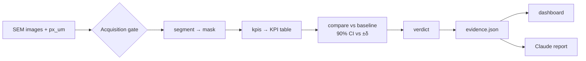

# Track 4 · Batch QC for electrode microstructure: Plan v0

> [!NOTE]
> **v0: starting material, not a spec.** Written on the morning of Day 1, before we'd seen the data. Everything here is a default to override once we look at the images or talk to the Polaron mentors. Edit freely, delete what turns out to be wrong.

---

## 1. The brief (Polaron, Track 4)

> Can you detect when a supplier's material has changed before it becomes a manufacturing problem? Using electron microscopy images, build a trustworthy, interpretable, uncertainty-aware QC system that compares incoming batches against an approved baseline: detect whether a batch has meaningfully changed, quantify what's driving the difference, and explain the verdict (accept / investigate / reject) to a materials expert.

- **Data:** a baseline batch plus several incoming batches (a mix of acceptable and defective variation). A brand-new unseen batch drops ~8 hours into Day 1 (~17:00) to test generalisation.
- **Track judged on:** quality of extracted material KPIs, accuracy on the new batch, interpretability, honest handling of uncertainty, real-world usability for a QC decision.
- **Overall judging:** 5 × 20 points: Technicality, Creativity, Usefulness, Demo, Track/sponsor alignment.
- **Submission:** 2-minute demo video, GitHub repo, short description. Round 1 is 5 minutes per team, including a 1:30 pitch (problem, approach, high-level schematic).

## 2. Our angle (one line)

**Polaron measures; we decide.** Polaron already sells segmentation, KPIs and an image-level trust score. We build the **decision layer** on top: treat QC as an **equivalence test against the baseline**, so accept / investigate / reject come straight out of the statistics, with error bars and an audit trail.

What Polaron already ships (so we don't pitch it as novel):
- Segmentation of pore / single-crystal NMC / polycrystalline NMC / crack in cross-sections, benchmarked against experts (8 h → <5 min per sample).
- **"Coherence"**: a deep-feature similarity score flagging images unfamiliar to the segmenter. Clusters of low coherence = drift signal.
- Messaging: "objective acceptance criteria from microstructure metrics", "drift detection and batch-to-batch comparability", "traceable evidence". Reuse their vocabulary in the pitch.

---

## 3. The core: what actually matters

Five things map directly onto the judging. Everything else is an upgrade to one of them.

1. **Masks:** segment each image into phases (start pore vs. solid; later active material, binder, crack).
2. **KPIs per image:** 3–5 numbers an expert recognises: porosity, median particle size (µm), interface length per area, later crack fraction.
3. **Comparison with error bars:** per KPI, batch − baseline difference with a confidence interval. Unit = image, not pixel or patch.
4. **Verdict rule:** CIs → accept / investigate / reject.
5. **Explanation page:** verdict, which KPIs drove it, baseline vs. batch images side by side.



### Verdict rule (v0)

| KPI status | Condition |
|---|---|
| pass | 90% CI of (batch − baseline) entirely inside ±δ |
| fail | 90% CI entirely outside ±δ |
| uncertain | CI straddles δ |

| Batch verdict | Condition |
|---|---|
| **REJECT** | any KPI fails (and gate/trust checks pass) |
| **INVESTIGATE** | any KPI uncertain, OR gate fails, OR anomaly map fires with no KPI explaining it. Say "image ~N more fields to resolve" |
| **ACCEPT** | every critical KPI passes |

v0 margin: **δ = 1.5 × baseline image-to-image SD** (borrowed from the FDA's equivalence-testing default for comparing batches). Placeholder until we calibrate (see §7).

---

## 4. Interface contract (agree in the first 30 min)

Think of it as an API between two services. **ML side** = image in → numbers out. **Backend side** = numbers in → verdict out. Keep the boundary stable and each side can rewrite its internals freely.

```python
# qc/segment.py  (ML owns)
def segment(img: np.ndarray, px_um: float) -> np.ndarray:
    """img: 2D greyscale (H, W). Returns int mask (H, W) using LABELS."""

# qc/kpis.py  (ML owns)
def kpis(mask: np.ndarray, px_um: float) -> dict[str, float]:
    """Never raises. Returns NaN for anything it can't compute."""

# qc/stats.py  (Backend owns)
def compare(baseline: pd.DataFrame, batch: pd.DataFrame, cfg: dict) -> Evidence:
    """Pure stats on KPI tables. No images."""
```

**To agree (fill in after looking at the data):**

- [ ] Label codes. v0: `0 = pore, 1 = active material, 2 = carbon-binder (CBD), 3 = crack`
- [ ] KPI names and units: fractions as 0–1 (not %), sizes in µm
- [ ] Where `px_um` comes from (TIFF metadata?) and the fallback if missing
- [ ] Folder layout (below)
- [ ] `kpis()` never crashes, returns NaN on failure

**KPI table:** one row per image; this is the real handoff:

| batch | image_id | porosity | d50_um | crack_frac |
|---|---|---|---|---|
| baseline | b_01 | 0.31 | 8.4 | 0.010 |
| baseline | b_02 | 0.29 | 8.1 | 0.012 |
| batch_C | c_01 | 0.24 | 7.2 | 0.031 |

**Evidence JSON:** the only thing the dashboard and Claude read:

```json
{
  "batch": "batch_C",
  "verdict": "REJECT",
  "kpis": [
    {"name": "porosity", "unit": "fraction",
     "baseline_mean": 0.30, "batch_mean": 0.24, "diff": -0.06,
     "ci90": [-0.08, -0.04], "margin": 0.03, "status": "fail"}
  ],
  "n_images": {"baseline": 20, "batch": 12},
  "gate": {"ok": true, "warnings": []},
  "config_version": "v0"
}
```

**Folder layout (v0):**

```
data/<batch>/*.tif            # raw images (not committed)
out/masks/<batch>/*.png       # saved masks, for eyeballing
out/kpis.csv                  # the KPI table
out/evidence/<batch>.json     # one per batch
config/decision.yaml          # margins δ, CI level. Freeze + git tag before 16:30
qc/  io.py gate.py segment.py kpis.py stats.py verdict.py report.py schema.py
app.py                        # Streamlit dashboard
modal_app.py                  # GPU features, sweeps, run-a-batch
notebooks/                    # ML sandbox
tests/                        # golden tests
```

Stub so the backend side is unblocked immediately:

```python
import numpy as np
from skimage.filters import threshold_otsu

def segment(img, px_um):
    return (img > threshold_otsu(img)).astype(np.uint8)  # 0 = pore, 1 = solid

def kpis(mask, px_um):
    return {"porosity": float((mask == 0).mean())}
```

---

## 5. First end-to-end slice (target: ~13:00)

**Goal:** one command takes a batch folder and produces a verdict page, on every batch, with no manual steps.

1. **Load:** read baseline + batch TIFFs with `tifffile`, get `px_um` from metadata.
2. **Segment:** Otsu threshold → pore vs. solid. Crude but real.
3. **KPIs:** porosity; median particle size (distance transform + watershed, scikit-image); perimeter per area.
4. **Compare:** per KPI, bootstrap 90% CI on (batch mean − baseline mean) over images. δ = 1.5 × baseline SD.
5. **Verdict:** rule from §3.
6. **Output:** `evidence.json` + Streamlit page with:
   - verdict card
   - **forest plot** of each KPI's difference ± CI against the ±δ band (the money chart)
   - 2 baseline + 2 batch images with mask overlays
7. **Evaluate:** run all incoming batches → table of our verdict vs. known label.

**Golden tests:**
- Baseline split in half vs. itself → must **ACCEPT**.
- Baseline masks with pores eroded → must **REJECT**.

**Definition of done:** `python -m qc.run --batch data/<x>` works for every batch and the eval table prints.

---

## 6. Division of work

| | Backend / agent engineer | ML engineer |
|---|---|---|
| **Hour 1** | Repo (uv, pyproject), loader, metadata reading, folder layout, fake `kpis.csv` | Look at the data. Decide which phases and KPIs are physically meaningful. Ask mentors the data questions |
| **Slice 1** | `compare`, verdict rule, evidence schema, Streamlit page, eval table, golden tests | Real `segment` + `kpis`, eyeballing masks |
| **After slice** | Acquisition gate, Claude report + number check, zero-touch new-batch runner, Modal | Better segmentation (random forest on DINO features), crack class, segmentation uncertainty, margins δ |

**Sync points**
- **~11:00:** contract test: real `kpis()` output flows through `compare()`.
- **~13:00:** slice 1 demo to each other.
- **~16:00:** dry run: treat one incoming batch as "unseen", run zero-touch, fix anything manual.
- **~16:30:** freeze `config/decision.yaml`, `git tag rules-frozen`. This is our pre-registration.
- **~17:00:** unseen batch drops → run, don't tune.
- **Evening / Day 2:** one ambitious item, demo video draft Day 1 night, pitch rehearsal.

### First steps checklist

**Both (first 30 min)**
- [ ] Open the data: count images per batch, look at 3 images per batch side by side
- [ ] Check: same magnification? same detector? same brightness/contrast?
- [ ] Agree the contract (§4)
- [ ] Ask the mentors (below)

**Backend**
- [ ] `uv init`, Python 3.11, push skeleton
- [ ] `qc/io.py`: load TIFFs + `px_um`
- [ ] Hand-write a fake `out/kpis.csv`; build `compare` + verdict + eval against it
- [ ] Streamlit page reading `evidence.json`

**ML**
- [ ] Decide phases + label codes
- [ ] Threshold `segment`, first `kpis`, save mask PNGs to `out/masks/`
- [ ] Sanity-check porosity values against what the images look like

### Questions for the Polaron mentors

- Cross-sections or top-down? SE or BSE detector? Pixel size? Is metadata in the TIFFs?
- Are the incoming batches labelled, and do labels say *what* changed?
- Which KPIs and tolerances do their customers actually specify?
- Is the unseen batch scored on the verdict alone? Does INVESTIGATE count as correct on borderline cases?

---

## 7. Upgrades after the slice (rough priority)

1. **Better segmentation + crack KPI.** Scribble labels → random forest on DINOv2 + classical features (the Polaron lab's own approach). Directly drives "quality of KPIs".
2. **Calibrate margins.** Treat known-acceptable batches as extra reference lots. Ask mentors for real tolerances. Don't tune δ until every known batch is right; with this few batches that's overfitting.
3. **Honest uncertainty.**
   - Hierarchical bootstrap (image is the unit).
   - Segmentation uncertainty (perturb threshold / use random-forest probabilities).
   - "Image ~N more fields to resolve this".
4. **Acquisition gate.** Magnification / detector / contrast mismatch → INVESTIGATE, not a fake material change.
5. **Claude explanation**, written only from `evidence.json`.
   - Every number in the text checked against the JSON.
   - Root causes framed as ranked hypotheses (e.g. lower porosity + more cracks → calendering; PSD shift → powder change).
6. **Anomaly heatmap** (AnomalyDINO-style: baseline patch features as a memory bank, nearest-neighbour distance per patch) for changes no KPI captures.
7. **Modal + side challenges** (§9).

### Ideas evaluated

**Brightness/contrast augmentation: yes, for the segmenter.**
- SEM "lighting" = brightness/contrast/detector/noise/focus. Polaron's trust blog shows segmentation accuracy falling as contrast moves from training conditions, and recovering when trained on several contrast levels.
- Augment **imaging only**: brightness/contrast, gamma, noise, mild blur, flips. **Never scale** (changes size KPIs), elastic warp (changes shapes) or strong blur (erases cracks).
- Prefer augmentation over histogram-matching to the baseline: matching biases masks when a batch genuinely has more/fewer pores.
- **Demo asset:** robustness curve, KPI drift vs. synthetic contrast change (−50%…+50%), before vs. after augmentation.
- Gate should still *report* acquisition changes; a contrast-shifted baseline should read "imaging changed, material unchanged".

**VLM image → text: not for measurement.**
- VLMs can't give porosity to ±1 point or D50 in µm. Benchmarks show weak spatial reasoning on materials images. It also contradicts Polaron's pitch (replacing qualitative judgement with numbers).
- Calibrating it against our own KPIs just reproduces the pipeline, worse.
- **Optional, late uses:**
  - describe the top anomaly crop vs. a baseline crop (labelled as a qualitative observation, crops shown)
  - name *why* a gated image looks odd (charging, defocus, wrong region) → INVESTIGATE
- Validate on ~20 hand-labelled images; use agreement across 5 samples as confidence.

---

## 8. Ambitious options (pick at most one)

- **Minimum-detectable-change curves (best wow/risk).**
  - Inject controlled changes into baseline masks (erode pores, rescale particles, add synthetic cracks).
  - Rerun the pipeline hundreds of times on Modal.
  - Claim: "we detect a 2-point porosity shift with 95% power from 15 images". That's method validation, what a QC lead asks for.
- **Process-axis embedding:** use those synthetic shifts as directions in feature space; describe a new batch as "looks like over-calendering".
- **3D reconstruction + TauFactor:** performance cost of a change. Risky: anisotropy, no orthogonal views likely.
- **Agentic investigator:** on INVESTIGATE, an agent queries KPIs, heatmaps and exemplar images, leaves an audit trail.

## 9. Side challenges

- **Devin** (reproduce a paper result, then push past it): reproduce **ImageRep** (single-image phase-fraction CI, from Polaron's founders' lab).
  - Push past it: a two-batch version (detectable difference vs. number of images), or folding in segmentation uncertainty.
  - Give Devin its **own repo/branch**; start it Day 1 morning.
- **Modal:** real load, not decoration.
  - GPU feature extraction (an L4 is plenty for DINOv2-base)
  - `.map()` for perturbation sweeps
  - Volume for data + cached features (key by image hash)
  - `modal run modal_app.py --batch X` for the zero-touch run
  - `modal deploy` for the dashboard
- **AMASS:** life-science data layers; weak fit for battery materials. Don't force it.

---

## 10. What will bite us

- **Only one baseline batch.** We see within-batch spread but not normal lot-to-lot spread → too strict → false rejects. Use acceptable batches as extra reference.
- **Pseudoreplication.** Patches from one image aren't independent. Image = unit; hierarchical bootstrap.
- **Imaging vs. material change.** Contrast shifts break segmentation; blind normalisation can erase real contrast. Gate and report.
- **Pixels vs. µm.** Always convert sizes using `px_um`.
- **Overfitting to a few labelled batches.** No supervised batch classifier. Freeze rules before the drop. A new failure mode should land as INVESTIGATE.
- **Overclaiming.** 2D cross-sections don't give tortuosity. 2D particle sizes are "apparent". The LLM never states a number that isn't in the evidence.

---

## 11. Tech stack (keep it boring)

- **Python 3.11**, **uv**, one `pyproject.toml` + `uv.lock`. Modal image built from the same lock.
- **I/O and image ops:** `tifffile`, `scikit-image`, `scipy.ndimage`.
- **Features:** DINOv2 via HF `transformers` (`facebook/dinov2-small` / `-base`). Ungated; Polaron-lab tools (HR-Dv2, vulture) target it. DINOv3 is gated; don't depend on it.
- **Segmentation:** `scikit-learn` random forest first; `segmentation_models_pytorch` U-Net only if time.
- **Microstructure metrics:** `porespy` (two-point correlation, local thickness, pore sizes); ImageRep vendored from GitHub (not on PyPI as far as we found).
- **Stats:** numpy/scipy, a hand-written hierarchical bootstrap (~20 lines). TOST = "is the 90% CI inside ±δ".
- **Schema:** `pydantic` → JSON; pandas/parquet for KPI tables.
- **LLM:** `anthropic` SDK directly, structured outputs. `claude-sonnet-5-5` while iterating, `claude-opus-5-5` for final reports.
- **UI:** Streamlit + plotly, served from Modal.
- **Skip:** LangChain/agent frameworks, React, databases, local Docker, Detectron/mmseg, training from scratch.

---

## 12. Glossary (the 18 that matter)

**Material**

| Term | Meaning |
|---|---|
| Phase | One kind of material in the image (pore, active material, binder, crack). Every pixel belongs to one |
| Active material | Particles that store lithium (NMC in cathodes, graphite in anodes). Bright, roundish blobs |
| Carbon-binder domain (CBD) | Grey glue + conductive carbon between particles |
| Porosity | Share of the image that is pore. Key electrode KPI, typically ~25–40% |
| PSD / D50 | Particle size distribution / its median. In 2D it's an "apparent" size, smaller than true 3D |
| Crack (intra-particle) | Break inside a particle. Precursor to capacity loss; common sign of overpressing |
| Calendering | Pressing the electrode between rollers. Too much → lower porosity + more cracks |
| Formulation | Recipe ratio of active material : binder : carbon. A change shifts phase fractions |

**Images**

| Term | Meaning |
|---|---|
| Segmentation | Labelling every pixel with its phase. All KPIs come from it |
| Phase fraction | Share of pixels in a phase. In 2D, a fair estimate of 3D volume fraction |
| Pixel size (µm/px) | Converts pixels to real units. Different magnification + no conversion = meaningless sizes |
| BSE vs. SE detector | BSE brightness ∝ composition (heavier = brighter); SE ∝ surface shape. Detector change ≠ material change |
| Artefact | Feature caused by sample prep/imaging (charging glow, smeared binder, prep cracks), not the material |
| Representativity | Is the image big enough for its KPI to reflect the whole material? Small images → noisy KPIs |

**Decision**

| Term | Meaning |
|---|---|
| Equivalence test (TOST) | "Is the difference smaller than what matters?" Equivalent if 90% CI is inside ±δ |
| Margin δ | Largest difference that doesn't matter in practice. A domain decision; ask mentors |
| Lot-to-lot variation | Normal spread between good batches. Invisible with one baseline → we'll be too strict |
| Pseudoreplication | Treating non-independent samples (patches from one image) as independent → overconfidence |

---

## 13. References

**Polaron**
- [Polaron homepage](https://www.polaron.ai/) · [Quality and Qualification](https://www.polaron.ai/applications/quality-and-qualification)
- [Trust in Microstructure Quantification (coherence, contrast robustness)](https://www.polaron.ai/newsroom/trust-in-microstructure-quantification)
- [Quantifying cracks for supplier qualification](https://www.polaron.ai/newsroom/quantifying-cracks)

**Tools from the Polaron founders' lab (tldr-group, Imperial)**
- [ImageRep: phase-fraction CI from a single image](https://github.com/tldr-group/ImageRep) · [paper](https://advanced.onlinelibrary.wiley.com/doi/10.1002/advs.202414149)
- [HR-Dv2: upsampled DINOv2 features for materials segmentation](https://github.com/tldr-group/HR-Dv2) · [paper](https://arxiv.org/abs/2410.19836)
- [SAMBA: scribble-based trainable segmentation](https://arxiv.org/abs/2312.04197)
- [TauFactor 2: GPU tortuosity](https://joss.theoj.org/papers/10.21105/joss.05358)
- [Kench et al., battery electrode design with generative AI (Matter)](https://www.cell.com/matter/fulltext/S2590-2385(24)00446-6)

**Methods**
- [AnomalyDINO: patch nearest-neighbour anomaly detection](https://arxiv.org/abs/2405.14529)
- [Failing Loudly: detecting dataset shift](http://papers.neurips.cc/paper/8420-failing-loudly-an-empirical-study-of-methods-for-detecting-dataset-shift.pdf)
- [FDA approach to analytical similarity (1.5σ equivalence margin)](https://journal.pda.org/content/early/2016/06/18/pdajpst.2016.006551)
- [PoreSpy metrics](https://porespy.org/_examples/metrics/reference.html)
- [Limits of multimodal LLMs for chemistry/materials (MaCBench)](https://www.nature.com/articles/s43588-025-00836-3)

**Domain**
- [Calendering density and NMC811 single vs. poly crystal cracking](https://iopscience.iop.org/article/10.1149/1945-7111/ad6378)

**Infra**
- [Modal: Streamlit example](https://github.com/modal-labs/modal-examples/blob/main/10_integrations/streamlit/serve_streamlit.py) · [Modal web functions](https://modal.com/docs/guide/webhooks)
- [Claude API: structured outputs](https://docs.claude.com/en/docs/build-with-claude/structured-outputs)
