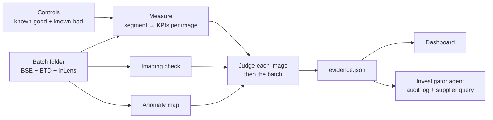

# Track 4 · Batch QC for electrode microstructure: Plan

Team Batch Size 2. ML: Pat. Software: Patrik.

---

## 1. What we are building

Drop a folder of microscope images for an incoming batch. Get back **accept / investigate / reject**, with the evidence a materials engineer needs to trust it:

- **Verdict** for the batch, with the share of images that look off and the range that share could plausibly lie in.
- **Per-image evidence:** which images are off, which measured property moved (µm, fractions), by how much against the baseline's tolerance, and a mask overlay to check by eye.
- **Next action:** "image N more fields", "re-image, detector settings changed", or a drafted query to the supplier.



### Rules

1. **No Polaron models.** Segmentation and KPIs are ours. Polaron's role is mentor answers.
2. **No classifier trained on batch folders.** It would learn which strip an image came from (§2), not the material.
3. **Language models never measure and never decide.** They describe, explain and draft.
4. **The frozen verdict path runs on a laptop with no network.**
5. **Ask before the images leave our machines** (Modal, Hugging Face, Devin, LLM APIs).

---

## 2. What the data is

| Fact | Consequence |
|---|---|
| 31 fields of view: Batch_1 = 7, Batch_2 = 7, Batch_3 = 17 | Very small n. Every claim needs a stated bound |
| Each field has pixel-aligned BSE, ETD and InLens images. 4 fields name the ETD channel `SE` | Alias `SE` → `ETD` |
| ~7000 × 1600–2300 px at 25 nm/px (175 × 40–58 µm) | Pixel size comes from the TIFF tags |
| 13 BSE tiles have a 1–4 px coloured column at one edge | Crop 8 px off each side |
| Graphite anode with a silicon-based additive (our reading, not yet confirmed) | Phases: pore (black), graphite (dark grey), Si particle (bright) |
| **Tiles are cuts from 13 longer strips. 5 strips span more than one batch folder** | The independent unit is the strip. Validate leave-one-strip-out. Never use height, resolution tag or raw grey level as a feature |
| Grey levels are not calibrated between strips | Subtract the black level before any intensity KPI |

**Strip map.** `→` means the right edge of one tile continues into the left edge of the next.

| Strip | Tiles | Folders |
|---|---|---|
| P2080 | `cfe5vt7s` → `r17byphk` → `ffwubibz` | B3, B2, B1 |
| P2148 | `f1vzngrs` → `epqdaau9` | B1, B2 |
| P2156 | `fzrt2k6r`, `b3esycq1` | B1, B2 |
| P2272 | `i9jiqjwl`, `pl8uabbv` | B2, B3 |
| P2068 | `vc2whyaq` → `x77cy643` → `utfgcjfa` → `rxax5ozo` | B3, B3, B3, B2 |
| **P2316** | `4ih2ggld`, `5n1q8atc` | B1 |
| P1780, P1880 | `iv6g2oq0`; `uhdslk0o` | B1 |
| P2048 | `3806gxp0`, `avn74qx1` | B2 |
| **P2060** | `x7u69zsw` → `tuy3zymq` → `kbdh4tri` → `71vgq3fw` | B3 |
| P1904 | `mgxahqnk` → `hawkfj64` → `0grcilhi` | B3 |
| P2088 | `9luzk4jm` → `hzumfsms`, `ufdvpb81` | B3 |
| P1612 | `ptg8lmto`, `xgj4xftb` | B3 |

**Three kinds of bright particle** (rough numbers from a crude threshold pass):

| Where | Look | Numbers |
|---|---|---|
| 11 ordinary strips | Small, dense, very bright | Area fraction 0.04–0.07. Brightness about 1.9–2.35× graphite |
| P2316 (Batch_1) | Larger and clearly dimmer | Area fraction about 0.16. Brightness about 1.67× graphite |
| P2060 (Batch_3) | Normal brightness, speckled and porous inside | About twice as many small bright objects per area |

P2060 also has a raised black level (pores at grey level 22 instead of 0). That is a detector offset, not the material.

**Open:** we do not know which folder is the baseline. If it is Batch_1, two of its seven images (P2316) look unlike everything else. See §8.

---

## 3. How it works

### 3.1 Contract

Follow the repo: `qc/measure.py` (ML) writes tables, `qc/decide.py` (software) reads them. Changes to agree first:

```python
# qc/schema.py
class Phase(IntEnum):
    PORE = 0; GRAPHITE = 1; SI = 2; BINDER = 3; IGNORE = 255

KPI_UNITS = {
    "si_area_frac": "fraction",
    "si_d50_um": "um",
    "si_d90_um": "um",
    "si_internal_void_frac": "fraction",
    "si_contrast_ratio": "ratio",
    "si_fragments_per_1e4um2": "count",
    "si_dispersion_cv": "ratio",
    "porosity_apparent": "fraction",
}
KPI_TABLE_COLUMNS = ["batch", "image_id", "strip_id", "px_um", *KPI_UNITS]

# qc/measure.py
def segment(channels, px_um) -> np.ndarray: ...
def kpis(mask, px_um, channels=None) -> dict[str, float]: ...   # channels optional
```

| File (written by ML) | Rows | Used for |
|---|---|---|
| `out/kpis.csv` | One per image. Optional column `anomaly_score` | Verdict |
| `out/kpis_windows.csv` | One per 1000 px window, extra column `window` | Sampling uncertainty |
| `out/kpis_variants.csv` | One per segmentation variant, extra column `variant` | Segmentation uncertainty |
| `out/kpis_controls.csv` | One per control image, extra columns `source_image`, `kind` (`negative`/`positive`), `perturbation`, `level` | Controls check |
| `out/masks/<batch>/<image_id>.png`, `out/anomaly/<batch>/<image_id>.png` | Overlays | Dashboard |

### 3.2 KPIs

| KPI | Definition | Catches |
|---|---|---|
| `si_area_frac` | Si pixels / non-ignored pixels | Recipe change (P2316) |
| `si_d50_um`, `si_d90_um` | Area-weighted equivalent diameter. Apparent 2D size | Different powder (P2316) |
| `si_internal_void_frac` | Dark pixels inside filled Si particles / filled area | Porous or cracked particles (P2060) |
| `si_contrast_ratio` | (Si mode − black level) / (graphite mode − black level) | Different composition (P2316). Only valid when the imaging check passes |
| `si_fragments_per_1e4um2` | Si objects under 1 µm, per 10⁴ µm² | Fines, pulverisation |
| `si_dispersion_cv` | Variation of local Si fraction across 20 µm windows | Poor mixing |
| `porosity_apparent` | Pore pixels / non-ignored pixels. Biased, because the back of open pores is visible | Densification |

### 3.3 Imaging check

Per channel: black level (0.5th percentile), grey-level percentiles, noise, sharpness, saturated fraction. An image outside the baseline's envelope is reported as "imaging changed", and `si_contrast_ratio` and `porosity_apparent` are not used for it.

### 3.4 Anomaly map

DINOv2 patch features on BSE (4× downsampled, contrast-normalised per crop). Fit PCA on baseline patches and score by reconstruction error. It never decides alone: if it fires and no KPI moved, the image is SUSPECT with the reason "change not captured by our KPIs".

### 3.5 Decision

**Baseline audit.** Test each baseline strip against the others. If one fails, report it and ask which images define "approved". The config lists excluded reference images explicitly.

**Per image.** Each KPI has a tolerance band from the baseline: a prediction interval for one new image, widened for the number of KPIs. A mentor-supplied tolerance replaces it.

| Image status | Condition |
|---|---|
| NON-CONFORMING | Imaging check ok, and a KPI's value with its uncertainty lies entirely outside its band |
| SUSPECT | A KPI straddles the band edge, or the anomaly map fires alone, or the imaging check fails |
| CONFORMING | Otherwise |

**Per batch.** Count non-conforming units (strips when known, otherwise images) and put an exact binomial interval on the fraction.

| Verdict | Condition (defaults) | Example |
|---|---|---|
| REJECT | 95% lower bound on the non-conforming fraction > 5% | 2 of 7 |
| ACCEPT | None non-conforming, none suspect, controls passed. Printed with its bound | 0 of 7: "cannot rule out up to 28%" |
| INVESTIGATE | Everything else, with a named next action | 1 of 7: "image N more fields" |

### 3.6 Uncertainty

Each KPI's uncertainty is shown split by source, with the action that shrinks it.

| Source | Estimated from | Shrinks with |
|---|---|---|
| Sampling | Spread across windows inside the image | More or larger fields |
| Segmentation | Spread across threshold and smoothing variants | Better segmentation |
| Imaging | Movement under negative controls | Imaging protocol |
| Reference | Resampling baseline strips | More approved lots |

With 6–7 baseline strips, no distribution-free test can give a p-value below 1/8. Stronger claims rest on a normality assumption, and the report says so.

---

## 4. Creative features

| Feature | What the judge sees | Owner |
|---|---|---|
| **Controls on every run** | Like a lab assay: each run also judges a known-good image (brightness, contrast, noise changed; material untouched) and a known-bad one (extra particles pasted in, voids punched into particles). The report says "controls passed" | ML makes them, software checks them |
| **Verified tags** | A vision-language model picks morphology tags from a fixed list for a flagged region. A tag is shown as confirmed only if the matching KPI moved; otherwise "unverified". Its hit rate on blind control pairs is shown beside it | Software |
| **Investigator agent** | On INVESTIGATE or REJECT, an agent works the case with tools, writes an audit log, and drafts the supplier query. It cannot change the verdict | Software |
| **Counterfactual** | "This field would pass with about 60% fewer bright particles", next to the nearest conforming baseline image | Software |
| **Strip-leak slide** | A classifier on folder labels scores well on a random split and collapses leave-one-strip-out | ML |
| **Uncertainty by source** | Stacked bar per KPI, plus the next action | Software |

Not doing: augmentation to train a classifier, generated synthetic microstructures as evidence, geometric scaling or warping.

---

## 5. Step by step

The unseen batch drops about 8 hours after kickoff (17:00–18:00; confirm). Submission is Sunday 14:45.

### Sync points

| When | What |
|---|---|
| Start | Agree §3.1. Send §8 to the mentors |
| Sync 1 | Real `out/kpis.csv` runs through `qc.decide`. Baseline against itself is not rejected |
| Dry run, 1 h before the drop | Treat Batch_2 as unseen, one command, no manual steps |
| Freeze, 30 min before the drop | `config/decision.yaml` frozen, `git tag rules-frozen`, push |
| Drop | Run once. Commit the output unchanged. No tuning |

### Pat (ML)

**Before the drop**

1. **Set up.** `brew install uv`, `uv sync`, `uv run pytest`, `uv run python -m qc.measure`.
2. **Request access** to [DINOv3](https://huggingface.co/facebook/dinov3-vitb16-pretrain-lvd1689m) on Hugging Face. Optional upgrade; do not wait for it.
3. **Segment on BSE** in `segment()`.
   - Work at 2× downsample. Subtract the black level. Smooth lightly.
   - 3-class multi-Otsu per image: pore, graphite, Si.
   - Clean the Si mask: small opening, minimum area about 0.25 µm².
   - Mark the top and bottom 5% of rows `IGNORE`.
   - Save overlays to `out/masks/`. Check two images per strip by eye before trusting numbers.
4. **KPIs** in `kpis()`: the eight in §3.2. Start with `si_area_frac`, `si_d50_um`, `si_internal_void_frac`, `si_contrast_ratio`.
5. **Write `out/kpis_windows.csv`:** the same KPIs per 1000 px window.
6. **Sync 1** with Patrik.
7. **Controls** in a new `qc/controls.py`, writing `out/kpis_controls.csv`.
   - Negative: brightness ±20%, black-level offset +20, contrast ±20%, added noise. Apply to 3 baseline images.
   - Positive: paste Si particles from other baseline images to raise the fraction by 50% and 100%; punch voids into 30% of Si particles.
8. **Segmentation variants:** rerun steps 3–4 with thresholds ±5 grey levels and two smoothing widths. Write `out/kpis_variants.csv`.
9. **Anomaly map** with [dinov2-base](https://huggingface.co/facebook/dinov2-base) (`uv add torch transformers scikit-learn`). Add `anomaly_score` and heat-map PNGs. Skip it if it is not solid by the dry run.
10. **Dry run and freeze** with Patrik.

**At the drop**

11. Run `qc.measure` on the new folder. Look at the overlays. Change nothing.

**Evening**

12. **Strip-leak experiment:** logistic regression on DINOv2 image features predicting the folder, random split vs leave-one-strip-out. One chart.
13. **Better void and crack detection:** scribble labels and a random forest on DINOv2 plus intensity features, if thresholds miss the porous particles.
14. **Power curves** from the positive controls: detection rate against size of change and number of images. Run on Modal if allowed.

**Day 2**

15. Figures for the pitch: three particle types, strip seams, power curve, strip-leak chart.

### Patrik (software)

**Before the drop**

1. **`qc/io.py`:** alias `SE` → `ETD`; crop 8 px left and right; yield `strip_id` as `f"{height}_{round(xres)}"`.
2. **`qc/schema.py`:** new `Phase`, `KPI_UNITS`, `strip_id` column (§3.1). Update `tests/fixtures/kpis_fake.csv` and the contract test.
3. **`config/decision.yaml`:** `baseline: Batch_1` (until mentors say otherwise), `reference_exclude: []`, band level, verdict thresholds.
4. **`qc/decide.py`:** replace the batch-mean comparison with §3.5.
   - Tolerance bands from baseline images.
   - Image status from KPI value, its uncertainty, and the band.
   - Exact binomial interval on the non-conforming fraction, strip as the unit.
   - Baseline audit, leave-one-strip-out.
5. **Extend `Evidence`:** `tiles[]`, `nonconforming`, `uncertainty`, `controls`, `next_action`, `baseline_audit`.
6. **Golden tests:** baseline against itself → ACCEPT; one odd image of seven → INVESTIGATE; two of seven → REJECT.
7. **Sync 1** with Pat.
8. **Imaging check** in a new `qc/gate.py` (§3.3), written into the evidence.
9. **Controls check:** read `out/kpis_controls.csv`. Negative controls must be CONFORMING, positive ones flagged. Write `controls.passed`.
10. **One command:** `uv run python -m qc.run --batch data/<x>` runs measure → decide → evidence.
11. **Dashboard** in `app.py`: verdict card with its bound, KPI chart against bands with one dot per image, image gallery by status, three-detector viewer with mask overlay, controls badge.
12. **Dry run and freeze** with Pat.

**At the drop**

13. Run once. Commit `out/evidence/<batch>.json` as produced.

**Evening**

14. **Uncertainty panel** from the windows and variants tables, plus the next-action line.
15. **Verified tags:** closed-vocabulary prompt with baseline crop, flagged crop and heat map. Confirm each tag against its KPI. Measure hit rate on blind control pairs.
16. **Investigator agent:** Claude with tools (re-measure a region, nearest baseline patch, imaging test on one image, cause lookup, images needed to resolve). Output an audit log and a drafted supplier query. Use `claude-sonnet-5-5` while iterating and `claude-opus-5-5` for the final run.
17. **Counterfactual line** and nearest conforming baseline image.
18. **Report writer** from `evidence.json`, every number checked against the JSON.

**Day 2**

19. Deploy the dashboard, record the 2-minute video, README, pitch rehearsal.

If time runs short, steps 1–13 on the software side and 1–8, 10–11 on the ML side are a complete entry.

---

## 6. Tools

| Tool | Job | Owner |
|---|---|---|
| Claude API | Verified tags, investigator agent, report | Patrik |
| Hugging Face | DINOv2 weights (ungated). DINOv3 access request | Pat |
| Modal | Control sweeps and power curves in the evening. Host the dashboard | Patrik sets up, Pat uses |
| Devin | Own branch: the perturbation functions with unit tests; reproduce ImageRep's single-image confidence interval and check it against neighbouring tiles of the same strip | Brief at the start, merge in the evening |
| Antigravity | Build and browser-test the dashboard. Gemini as a second opinion on tags | Patrik |
| AMASS | 20-minute test: can it supply citations for the cause table? Drop it if results are thin | Either |

One agent per directory: Antigravity on the UI, Devin on its branch, the core pipeline stays with us.

---

## 7. Unseen batch and demo

**Unseen batch.** Frozen tag exists before the drop. One run. Output committed as produced. Report the verdict, the non-conforming fraction with its interval, the KPIs that drove it, and the next action. Anything learned afterwards goes in a separate post-hoc note.

**Two-minute video.**

| Time | Shot |
|---|---|
| 0:00–0:15 | £50k of images, 31 fields, a supplier who may have changed something |
| 0:15–0:45 | Drop a folder. Verdict card, KPI chart against bands, image gallery, "controls passed" |
| 0:45–1:15 | Open a flagged image: detectors, overlay, KPI deltas, one tag confirmed and one rejected, counterfactual |
| 1:15–1:40 | Agent audit log ending in the drafted supplier query. Uncertainty by source |
| 1:40–2:00 | Unseen batch: frozen-tag timestamp and the verdict we committed. Strip-leak chart |

**Pitch opener:** what we found in the data (strips crossing folders, three particle types, a detector offset that is not a material change).

---

## 8. Questions for the mentors

1. Is Batch_1 the approved baseline? Is there ground truth for the other two, per batch or per image?
2. Images in different folders are adjacent pieces of one continuous image (`cfe5vt7s` → `r17byphk` → `ffwubibz`; `f1vzngrs` → `epqdaau9`). Intended? Is a folder one physical batch or a mix?
3. When does the unseen batch drop, and is it scored per batch or per image? Does "investigate" count on a borderline case?
4. Is this a graphite anode with a silicon-based additive? What are the three kinds of bright particle?
5. Will the unseen batch have the same detectors, pixel size and prep? Should grey levels be treated as uncalibrated?
6. Which two or three microstructure numbers matter most for incoming material, and at what tolerance?
7. May the images be uploaded to Modal, Hugging Face (private), Devin and LLM APIs?

---

## 9. Risks

| Risk | Mitigation |
|---|---|
| Baseline is not Batch_1, or is itself mixed | Baseline audit. Config lists reference images explicitly |
| Segmentation eats the afternoon | Thresholds on BSE first. Stop when overlays look right |
| Strip fingerprints leak into a learned part | No metadata or raw grey levels as features. Leave-one-strip-out |
| Thresholds tuned on the real batches | Tune on baseline and controls only, then freeze |
| Too many features, no finished flow | The cut line at the end of §5 |
| Language model says something wrong | Fixed vocabulary, KPI confirmation, measured hit rate, never in the verdict |

---

## 10. References

- [SubspaceAD: training-free few-shot anomaly detection](https://arxiv.org/abs/2602.23013) · [AnomalyDINO](https://arxiv.org/abs/2405.14529)
- [MMAD: multimodal LLMs in industrial anomaly detection](https://arxiv.org/abs/2410.09453) · [Verbalized calibration in vision-language models](https://arxiv.org/abs/2505.20236)
- [Testing for outliers with conformal p-values](https://arxiv.org/abs/2104.08279)
- [ImageRep: phase-fraction confidence from a single image](https://github.com/tldr-group/ImageRep)
- [ZEISS: segmentation techniques for battery SEM images](https://pages.zeiss.com/rs/896-XMS-794/images/EN_WhitePaper_ZEN_core_Segmentation_Techniques_Battery.pdf)
