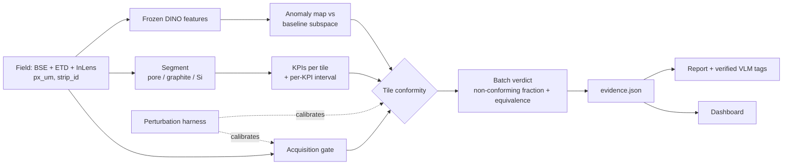

# Track 4 · Batch QC for electrode microstructure: Plan v1

> [!NOTE]
> **v1 supersedes [PLAN_v0](PLAN_v0.md).** v0 was written before anyone had opened the data. v1 is written after looking at all 93 files, a rough KPI pass, and a literature scan (Oct 2026). The framing of v0 survives; the material model, the unit of analysis and the decision statistics do not.

---

## 1. TL;DR

1. **The data is not what v0 assumed.** It is a graphite + silicon-based **anode** (not NMC), 31 fields of view × **3 co-registered detectors**, and the fields are tiles cut from **~13 longer strips, five of which are split across batch folders**. Details and evidence in §2.
2. **The signal lives at tile/strip level, not at batch-mean level.** In a crude pass the three folder means overlap; two strips stand out sharply. A "batch mean ± CI vs ±δ" test (v0) would average this away. v1 judges **each tile**, then aggregates to a batch verdict with an acceptance-sampling rule.
3. **Three layers of evidence, most transparent first:** measured KPIs with units → frozen-feature anomaly map for unknown unknowns → acquisition gate that separates "imaging changed" from "material changed".
4. **Uncertainty is a budget, not one error bar:** sampling, segmentation, acquisition, and thin-baseline terms shown separately, each with the action that would shrink it.
5. **Synthetic perturbation is promoted to core**, but as a *test harness* (imaging-invariance checks and injected positive controls), not as training-data augmentation.
6. **VLM stays out of the measurement and the verdict.** It gets one new job: propose morphology tags from a closed vocabulary that must be confirmed by a measured KPI, with its hit rate measured on blind pairs.
7. **Sponsor tools each get one job** (§13): Polaron as second-opinion segmenter and source of tolerances, Modal for the perturbation sweeps and hosting, Devin for the ImageRep side challenge on its own branch. None of them sits in the frozen verdict path.
8. **Cut for now:** 3D + TauFactor, process-axis embedding, any generative augmentation, any trained batch classifier.

---

## 2. What the data actually is

Everything here was checked on the files in `data/`; the scripts were throwaway, so re-derive in `qc/io.py`.

| Fact | Evidence | Consequence |
|---|---|---|
| 31 fields of view: Batch_1 = 7, Batch_2 = 7, Batch_3 = 17 | 93 TIFFs = 31 IDs × 3 detectors | v0 assumed ~20 baseline images. We have 7 |
| Each field has **BSE + ETD + InLens**, pixel-aligned | Same ID, same shape. 4 fields name the SE channel `SE` instead of `ETD` | `segment(img_2d)` contract is wrong. Alias `SE`→`ETD` |
| ~7000 × 1600–2300 px, **25 nm/px** → ~175 × 40–58 µm | TIFF `XResolution` ≈ 1.016 × 10⁶ px/inch | `px_um = 0.025`, read per file. No instrument metadata (files re-saved by `tifffile.py`) |
| RGB with identical channels | 13 of 31 BSE tiles have a 1–4 px coloured column at the left or right edge (stitch border) | Take one channel, crop 8 px off each side |
| **Graphite + Si-based anode cross-section**, ion-milled | BSE: black pores, dark-grey flaky particles, sparse bright angular particles. Curtaining streaks in ETD | My reading of the images; confirm with mentors. v0's NMC labels, "25–40% porosity", and crack-as-a-phase are off |
| **Tiles are cuts from ~13 strips** | Tiles sharing (height, resolution tag) form 13 groups. In 11 cases the right edge of one tile continues into the left edge of another (row-profile correlation 0.47–0.80, vs \|r\| ≤ 0.35 and mostly < 0.15 for every other pairing) | The independent unit is the **strip**, not the tile. 6 / 6 / 7 strips per folder |
| **5 of 13 strips span more than one batch folder** | 3 confirmed by edge continuity, e.g. `cfe5vt7s` (B3) → `r17byphk` (B2) → `ffwubibz` (B1). 2 more inferred from matching height + resolution tag only | Folders are not three physically separate samples. Top question for mentors (§10) |
| Height, resolution tag and grey-level offsets identify the strip | See table below | **Shortcut risk.** Never use them as features. All validation is leave-one-strip-out |

### Strip map

`→` means verified adjacency. Otherwise same group, not adjacent.

| Strip | Tiles | Folders |
|---|---|---|
| P2080 | `cfe5vt7s` → `r17byphk` → `ffwubibz` | B3, B2, B1 |
| P2148 | `f1vzngrs` → `epqdaau9` | B1, B2 |
| P2156 | `fzrt2k6r`, `b3esycq1` | B1, B2 |
| P2272 | `i9jiqjwl`, `pl8uabbv` | B2, B3 |
| P2068 | `vc2whyaq` → `x77cy643` → `utfgcjfa` → `rxax5ozo` | B3, B3, B3, B2 |
| **P2316** | `4ih2ggld`, `5n1q8atc` | B1 only |
| P1780 | `iv6g2oq0` | B1 only |
| P1880 | `uhdslk0o` | B1 only |
| P2048 | `3806gxp0`, `avn74qx1` | B2 only |
| **P2060** | `x7u69zsw` → `tuy3zymq` → `kbdh4tri` → `71vgq3fw` | B3 only |
| P1904 | `mgxahqnk` → `hawkfj64` → `0grcilhi` (last link weak, r = 0.35) | B3 only |
| P2088 | `9luzk4jm` → `hzumfsms`, `ufdvpb81` | B3 only |
| P1612 | `ptg8lmto`, `xgj4xftb` | B3 only |

### Rough KPI pass (indicative only)

3-class Otsu on 4×-downsampled BSE, no cleanup. Good enough to see effect sizes, not to quote.

| | Bright-phase area fraction | Dark (pore) fraction | Bright/graphite intensity ratio | Bright objects per 10⁴ µm² |
|---|---|---|---|---|
| Batch_1 (7 tiles) | 0.088 ± 0.049 | 0.085 ± 0.017 | 1.79 ± 0.20 | 219 ± 167 |
| Batch_2 (7 tiles) | 0.055 ± 0.014 | 0.100 ± 0.017 | 1.98 ± 0.13 | 119 ± 23 |
| Batch_3 (17 tiles) | 0.063 ± 0.011 | 0.106 ± 0.018 | 1.83 ± 0.18 | 151 ± 81 |
| 11 "ordinary" strips | 0.044–0.071 | 0.068–0.134 | 1.76–2.10 | 92–151 |
| **P2316** (B1, 2 tiles) | **0.158** | 0.079 | **1.53** | **455** |
| **P2060** (B3, 4 tiles) | 0.075 | 0.090 | **1.57** | **256** |

- **P2316**: about 2.7× the bright-phase fraction of an ordinary strip, with larger, lower-contrast, granular-looking particles.
- **P2060**: shifted grey levels in all three detectors, and bright particles that look cracked or fragmented.
- **Folder means overlap.** Batch_1's spread is driven by the two P2316 tiles.
- **Contrast is a per-strip property.** The intensity ratio typically varies by less than 0.04 within a strip and from 1.5 to 2.1 between strips, so imaging session and material are confounded at strip level. Intensity-based KPIs need the gate (§4.3).

If Batch_1 is the baseline, it contains a sub-population (P2316) that looks unlike the rest of the dataset. Either the approved baseline is legitimately bimodal, or our assumption about which folder is the baseline is wrong. We do not know yet.

---

## 3. Verdict on Plan v0

**Keep**
- "Polaron measures; we decide": the decision layer on top of KPIs, with an audit trail.
- `evidence.json` as the only thing the dashboard and the LLM read.
- Image (not pixel or patch) as the statistical unit. v1 tightens this to strip.
- Freeze config and `git tag` before the unseen batch drops.
- No supervised batch classifier. New failure modes land as INVESTIGATE.
- LLM writes only from evidence, every number checked.
- Golden tests (baseline vs itself must ACCEPT).

**Change**

| v0 | Problem | v1 |
|---|---|---|
| NMC cathode: pore / active / CBD / crack | Wrong material | Pore / graphite / Si-based particle, optional binder film. Cracks are a *property of Si particles*, not a phase |
| `segment(img_2d)` | Discards two detectors | `Field` object with 3 channels. BSE for composition, ETD + InLens for pore edges and binder |
| Batch mean, 90% CI vs ±δ | Averages away mixtures. Baseline n = 7 tiles from 6 strips | Tile-level conformity, then acceptance-sampling aggregate (§4.4) |
| δ = 1.5 × baseline SD | With n = 7 the SD is only known to within 0.64–2.2× (95% CI), so δ is too | Prediction band for a new tile (±2.6 s at 95% for n = 7), widened by measured acquisition sensitivity. Engineering tolerances from mentors override it |
| "Porosity" as headline KPI | Un-infiltrated cross-section: the back of a pore is visible (shine-through), so thresholded porosity is biased | Report as *apparent* porosity, fused across detectors, tagged acquisition-sensitive |
| Min-detectable-change as an "ambitious option" | With no labels it is the only route to an accuracy number | Core (§6.1) |
| VLM "optional, late" | Fine, but under-specified | One defined role with a verification rule and a measured hit rate (§6.2) |
| No demo plan | Demo is 20 of 100 points | Storyboard in §9 |

**Cut** (revisit only if everything in §7 is done): 3D reconstruction + TauFactor, process-axis embedding, U-Net training.

**Re-scoped, not cut:** Modal, Devin and AMASS each get one bounded job in §13.

---

## 4. Design



### 4.1 Contract (replaces v0 §4)

```python
@dataclass
class Field:
    batch: str
    image_id: str
    strip_id: str | None          # inferred from (height, resolution); provenance only, never a feature
    channels: dict[str, np.ndarray]   # "BSE", "ETD", "InLens"; 2D uint8, edges cropped
    px_um: float

LABELS = {0: "pore", 1: "graphite", 2: "si_particle", 3: "binder_film", 255: "ignore"}

def segment(field: Field) -> np.ndarray: ...                 # ML
def kpis(field: Field, mask: np.ndarray) -> dict[str, float]: ...   # ML, never raises, NaN on failure
def anomaly(field: Field) -> tuple[float, np.ndarray]: ...   # ML, score + heat map
def gate(field: Field) -> dict: ...                          # backend
def judge(baseline: pd.DataFrame, batch: pd.DataFrame, cfg: dict) -> Evidence: ...  # backend, no images
```

`evidence.json` gains: `tiles[]` (per-tile status, KPI values with intervals, anomaly score, gate flags), `nonconforming` (`x`, `n`, interval, unit = tile or strip), `uncertainty_budget` per KPI, `next_action`, `baseline_audit`.

### 4.2 Layer A: KPIs

Start with BSE thresholds, since the three phases are well separated there. Use a scribble-trained random forest on upsampled DINO features (the Polaron founders' own approach) only for what thresholds cannot do: intra-particle cracks and binder films.

| Group | KPI | Unit | Points to | Acquisition-sensitive |
|---|---|---|---|---|
| Formulation | Si-particle area fraction | fraction | Recipe ratio | Low |
| Formulation | Si : graphite area ratio | ratio | Recipe ratio | Low |
| Powder | Si particle size D10 / D50 / D90, area-weighted | µm (apparent 2D) | Supplier powder, milling | Low |
| Powder | Si particle solidity, aspect ratio | – | Particle morphology | Low |
| Powder | Si/graphite BSE contrast ratio | ratio | Composition (e.g. SiOx vs Si–C) | **High**, only after gate passes |
| Particle integrity | Intra-particle void/crack fraction in Si | fraction | Cracking, porous particles | Medium |
| Particle integrity | Fragment count: small bright objects per area | per 10⁴ µm² | Pulverisation, fines | Medium |
| Mixing | Si dispersion: variance of local Si fraction across 20 µm windows; nearest-neighbour distance | –, µm | Mixing quality, agglomeration | Low |
| Mixing | Through-thickness Si and pore profile (top vs bottom third) | ratio | Binder migration, settling | Low |
| Densification | Apparent porosity | fraction | Calendering | **High** |
| Densification | Graphite orientation anisotropy (structure tensor) | 0–1 | Calendering | Low |

First slice: the six low-sensitivity KPIs in rows 1–4 and 8–9 plus fragment count. The rest are upgrades.

### 4.3 Layer B and C: anomaly map and gate

- **Anomaly map (unknown unknowns).** Frozen DINOv2 patch features on BSE at 2× downsample. Fit a PCA subspace on baseline patches (SubspaceAD) and score by reconstruction error; a k-NN memory bank (AnomalyDINO) is the fallback. Both are training-free and built for 1–few normal images. Output: heat map, tile score, and for each hot region the nearest baseline patch shown beside it.
- **The anomaly map never decides alone.** If it fires and a KPI moved, the KPI is the explanation. If it fires and no KPI moved, the tile is SUSPECT with the reason "change not captured by our KPIs".
- **Acquisition gate.** Per channel: grey-level percentiles, noise estimate, sharpness, curtaining strength (vertical-streak energy), saturated fraction in InLens, detector set, `px_um`. A tile outside the baseline's acquisition envelope has its acquisition-sensitive KPIs disabled and is reported as "imaging changed".

### 4.4 Decision

**Baseline audit first.** Before judging anything, test the baseline against itself (leave-one-strip-out). If it splits into sub-populations, as §2 suggests it may, the system says so and asks which one is the approved reference. This is a usability feature: golden-sample hygiene is a real QC failure mode.

**Tile level.** For each KPI the baseline gives a tolerance band: a prediction interval for a new tile, widened by the KPI's measured acquisition sensitivity, replaced by a mentor-supplied tolerance when we get one. Each tile's KPI has its own interval (§5).

| Tile status | Condition |
|---|---|
| NON-CONFORMING | Gate ok, and a KPI's interval lies entirely outside its band |
| SUSPECT | A KPI interval straddles the band edge, or the anomaly map fires with no KPI explanation, or the gate fails |
| CONFORMING | Otherwise |

Bands are calibrated on the maximum over KPIs, so the tile false-alarm rate is controlled for the whole KPI set, not per KPI. We report the leave-one-strip-out false-alarm rate we actually achieve.

**Batch level.** Count non-conforming units (strips when known, tiles otherwise) and put an exact binomial interval on the non-conforming fraction.

| Verdict | Condition (defaults, to be set with mentors) |
|---|---|
| **REJECT** | 95% lower bound on non-conforming fraction > 5%, or a low-sensitivity KPI fails batch-level equivalence |
| **ACCEPT** | No non-conforming or suspect tiles, gate ok, equivalence shown on critical KPIs. Always printed with the bound it implies |
| **INVESTIGATE** | Everything else, with a named next action |

What the defaults do with our sample sizes:

| Observed | Bound | Verdict |
|---|---|---|
| 0 of 7 non-conforming | ≤ 28% non-conforming (90% upper) | ACCEPT, stated as "7 clean fields cannot rule out up to 28%" |
| 1 of 7 | lower bound 0.7% | INVESTIGATE: "image N more fields" |
| 2 of 7 | lower bound 5.3% | REJECT |
| 0 of 17 | ≤ 13% | ACCEPT |

**Next action** is computed, not templated: number of extra fields needed to resolve the verdict, or "re-image, acquisition out of envelope", or "confirm composition by EDS" when only the contrast KPI moved.

---

## 5. Uncertainty budget

One error bar hides where the doubt comes from. Each KPI interval is built from four terms, shown as a stacked bar in the dashboard.

| Term | Question | How we estimate it | What shrinks it |
|---|---|---|---|
| Sampling | Is 175 × 50 µm enough to represent the material? | Spatial block bootstrap over windows inside the tile | More or larger fields |
| Segmentation | Would another reasonable segmenter give another number? | Ensemble over threshold perturbations, and BSE-only vs fused detectors | Better segmentation, scribble labels |
| Acquisition | Would the same material imaged differently give another number? | Perturbation harness (§6.1) | Imaging protocol, gate |
| Reference | How well do 6 strips define "normal"? | Hierarchical bootstrap over baseline strips | More approved lots |

Limits we state out loud:
- With 6–7 calibration units, a distribution-free (conformal) p-value cannot go below 1/8. Any stronger claim rests on a parametric assumption, and the report says which.
- 2D apparent sizes are smaller than true 3D sizes. Comparisons between batches are valid; absolute values are not.
- If the unseen batch shares a strip with a known folder, we report the provenance match and do not use it in the verdict.

---

## 6. The two creative ideas

### 6.1 Synthetic "lighting" augmentation: yes, as a test harness

SEM has no lighting. The physical equivalents are detector gain/offset (brightness/contrast), gamma, shot noise (dwell time), defocus, charging, and curtaining stripes.

| Use | Verdict | Why |
|---|---|---|
| **Imaging-invariance tests.** Perturb baseline tiles; the material is unchanged, so KPIs and verdict must not move | **Core** | Gives the acquisition term in §5 and tells us which KPIs to trust. Produces the robustness curve for the demo |
| **Gate calibration.** Learn what an imaging-only change looks like | **Core** | Needed because contrast is confounded with strip (§2) |
| **Positive controls.** Inject known material changes: paste extra Si particles from other tiles (+x% fraction), draw cracks into Si particles, dilate or erode pores | **Core** | We have no labelled defects. This is the only way to state "detects +2 points of Si fraction from 7 fields with 90% power", and the only way to tune thresholds without touching real batches |
| Intensity augmentation for the scribble segmenter | Yes, small | v0 cites Polaron's trust write-up on segmentation degrading under contrast shift |
| Augmenting images to train a batch classifier | **No** | 13 strips. It would learn strip fingerprints |
| Generative augmentation (diffusion, GAN) | **No, not this weekend** | Recent work shows gains for segmentation training, but a generator fitted to 7 tiles adds no information about lot-to-lot variation, and synthetic "evidence" is hard to defend to a QC lead |
| Geometric scaling, elastic warps, strong blur | **Never** | They change the sizes and shapes we are measuring |

### 6.2 VLM image → text: yes, in a narrow, checked role

What the literature says:
- MMAD (ICLR 2025): the best general VLM reached about 75% on industrial anomaly questions, well short of inspection needs, and VLMs will describe defects on normal parts.
- VLM-stated confidence is overconfident; agreement across repeated or perturbed queries is a better signal.
- Using VLMs to supply concepts for concept-bottleneck models costs concept quality.

So: no VLM numbers, no VLM verdict, no VLM-stated probability.

| Use | Verdict | How |
|---|---|---|
| **Morphology tags on flagged regions** | **Yes, the new piece** | Show baseline crop, flagged crop and heat map. The model picks from a closed list ("intra-particle cracking", "fragmented particles", "granular particle interior", "agglomerated Si", "curtaining", "charging", …). Each tag maps to a KPI. Tag + KPI moved → shown as confirmed. Tag without KPI → shown as "unverified visual observation". The VLM proposes, the measurement decides |
| **Reliability of those tags** ("calibration") | **Yes, cheap** | Blind pairs: baseline vs baseline, and baseline vs positive control from §6.1, order randomised, 3–5 repeats. Report hit rate and false-alarm rate next to every tag. If it is near chance we show that and keep the VLM as writer only |
| Artefact triage in the gate | Yes | Naming *why* an image is unusable. It can only make us more cautious |
| Report writer from `evidence.json` | Yes (as v0) | Every number checked against the JSON |
| Root-cause hypotheses | Yes, constrained | Text-only, from a short KPI-pattern → cause table reviewed by a mentor. Ranked, each with the test that would confirm it |
| Measuring KPIs, deciding the verdict, giving confidence | **No** | See above |
| SAM 3 text-prompted particle instances | Only if access arrives | Gated on Hugging Face. Watershed is the default |

Our hand-built KPIs already act as the concept bottleneck: the verdict is a readable function of physically meaningful quantities. The VLM adds vocabulary, not evidence.

### 6.3 What we take from recent work

| Source | Take |
|---|---|
| SubspaceAD (2026), AnomalyDINO (2025) | Training-free few-shot anomaly maps from frozen DINOv2 patches. Layer B |
| DINOv3 (2025) | Better dense features, own licence, access request needed. DINOv2 is the default |
| HR-Dv2 and "Maybe you don't need a U-Net" (Polaron founders' lab) | Scribbles + classifier on upsampled features, good at hairline cracks. Segmentation upgrade path |
| Conformal outlier detection (Bates et al.) | Finite-sample false-alarm control, and the 1/(n+1) floor we quote in §5 |
| Failing Loudly | Batch-level two-sample test on reduced features as a cross-check, permuted at strip level |
| MMAD, VLM calibration study, VLM concept bottlenecks | The limits in §6.2 |
| FIB-SEM shine-through literature | Why porosity is "apparent" and why multi-detector helps |
| PF-DiffSeg, ControlNet on FIB-SEM | Generative augmentation is a segmentation-training tool. Out of scope |

---

## 7. Schedule

Clock times assume the unseen batch at ~17:00. Shift everything if that moves.

| When | Backend / agent | ML |
|---|---|---|
| **Now, 30 min** | Both: put §10 to the mentors, including the data-sharing question (§13). Agree §4.1. Request DINOv3 and SAM 3 access on Hugging Face. Brief Devin (§13.3) | |
| **→ 14:00, slice 1** | `io.py` (`Field`, alias, crop, `px_um`, `strip_id`), `judge` with tile bands + binomial aggregate, `evidence.json`, Streamlit skeleton, baseline-audit view | BSE 3-phase `segment`, first 7 KPIs, mask PNGs for eyeballing, per-tile table |
| **14:00, sync** | Real KPI table through `judge`. Baseline vs itself must ACCEPT | |
| **→ 16:00** | Acquisition gate. Perturbation harness: invariance + positive controls, small grid locally. Zero-touch runner `python -m qc.run --batch <dir>` | DINO anomaly map. Segmentation ensemble for the uncertainty term. Fragment and crack KPIs |
| **16:00, dry run** | Treat Batch_2 as unseen, end to end, no manual steps | |
| **16:30, freeze** | `config/decision.yaml` frozen, `git tag rules-frozen`, push | |
| **~17:00** | Run the unseen batch once. Commit `evidence/<unseen>.json` unchanged. No tuning | |
| **Evening** | VLM tags + blind reliability test, report writer, uncertainty-budget chart. Full harness sweep on Modal. Merge Devin's PRs | Scribble RF for cracks/binder if thresholds fall short. Remaining KPIs. Polaron second-opinion comparison |
| **Day 2** | Deploy dashboard, demo video, pitch rehearsal, README | Power curves for the pitch. AMASS-cited cause table if the 20-minute test passed |

If slice 1 slips past 14:30, drop the DINO layer from the frozen config and ship KPIs + gate only.

Housekeeping: add `data/`, `out/` and `.DS_Store` to `.gitignore` (the data is 1.6 GB).

---

## 8. Unseen-batch protocol

1. Frozen tag exists before the drop.
2. One zero-touch run. Output committed as produced.
3. The gate runs first. If the new batch is missing a detector or is outside the acquisition envelope, we say so and fall back to BSE-only KPIs.
4. Report the verdict, the non-conforming fraction with its interval, the driving KPIs, the nearest known strip in KPI space, and the next action.
5. Anything we learn afterwards goes in a separate "post-hoc" section, never back into the frozen result.

---

## 9. Demo and pitch

**One line:** three detectors, three layers of evidence, one verdict that says how sure it is and what to do next.

2-minute video:

| Time | Shot |
|---|---|
| 0:00–0:15 | The problem: £50k of images, 31 fields, and a supplier who may have changed something |
| 0:15–0:45 | Drop a batch folder. Verdict card, KPI forest plot against tolerance bands, tile gallery with status |
| 0:45–1:15 | Open a flagged tile: 3-detector viewer, heat map, nearest baseline patch, KPI deltas, VLM tags marked confirmed or unverified, ranked hypotheses with the test to run |
| 1:15–1:40 | Honesty panel: uncertainty budget, "7 clean fields only rule out > 28%", imaging-vs-material robustness curve, power curve from positive controls |
| 1:40–2:00 | Unseen batch: frozen-tag timestamp, the verdict we committed, what happened |

Things to show that other teams probably will not have: the strip map and baseline audit (we found structure in the data), detector fusion, the uncertainty budget, and a measured reliability figure for the VLM.

---

## 10. Questions for the Polaron mentors (ask now)

1. **Which folder is the approved baseline?** Are the other two labelled acceptable / defective, and at what level: batch, or image?
2. **Tiles from one strip sit in different folders** (e.g. `cfe5vt7s` / `r17byphk` / `ffwubibz`). Is that intended? Are folders deliberate mixtures?
3. Is the unseen batch scored on the batch verdict alone, or per image? Does INVESTIGATE count as correct on a borderline case?
4. Is this a graphite/SiOx (or Si–C) anode? What are the bright particles in BSE?
5. Will the unseen batch have all three detectors, same pixel size, same prep?
6. Which KPIs and tolerances do their customers actually specify for incoming anode material?
7. Is the BSE contrast between sessions controlled, or should we treat intensity as uncalibrated?
8. **May we upload the images to Modal, Hugging Face (private), Devin and LLM APIs?** Does the Polaron platform have an API, and which phases does it segment for this material?

Answers to 1–3 can change §4.4. The rest of the plan holds either way.

---

## 11. Risks

| Risk | Mitigation |
|---|---|
| Baseline is not what we think, or is itself mixed | Baseline audit, mentor question 1, config takes an explicit list of reference tiles |
| Strip fingerprints leak into a learned component | No metadata or absolute grey levels as features. Leave-one-strip-out everywhere. DINO runs on gate-normalised BSE |
| Contrast confounded with material | Intensity KPIs only after the gate passes; flagged as needing EDS confirmation |
| Thresholds tuned on the three real batches | Tuned on baseline + synthetic positive controls only, then frozen |
| Too much scope before 17:00 | Fallback line in §7. Layers are independent: KPIs + gate alone still give a verdict |
| Positive controls look unrealistic | Paste real particles from real tiles, keep changes small, show examples to a mentor |
| VLM adds confident nonsense | Closed vocabulary, KPI confirmation, measured hit rate, never in the verdict |
| Overclaiming | "Apparent" for 2D sizes and porosity. Every ACCEPT printed with its bound |

---

## 12. References

**Anomaly detection and features**
- [SubspaceAD: training-free few-shot anomaly detection via subspace modeling](https://arxiv.org/abs/2602.23013)
- [AnomalyDINO: patch nearest-neighbour anomaly detection](https://arxiv.org/abs/2405.14529)
- [DINOv3](https://github.com/facebookresearch/dinov3) · [SAM 3: Segment Anything with Concepts](https://arxiv.org/abs/2511.16719)

**Materials segmentation (Polaron founders' lab)**
- [Maybe you don't need a U-Net: convolutional feature upsampling for micrograph segmentation](https://arxiv.org/abs/2508.21529)
- [HR-Dv2: upsampled DINOv2 features for weakly supervised materials segmentation](https://arxiv.org/abs/2410.19836)
- [ImageRep: phase-fraction confidence from a single image](https://github.com/tldr-group/ImageRep)

**VLM limits and explainability**
- [MMAD: benchmark for multimodal LLMs in industrial anomaly detection (ICLR 2025)](https://arxiv.org/abs/2410.09453)
- [Verbalized calibration in vision-language models](https://arxiv.org/abs/2505.20236)
- [Explainable visual anomaly detection via concept bottleneck models](https://arxiv.org/abs/2511.20088)
- [If concept bottlenecks are the question, are foundation models the answer?](https://arxiv.org/abs/2504.19774)

**Uncertainty and shift**
- [Testing for outliers with conformal p-values](https://arxiv.org/abs/2104.08279)
- [Failing Loudly: detecting dataset shift](http://papers.neurips.cc/paper/8420-failing-loudly-an-empirical-study-of-methods-for-detecting-dataset-shift.pdf)

**Synthetic data**
- [PF-DiffSeg: phase-fraction guided diffusion for microstructure segmentation](https://arxiv.org/abs/2508.00896)
- [Deep-learning segmentation of battery microstructures enhanced by artificially generated electrodes](https://www.nature.com/articles/s41467-021-26480-9)

**Imaging**
- [FIB/SEM tomography segmentation and shine-through artefacts](https://cris.fau.de/publications/242390311/)
- [Polaron: trust in microstructure quantification](https://www.polaron.ai/newsroom/trust-in-microstructure-quantification)

Glossary, tech stack and Polaron product notes in [PLAN_v0](PLAN_v0.md) §11–13 still apply, apart from the NMC-specific entries.

---

## 13. Sponsor tools and credits

Two rules apply to all of them.

- **Nothing external in the frozen verdict path.** The 17:00 run must work on a laptop with no network. Sponsor tools feed calibration, cross-checks, capacity and the demo.
- **Ask Polaron before the data leaves our machines.** These images cost £50k to collect. Uploading them to Modal, Hugging Face, Devin, or any LLM API needs an explicit yes. Until then, only derived artefacts (KPI tables, features, downsampled crops) go off-laptop.

| Tool | Job in this plan | When | Priority |
|---|---|---|---|
| **Polaron** | Mentor time for tolerances and material ID. Platform segmentation as an independent second opinion | Now, then evening | 1 |
| **Modal** | Fan out the perturbation harness and power curves. GPU feature extraction. Host the dashboard | After slice 1 works locally | 2 |
| **Devin** | ImageRep side challenge on its own branch. Perturbation library with tests | Brief now, merge in the evening | 3 |
| **Hugging Face** | Model weights. Access requests for gated models. Private dataset repo if permitted | Requests now | 4 |
| **Antigravity** | Build and browser-test the dashboard. Gemini as a second VLM for tag agreement | From slice 1 onward | 5 |
| **AMASS** | Citations for the root-cause table | 20-minute test, then Day 2 | 6 |

### 13.1 Polaron

- **Mentors are worth more than the platform.** The answers to §10 decide the decision rule. Real customer tolerances replace our statistical bands, which is the single biggest upgrade to "usefulness".
- **Second-opinion segmentation.** Run the baseline tiles through Polaron's segmenter and compare with ours, phase by phase. The disagreement becomes the segmentation term in the uncertainty budget (§5), measured against the sponsor's own tool. This also makes "Polaron measures; we decide" literal.
- **Do not make it the frozen segmenter** unless there is an API we can call from the runner. A manual upload step breaks zero-touch at 17:00.
- **If their trust/coherence score is exposed**, feed it into the acquisition gate as one more input.
- Skip 2D→3D reconstruction and design. They are impressive and off the QC question.
- To ask: is there an API, which phases does their model output for this anode, and can we export masks?

### 13.2 Modal

The harness in §6.1 is the real load: 31 tiles × imaging perturbations × levels, plus positive controls × effect sizes × number of fields × repeats, each a full segment-and-measure pass on a 14-megapixel image. That is thousands of runs, hours on a laptop and minutes with `.map()`.

- **CPU fan-out** for invariance sweeps and power curves. Output is one parquet table that the dashboard reads.
- **GPU function** for DINO features, cached in a Volume keyed by image hash.
- **Volume** as the shared data store for both of us and for Devin, if Polaron allows.
- **`modal deploy`** for the dashboard so judges get a URL.
- Same `qc/` code locally and on Modal, one image built from the lockfile. Calibrate thresholds from a small local grid before the freeze; the full sweep runs in the evening and is reported, not used to retune.

### 13.3 Devin

Treat it as a third teammate for work that is well specified, checkable, and off the critical path. Own branch, PRs only, never touches `config/decision.yaml` or `qc/judge.py`.

1. **ImageRep side challenge, which also feeds §5.** Reproduce ImageRep's single-image confidence interval for phase fraction, then apply it to our Si fraction. The push-past step is something only this dataset allows: neighbouring tiles from the same strip (§2) are held-out truth, so we can check whether the interval predicted from one tile covers its neighbours. That validates, or corrects, our sampling term.
2. **`qc/perturb.py`**: brightness/contrast, gamma, shot noise, defocus, curtaining stripes, each with a unit test and a physical parameter range.
3. If it finishes early: golden tests and CI, the Modal wrapper, README.

Brief it with the contract in §4.1 and a definition of done per task. It needs data access, so the permission question comes first; if the answer is no, give it the public ImageRep data and two downsampled crops.

### 13.4 Hugging Face

- **Request access now** for DINOv3 and SAM 3. Approvals can take hours, and both are optional upgrades, not dependencies. DINOv2 is ungated and is the default.
- **Private dataset repo** for masks, features and KPI tables, so the two of us and Devin work from the same versioned artefacts.
- **An open-weights VLM** through Inference Providers as a third rater in the tag reliability test (§6.2), if there is time.
- Hosting: use Modal for the dashboard and keep a Space as the fallback. Do not build both.

### 13.5 Antigravity

- **Dashboard work.** Its agent drives a real browser, so it can build a Streamlit view, click through it, and attach a recording as proof. Give it `app.py` and the `evidence.json` schema; keep it out of `qc/`.
- **Walkthrough recordings** double as regression checks for the demo path and as rough cuts for the video.
- **Gemini as a second VLM.** Run the closed-vocabulary tag prompt through both Claude and Gemini. A tag is shown only if both agree and the KPI confirms it. Cross-model agreement is a better reliability signal than either model's stated confidence. Check first whether the credits cover Gemini API calls outside the IDE.
- One agent per directory: Antigravity owns the UI, Devin owns its branch, the core pipeline stays with us.

### 13.6 AMASS

AMASS is built for life sciences, but two of its layers are general: research abstracts and patents. Silicon-graphite anode work is heavily patented, so there may be coverage.

- **One job:** turn the hand-written KPI-pattern → cause table (§6.2) into a cited one. Example row: "more fragmented Si particles + lower apparent porosity → over-calendering", with the paper or patent that supports it.
- **Run it offline** and store the result in `knowledge/causes.yaml`. No live call when a verdict is produced.
- **Time-box:** 20 minutes with three queries (Si particle cracking under calendering, SiOx vs Si–C morphology, Si agglomeration from mixing). If the results are thin, drop it and say nothing about it in the pitch.
