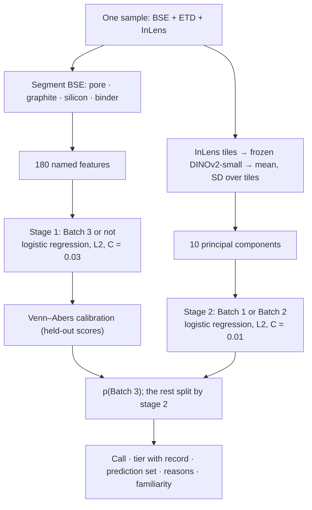

# Catalyst: batch attribution for Si–graphite anode cross-sections

Submission write-up, 4 Oct 2026. Model in use: `config/attribution_model.json` (v4.2, fitted 2026-10-04 10:57, staged `material > deep`). The answers for the held-back images are in §5.4, and the raw output, committed unchanged, is [results/Hackathon-Polaron-eval.json](../results/Hackathon-Polaron-eval.json).

Deeper detail: [MODEL.md](MODEL.md) (model, step by step), [MODEL_LITERATURE_REVIEW.md](MODEL_LITERATURE_REVIEW.md) (literature, references `[L…]`), [experiments/](experiments/) and [TICKETS.md](TICKETS.md) (each experiment, pre-registered).

## 1. The problem

A battery maker receives anode material from a supplier. **Batch 3 is the baseline**: what the supplier promised. Batches 1 and 2 arrived later. They are not better or worse by definition, but they show the kinds of variation a quality check must pick up. The task:

1. Find **what is different** about the batches.
2. **Assign each held-back sample** to a batch, with a confidence and an explanation that an engineer can pass on to their boss.

The data is deliberately small and realistic for a manufacturer, where about 20 images cost about £50k:

| | |
|---|---|
| One sample | Three 8-bit FIB-SEM images of the same field, from three detectors: **BSE** (composition: silicon bright, graphite grey, pores black), **ETD/SE** (topography and edges), **InLens** (fine surface detail, sensitive to charging). About 7,000 × 1,600–2,300 px at 25 nm per pixel, about 175 µm × 40–58 µm of electrode |
| Training data | **31 samples**: Batch 1 = 7, Batch 2 = 7, Batch 3 = 17 |
| Hidden structure | The 31 samples are tiles cut from **13 longer strips** (continuous cross-sections). Neighbouring tiles of one strip are strongly correlated, and 5 strips hold tiles from more than one batch folder |
| Held back | `Hackathon-Polaron-test`: 3 samples, true batches given after our calls. `Hackathon-Polaron-eval`: 6 samples, scored in §5.4 |
| Rules from the organisers | Every image gets a batch, even when the model is unsure. Explainability ranks above almost everything. A confident wrong answer is worse than an honest unsure one |

What makes it hard:

- **Fewer samples than any deep-learning method needs.** The hard question, Batch 1 against Batch 2, rests on 14 images from 9 strips.
- **Images are not independent.** A model that sees one tile of a strip in training recognises its neighbours from the strip's look, not the batch. Leaving one *image* out gives 0.49 on the 15 KPIs; leaving one *strip* out gives 0.35. The first number is leakage.
- **Microscope against material.** The batches were partly imaged in different sessions: different black level, noise and InLens contrast. Any signal can be the microscope rather than the electrode.

## 2. Approach and why

### 2.1 Principles

| Decision | Why |
|---|---|
| **Measure first, then classify** | A materials engineer understands "silicon area fraction", "pore chord length" or "fine texture" in physical units. Measurements also give the batch-against-baseline comparison (accept, investigate or reject) that a QC engineer needs, separately from attribution |
| **Only linear models** (regularised logistic regression) | Each reason is exact: coefficient × standardised value is a feature's contribution to the log-odds, not a post-hoc approximation such as SHAP on a black box. With 7 images per class, anything more flexible cannot be constrained [L1, L13] |
| **Frozen pretrained image features, no fine-tuning** | DINOv2 [L6] adds a "look" signal that named measurements miss, at no training cost. A linear probe on frozen features is the standard few-shot recipe [L5, L6, L7] |
| **Every score with whole strips held out**, plus a shuffled-label null | Holding out strips is the only honest estimate here. A score counts only if it beats 95% of 200 runs with batch labels shuffled across strip segments [L3, L4]. When several models are tried, the bar is the best-of-list null [L2] |
| **Pre-register experiments** | Each experiment wrote its hypothesis, metric and reading rule into git before running. With 31 images, trying many things and reporting the best is the main risk [L2] |
| **Calibrated, checked confidence** | Each confidence tier carries its held-out record ("when it says ≥ 75%, it was right 9 of 9 times"). A stage that is not better than guessing is labelled as such |

### 2.2 What we did not use, and why

From the literature review ([MODEL_LITERATURE_REVIEW.md](MODEL_LITERATURE_REVIEW.md) §2–4):

| Method | Verdict | Reason |
|---|---|---|
| **CNN or ViT trained or fine-tuned on the images** | No | 31 images from 13 strips. A network memorises strip appearance, which is exactly the leak above. Training on tiles with a per-image vote was tried and reached 0.50–0.64 three-way (PLAN §12.2). The organisers also noted that an LLM could describe the images but not group them |
| **Random forest, boosting, SVM, small MLP** | No | They overfit at this size and give no exact per-feature reasons |
| **TabPFN** (tabular foundation model) [L20, L21] | No | A black box with no coefficients. Its benchmarks start well above 7 samples per class |
| **QDA, Gaussian mixtures per class, GP with an RBF kernel** [L13, L14, L16] | No | A 10 × 10 covariance per class from 7 images is singular, and kernel length-scales cannot be identified from 31 points |
| **LDA, shrunken centroids, GP with a linear kernel** [L8–L12] | Not needed | The same linear boundary as logistic regression. At our size they cannot be shown to differ [L8, L9] |
| **Attention-based multiple-instance learning on tiles** [L22] | No | Attention overfits even at hundreds of slides; we have 14 bags for the hard question |
| **Transductive methods using the test set** [L23] | No | They help only when the test class balance is known, and it is not |
| **Larger or newer backbones** (DINOv3, MicroNet [L27]) | Not tried | Each one is another entry in the best-of-list and raises the bar. Vision foundation models are known to break across EM datasets that look alike [L25]. MicroNet is the most argued alternative (pretrained on micrographs), and it is listed as the next step. The planned try (T15) was not run: DINOv3 weights are gated, MicroNet needs new dependencies, and after T9 a new backbone was judged low value |
| **Data augmentation in training** | Tested, not adopted | See §4.1 |

The arithmetic behind "the classifier is not the bottleneck": with 14 images, a model that is truly right 75% of the time on Batch 1 against Batch 2 clears a fair null only about half the time. After seven models have been tried, that drops to about a quarter (review §2.1). Trying more classifiers makes it less likely that anything can be established.

## 3. The model

### 3.1 Input and data processing

| Step | What | Where |
|---|---|---|
| Load | Three TIFFs per sample; 8 px stitch borders cropped; pixel size read from the TIFF header | `qc/io.py` |
| Valid rows | Top and bottom 5% of rows excluded (edge artefacts); measured separately as `edge_` features | `qc/measure.py` |
| Segmentation | BSE: black level subtracted, 2×2 average, Gaussian σ = 1, three-class multi-Otsu per image → **pore, graphite, silicon**, then thin bright rims relabelled **binder**. Silicon particles split by watershed. No hand labels; checked with synthetic controls of known answer | `qc/measure.py` |
| Texture input | Every second pixel (50 nm), black level subtracted, all three detectors | `qc/features.py` |
| DINOv2 input | InLens, 1st–99th percentile stretched to 0..1 (removes black-level and contrast differences between sessions), 2×2 average, cut into 224 px tiles (11.2 µm), 45–60 tiles per image | `qc/deep.py` |
| Never an input | Strip id, image height or width, pixel size; `assert_no_leakage()` refuses them | `qc/features.py` |
| Augmentation, normalisation between images | None beyond the steps above | – |

### 3.2 Features

| Family | Count | What it measures | Used in |
|---|---|---|---|
| `tex_` texture | 86 | Local binary patterns (share of corners, edges, curves, flat areas) per detector, and co-occurrence statistics (contrast, smoothness, uniformity, regularity) at 0.05 and 0.2 µm | Stage 1 |
| `reg_` regions | 52 | Image cut into about 15 µm tiles; per tile silicon, pore, graphite and binder fraction, Si/graphite ratio, chord lengths; summarised as mean, SD, CV, p10/p50/p90 and top-to-bottom trend | Stage 1 |
| `par_` particles | 21 | Silicon particle size quantiles, brightness against graphite, internal voids, shape, particle-type shares | Stage 1 |
| `kpi_` whole image | 15 | Silicon area fraction, D50, D90, porosity, Si/graphite ratio, dispersion, agglomerates, graphite anisotropy, pore connectivity | Stage 1 |
| `edge_` | 6 | Silicon fraction, pore fraction and brightness in the top and bottom bands | Stage 1 |
| `deep_` | 1,536 → 10 PCs | Frozen DINOv2-small (ViT-S/14, 22 M weights, pinned revision): per InLens tile the CLS token and mean patch token; per image the mean and SD over tiles; reduced to 10 principal components | Stage 2 |
| `img_` imaging | 24 | Black level, noise, sharpness, saturation, curtaining per detector | **Not in the model.** Reported and used for checks only, because it describes the microscope, not the material |

### 3.3 Architecture

Two small logistic regressions in sequence. The structure follows the question: different from the baseline, and if so, in which way?



| Part | Detail |
|---|---|
| Stage 1 | Batch 3 against the rest, all 31 images, 180 standardised named features, L2 penalty, balanced class weights |
| Stage 2 | Batch 1 against Batch 2, the 14 non-baseline images only, 10 DINOv2 principal components |
| Penalty | `C` per stage from {0.01 … 1} by an inner leave-one-strip-out loop; both stages are heavily shrunk |
| Calibration | Venn–Abers on stage 1's held-out scores, with the two labels weighted equally; gives p(Batch 3) and an interval [L52, L53] |
| Call | Batch 3 if p(Batch 3) ≥ 0.5, else the leading variation |
| Stage check | Each stage carries its held-out record and a binomial p against guessing. If p ≥ 0.05, the stage is **not established**: both variations stay in the prediction set and the call's tier is capped at low |
| Prediction set | Conformal: batches that cannot be ruled out, aimed at containing the truth 8 times in 10 [L54] |
| Familiarity | Root-mean-square z of the named features against the assigned batch's strips; `unfamiliar` if beyond the largest distance that batch's own held-out images reached |
| Size | 190 coefficients, scalers and one projection, stored as readable JSON and hashed into provenance |

### 3.4 Output, per image

| Field | Meaning |
|---|---|
| `predicted`, `p_Batch_1/2/3` | The bet (never empty) and calibrated probabilities |
| `confidence_tier`, `confidence_record` | high (≥ 75%), medium, low, and how often held-out calls in that tier were right |
| `stage_baseline`, `stage_variation` | The two questions, each with its confidence, record and whether it is established |
| `prediction_set` | Batches that cannot be ruled out |
| `reasons` | Top contributions, each with feature, z against Batch 3 and a sentence. Exact for a linear model |
| `baseline_distance`, `unfamiliar` | In or out of distribution |

The app (`web/`, Identify page) shows the same output for any dropped sample in about 17 s, with the tile, its largest silicon particles and the reasons against the baseline's ±1σ and ±2σ band.

## 4. Discussion: what we tried

Every row is a pre-registered experiment ([TICKETS.md](TICKETS.md); results on the `pat/T*` branches and [experiments/](experiments/)), unless marked post-hoc.

| # | What | Result | Kept? |
|---|---|---|---|
| – | Each feature family alone, three-way | KPIs 0.35, particles 0.23, regions 0.31, texture 0.45, all 180 named 0.45: **none above its null**. DINOv2 0.64 against a null of 0.54: the only family that is | Staged design: named features for Batch 3 or not, DINOv2 for which variation |
| – | Other image representations for Batch 1 against Batch 2: BSE and ETD DINOv2 tiles, silicon particle crops, two-point correlation curves, tile-level training with a vote | Best: ETD tiles at 11 of 14, which is not above the best-of-7 null (0.86). ETD imaging descriptors alone reach 0.64 | No |
| T1 | **Augmentation as a test**: noise, blur, gain, contrast, gamma, shading, curtaining, left-right flip, darkened InLens graphite | Brightness, contrast, shading and flips: no effect. **Noise σ = 5 flips "Batch 3 or not" for 12 of 17 Batch 3 images; blur for 3.** Darkened graphite turns all 7 Batch 1 images into Batch 3 | Finding: stage 1 partly reads the microscope |
| T2 | Dark-graphite share in InLens (a charging contrast, not a material) | Batch 1 0.04, Batch 2 0.13, Batch 3 0.17 (median); two DINOv2 components track it (r ≈ 0.6). Regressing it out costs 0.02–0.03 and stays above the null | Reported, not removed |
| T3 | Do Batch 1 and Batch 2 tiles from the **same strip** differ more than same-batch pairs? | No (p = 0.58 and 0.91). The positive control also failed, so this "no" is weak | Finding: no visible label inside a strip |
| **T8** | **Augmentation in training**: 7 imaging copies plus a dark-graphite copy per training image, inside each fold | Same accuracy (0.675 against 0.675); noise flips 11 → 2, dark-graphite flips 7 → 0. Feature-space jitter failed | **Not adopted**, see §4.1 |
| T9 | Remove everything the measured imaging predicts (in-fold residualisation, LEACE-style [L41]) | **Every signal drops to chance**: Batch 3 or not 0.88 → 0.50, three-way 0.66 → 0.46. A shuffled-covariate control costs only 0.07 | Finding: signal and acquisition cannot be separated with these 31 images |
| T10 | Texture at the material scale (averaged before measuring) | Batch 3 or not 0.84; noise flips 12 → 3 but blur flips 3 → 5; still fails T9 | No |
| T11 | Better familiarity distances (Mahalanobis, relative Mahalanobis, tile nearest neighbour [L31, L48]) | AUC up from 0.32 to 0.71, but none flags any Batch 1/2 image at the threshold: Batch 3 itself is too spread | No; tile heatmaps kept as an idea |
| T12 | Tile types (8 clusters) and tile quantiles instead of mean pooling | Quantiles 0.65 against flat DINOv2 0.64: one image, inside the noise of a best-of-9 search | No |
| T13 | Materials descriptors: dim or ragged silicon share, binder, horizontal pores | Batch 1's difference is **spread**: 2 of 7 images (one strip) have a different silicon population; the other 5 match the baseline | Used in the explanation |
| T14 | Confidence: Venn–Abers, cross-conformal, MAP prior, against temperature scaling | Class-balanced Venn–Abers with a staged call: rehearsal accuracy 0.57 → 0.66, log loss 0.95 → 0.72 | **Adopted** (v4.2) |
| T16 | Particle-distribution shape (Wasserstein distances) | Three-way 0.28, below chance | No |
| T18 (post-hoc) | After the test truth: BSE and ETD DINOv2 tiles, tile quantiles, power spectra, acquisition forensics | Nothing separates Batch 1 from Batch 2 across strips (best 0.62 against a null p95 of 0.75) | Stage 2 marked **not established** |

### 4.1 Why augmentation is not in the submitted model

We ran T8's best augmented model on all 9 held-back images (6 eval and 3 test), next to the submitted model. Each image was also scored under 5 imaging changes: noise, 1 px blur, brightness +20%, shading and a left-right flip. Post-hoc check; the scripts were not committed.

| | Submitted model | Augmented (T8) |
|---|---|---|
| Same call on the 9 images | – | **9 of 9 identical** |
| Test images right (known truth) | 1 of 3 | 1 of 3 (the same) |
| "Batch 3 or not" unchanged under the 5 imaging changes | Batch 3 calls 5 of 5. Not-Batch-3 calls 4 of 5: **1 px blur pushes them to 91% Batch 3** | 5 of 5 on every image |
| Probability on the two wrong test calls | 46% (low tier) | **61% and 60%**: more confident while wrong |
| Calibration and stage cap | Venn–Abers, held-out tiers, "not established" cap | None; T8 found its tiers not monotone |

Augmentation buys robustness, not accuracy. It changes none of the six answers, and it would add an uncalibrated model that is more confident on wrong Batch 1 against Batch 2 calls. It was also not checked against T9's imaging removal, and it is the best of 9 candidates tried on the same 31 images. With confident wrong answers penalised, we keep the submitted model. Augmentation plus calibration is the first step for a version 2.

Rotations and vertical flips were never used: the vertical axis is the through-thickness direction (surface to foil), so they would destroy real structure.

### 4.2 What this means

- **What is different about the batches.** Batch 3 has a smoother, more uniform fine texture in all three detectors. Batch 1 is the most variable batch: 2 of its 7 images carry a different, dim and ragged silicon population, and the other 5 match the baseline. Batch 2 does not differ from the baseline in any physical measurement we have. Silicon content barely sorts the batches (area 8.3 / 5.7 / 6.2% for Batch 1 / 2 / 3).
- **What is established.** "Batch 3 or not" is right for 26 of 31 held out (29 of 34 with the test samples). "Batch 1 or Batch 2" is right for 8 of 12, which is not distinguishable from guessing (p = 0.19). Five strips hold both labels, sometimes on adjacent tiles of one continuous cross-section.
- **Main caveat.** T1 and T9 show the signal is entangled with how the images were acquired. Batches and imaging sessions follow strips, so with these 31 images we cannot prove that the Batch 3 difference is material. If the held-back images come from the same sessions (all test samples sit on known strips), the calls hold; the reasons should be read as "looks like", not "is made of".

## 5. Results

### 5.1 Training (in-sample, all 31 images)

| | Batch 1 | Batch 2 | Batch 3 | Total |
|---|---|---|---|---|
| Right | 7 of 7 | 6 of 7 | 17 of 17 | **30 of 31** (balanced 0.95) |

This fits the training data, as expected. It says nothing about new images; the next tables do.

### 5.2 Validation (leave-one-strip-out on the 31 images, and rehearsal)

| | Batch 1 | Batch 2 | Batch 3 | Total |
|---|---|---|---|---|
| Right, whole strips held out | 3 of 7 | 5 of 7 | 14 of 17 | **22 of 31**, balanced **0.66** (chance 0.33; shuffled-label null p95 0.51) |
| Right, 30 rehearsals of 9 unseen images (refit each time) | 47% | 61% | 90% | balanced **0.66** (single draws from 3 of 9 to 8 of 9) |

| Question | Held out |
|---|---|
| Batch 3 or not | **26 of 31**, p = 0.0001: established |
| Batch 1 or Batch 2 | 8 of 12, p = 0.19: **not established** |

Confusion, strips held out (rows = truth):

| | called Batch 1 | called Batch 2 | called Batch 3 |
|---|---|---|---|
| Batch 1 | 3 | 4 | 0 |
| Batch 2 | 0 | 5 | 2 |
| Batch 3 | 0 | 3 | 14 |

Is the confidence honest? Held out:

| Tier | Right, 31 known images | Right, 270 rehearsal calls |
|---|---|---|
| High (≥ 75%) | **9 of 9** | 56 of 58 |
| Medium (50–75%) | 5 of 7 | 25 of 52 |
| Low (< 50%) | 8 of 15 | 97 of 160 |
| Prediction set holds the truth | 87% (1.5 batches) | 95% (2.1 batches) |

These records include the cap that keeps every "Batch 1 or 2" call at low confidence. They were recomputed on 4 Oct with the current code from the same held-out probabilities. The model file still stores the pre-cap record for the 31 images (medium 7 of 11, low 6 of 11) until its next fit; the rehearsal numbers are the same with and without the cap.

### 5.3 Test (`Hackathon-Polaron-test`, truth given after our calls)

| Sample | Our call | Confidence | Batch 1 / 2 / 3 | Prediction set | Truth | Right? |
|---|---|---|---|---|---|---|
| `3e122cbj` | Batch 1 | Low (46%) | 46% / 43% / 11% | Batch 1 or 2 | Batch 2 | Batch 3 or not ✓, exact ✗ |
| `fn0mhxef` | Batch 2 | Low (46%) | 43% / 46% / 11% | Batch 1 or 2 | Batch 1 | Batch 3 or not ✓, exact ✗ |
| `xrv9xvzb` | Batch 3 | High (91%) | 4% / 4% / 91% | Batch 3 | Batch 3 | ✓ |

1 of 3 exact, 3 of 3 on Batch 3 or not, 3 of 3 inside the prediction set. Both misses were stated as coin flips (52:48 and 51:49). Each sits edge to edge with images of the other label on one continuous strip ([experiments/T18.md](experiments/T18.md)).

### 5.4 Eval (`Hackathon-Polaron-eval`): our answers

Run with `HF_HUB_OFFLINE=1 uv run python -m qc.attribute --images data/Hackathon-Polaron-eval` on `main` at `7fb7c34`. Output committed unchanged: [results/Hackathon-Polaron-eval.json](../results/Hackathon-Polaron-eval.json).

**How to read it.** The model answers two questions in turn:

1. **Batch 3 or not?** Reliable: 26 of 31 right on strips it never saw.
2. **If not, Batch 1 or Batch 2?** Not reliable: 8 of 12, which guessing matches 19% of the time.

So every image that is not Batch 3 is reported as **"Batch 1 or Batch 2", low confidence**. The named batch is the model's lean, not a finding.

"SD above or below Batch 3" compares the image with typical Batch 3 images. 1 SD is normal variation; 2–3 SD or more is unusual. "Fine texture" counts how often tiny features look like sharp corners, straight edges, gentle curves or flat areas.

| Sample | Answer | Confidence | Batch 1 | Batch 2 | Batch 3 | Can't rule out | Robust to imaging changes (§4.1) |
|---|---|---|---|---|---|---|---|
| `0eryguqq` | **Batch 3** | **High** (right 9 of 9 times at this level) | 6.4% | 7.3% | **86.3%** | – | 5 of 5 |
| `fhwrjtet` | **Batch 3** | **High** (9 of 9) | 6.6% | 7.1% | **86.3%** | – | 5 of 5 |
| `4hq27w4c` | Batch 1 or 2 (leans **Batch 1**) | Low (8 of 15) | 45.2% | 43.9% | 10.9% | Batch 2 | 4 of 5 (blur) |
| `fspqbkxl` | Batch 1 or 2 (leans **Batch 2**) | Low (8 of 15) | 42.3% | 46.8% | 10.9% | Batch 1 | 4 of 5 (blur) |
| `soo2ax3r` | Batch 1 or 2 (leans **Batch 2**) | Low (8 of 15) | 40.2% | 41.7% | 18.0% | Batch 1 | 4 of 5 (blur) |
| `y59rxmxl` | Batch 1 or 2 (leans **Batch 1**) | Low (8 of 15) | 46.0% | 43.1% | 10.9% | Batch 2 | 4 of 5 (blur) |

All six are within the familiarity limit of their assigned batch (none unfamiliar). The augmented model of §4.1 gives the same answer for all six.

The tier records are the corrected held-out values (§5.2). The committed output file still shows the low-tier record stored in the model file, 6 of 11, which was computed before the low-confidence cap. The answers and probabilities do not depend on it.

**Why each answer**

| Sample | Step 1: Batch 3 or not | Evidence the model used (the largest contributions) | Step 2: Batch 1 or 2 |
|---|---|---|---|
| `0eryguqq` | **Batch 3**, 86% | InLens fine surface detail looks like Batch 3: local contrast at 0.2 µm 1.8 SD above the Batch 3 average, texture uniformity at 0.05 and 0.2 µm about 1.2 SD above, left-right against up-down contrast 2.4 SD below. BSE dark notches 1.4 SD above. None points to Batch 1 or 2 | – |
| `fhwrjtet` | **Batch 3**, 86% | **For:** InLens local contrast 2.3 SD above at 0.2 µm and 2.7 SD at 0.05 µm, typical of Batch 3; BSE dark notches 1.3 SD above. **Against:** silicon spread less evenly (2.1 SD below) and graphite strongly aligned (5.7 SD above), both more like Batch 1. The texture evidence outweighs them | – |
| `4hq27w4c` | Not Batch 3, 89% | ETD fine texture has clearly fewer sharp features than Batch 3: corners 3.0 SD below, straight edges 2.7 SD below, soft corners 2.3 SD below, gentle curves 2.2 SD below. BSE corners 2.1 SD below | Coin flip, 51:49 toward Batch 1 |
| `fspqbkxl` | Not Batch 3, 89% | Smoother and flatter fine texture than Batch 3 on both detectors: ETD gentle curves 2.2 SD below, BSE corners 1.8 SD below and gentle curves 1.6 SD below; flat areas and dark specks 1.8 SD (ETD) and 1.5 SD (BSE) above | Coin flip, 53:47 toward Batch 2 |
| `soo2ax3r` | Not Batch 3, 82% (the least certain) | Mostly the material itself: the silicon particle-type mix differs from Batch 3 (one type 2.7 SD rarer, another 2.7 SD more common); silicon darker relative to graphite (2.2 SD below); InLens surface less smooth (1.5 SD below at both scales) | Coin flip, 51:49 toward Batch 2 |
| `y59rxmxl` | Not Batch 3, 89% | **For:** InLens texture strongly direction-dependent, much more even left-right than up-down (5.2 SD above, the most extreme value in this set); ETD and BSE fewer gentle curves and corners (2.0 and 2.1 SD below). **Against:** pore space changes more than usual from top to bottom (2.7 SD above), a pull toward Batch 3 that the texture outweighs | Coin flip, 52:48 toward Batch 1 |

**Limits of these answers**

- **Batch 1 against Batch 2:** with this data the images give no reliable way to separate them, so both are reported as possible.
- **Imaging:** fine-texture reasons partly reflect how the image was taken (detector noise, focus), not only the material (§4, T1, T9). The material reasons are the more physically meaningful ones: silicon spread, particle-type mix, graphite alignment.
- **Robustness:** in the submitted model a 1-pixel blur can push a "not Batch 3" image toward Batch 3. Added noise (σ = 5), brightness +20%, shading and a left-right flip do not change any of the six "Batch 3 or not" answers.

## 6. Reproduce

```bash
uv sync
uv run python -m qc.features data/Batch_1 data/Batch_2 data/Batch_3     # named features, 31 images
uv run python -m qc.deep data/Batch_1 data/Batch_2 data/Batch_3         # DINOv2 features (CPU)
uv run python -m qc.attribute --evaluate                                # families against their nulls
uv run python -m qc.attribute --dry-run --repeats 30 --staged reg,edge,tex,par,kpi:deep   # rehearsal
uv run python -m qc.attribute --fit --staged reg,edge,tex,par,kpi:deep  # writes config/attribution_model.json
HF_HUB_OFFLINE=1 uv run python -m qc.attribute --images data/Hackathon-Polaron-eval   # about 13 s per sample
uv run pytest
```

## 7. Next steps

1. **More labelled strips**, especially strips holding both Batch 1 and Batch 2. This is the only thing that can establish the Batch 1 against Batch 2 question.
2. **Acquisition-robust model:** T8 augmentation plus calibration, then checked against T9's imaging removal.
3. **MicroNet** (pretrained on micrographs) as the one backbone with an argument behind it [L27]; tile heatmaps to show *where* an image differs (T11).
4. **Same imaging settings for every batch.** Most of what we cannot separate comes from imaging sessions that follow strips.
