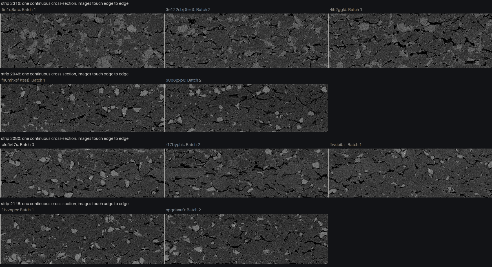

# T18 · Ground truth of the three test samples, and whether anything separates Batch_1 from Batch_2

Written 4 Oct 2026, after the organisers gave the true batches of `Hackathon-Polaron-test`. **Not pre-registered**: the truth was known before any of this was run, and several representations were tried. Every p-value below is therefore uncorrected and is read with that in mind. The classifier was not changed.

Commands:

```bash
HF_HUB_OFFLINE=1 PYTHONPATH=. uv run python scripts/experiments/T18_tiles.py         # tile embeddings, 3 detectors, 34 images (~6 min)
PYTHONPATH=. uv run python scripts/experiments/T18_ground_truth.py                    # everything below (~4 min)
```

Inputs: `out/experiments/gt/features34.csv` (the 31 known rows plus the 3 test rows built with `qc.features` + `qc.deep`, labelled with the truth), `out/experiments/gt/forensic.csv`, `out/experiments/T18/{tiles,spectrum}.npz`. Output: `out/experiments/T18/result.json`, [T18_strips.png](T18_strips.png), `results/Hackathon-Polaron-test.ground-truth.json`.

## 1. The calls against the truth

| Sample | Called | Truth | Batch_3 or not | Truth in the prediction set |
|---|---|---|---|---|
| `3e122cbj` | Batch_1 (0.46, low) | **Batch_2** | right (not Batch_3) | yes: {Batch_1, Batch_2} |
| `fn0mhxef` | Batch_2 (0.46, low) | **Batch_1** | right (not Batch_3) | yes: {Batch_2, Batch_1} |
| `xrv9xvzb` | Batch_3 (0.91, high) | Batch_3 | right | yes |

1 of 3 exact. 3 of 3 on "Batch_3 or not". 3 of 3 inside the prediction set. The two wrong calls were both low tier at 0.46, with a stage-2 lean of 52:48 and 51:49: the model said "coin flip", and the coin came up wrong twice. That is what the held-out record predicted (8 of 12 on "which variation", T14/MODEL.md §7.3).

## 2. Why: Batch_1 and Batch_2 images sit side by side on the same cross-section

The test images share height and `XResolution` with known strips (T2 §5). Their edge columns also continue the neighbouring images' edge columns (correlation of the last kept column of one image with the first kept column of the next, best of ±30 px vertical shift; adjacent pairs r = 0.40–0.69, every non-adjacent pair of the same strip ≤ 0.28). The chains, left to right (* = test image, true label):

| Strip | Contiguous chain |
|---|---|
| 2316 | `5n1q8atc` (B1) → **`3e122cbj` (B2*)** → `4ih2ggld` (B1) |
| 2048 | **`fn0mhxef` (B1*)** → `3806gxp0` (B2) |
| 2080 | `cfe5vt7s` (B3) → `r17byphk` (B2) → `ffwubibz` (B1) |
| 2148 | `f1vzngrs` (B1) → `epqdaau9` (B2) |
| 2068 | `vc2whyaq` (B3) → `x77cy643` (B3) → `utfgcjfa` (B3) → `rxax5ozo` (B2) |
| 2088 | `ufdvpb81` (B3) → **`xrv9xvzb` (B3*)** → `9luzk4jm` (B3) → `hzumfsms` (B3) |



- With the truth, **five strips hold both Batch_1 and Batch_2**: 2048, 2080, 2148, 2156, 2316. On 2316 the labels alternate B1 → B2 → B1 across about 525 µm of one continuous electrode cross-section.
- Both test images that were wrong carry the **minority label of their strip**. The frozen stage 2 (DINOv2 on InLens) mostly reads the look of the strip: in-sample, strip 2316's images were all Batch_1 and strip 2048's were all Batch_2, so it called the new tile of each strip by its strip.
- Acquisition descriptors are a strip fingerprint, not a label fingerprint. On 2316 the Batch_2 test image has the same noise (BSE 11.5, ETD 7.3, InLens 8.4 grey levels), black level, sharpness and grey-level use as its two Batch_1 neighbours (`out/experiments/gt/forensic.csv`).
- In 14 of 34 samples the three RGB planes differ, but only in the first or last 1–2 pixel columns: a coloured border line at an end of the stitched mosaic. `load_image` crops 8 columns per side, so no feature sees it. It is not a label marker (Batch_1 5 of 8, Batch_2 2 of 8, Batch_3 7 of 18; on strip 2316 neither end tile has it), and using it would be reading file construction, not material.

## 3. Batch_1 vs Batch_2 without strip context (the question the live model answers)

Leave-one-strip-out on the 16 Batch_1 and Batch_2 images (8 each), nested `C`, null = 100 segment shuffles:

| Inputs | Balanced accuracy | Null p95 | Above null |
|---|---|---|---|
| DINOv2 InLens (frozen stage 2) | 0.62 (10/16) | 0.75 | no |
| Material, 180 named | 0.56 (9/16) | 0.69 | no |
| Texture | 0.50 (8/16) | 0.75 | no |
| Imaging descriptors (never a model input) | 0.75 (12/16) | 0.72 | barely |

Leave-one-**image**-out on deep, for the 12 images of the five mixed strips: 6 of 12. When the strip is in training, the model predicts the strip, and that is right only when the held-out image carries the strip's majority label.

The frozen recipe refitted on all 34 images: three-way leave-one-strip-out 0.65 (calls) / 0.67 (classifier), "Batch_3 or not" 29 of 34, "which variation" 9 of 14 (one-sided binomial p = 0.21). Nothing moved.

## 4. More sophisticated features, compared inside the strip

To remove the strip, each mixed strip gives one contrast d = mean(Batch_1 images) − mean(Batch_2 images) of that strip. Two tests on these five contrasts:

- **Paired leave-one-strip-out:** direction w = mean of the other four strips' d; right if w · d > 0. Exact null: each strip's orientation is a fair coin (5 of 5 has p = 1/32).
- **Neighbour distance:** are Batch_1–Batch_2 neighbours further apart than same-label neighbours of one strip (AUC > 0.5)?

Representations (label-free; PCA fitted on all 34 images):

| Representation | Paired LOSO | p | Same-sign features (null median) | B1–B2 vs same-label neighbour AUC |
|---|---|---|---|---|
| Material, 180 named | 3/5 | 0.50 | 17/180 (10) | 0.28 |
| Texture | 4/5 | 0.19 | 14/86 (4) | 0.33 |
| Imaging descriptors | 2/5 | 0.81 | 2/24 (1) | 0.35 |
| **DINOv2 InLens (frozen stage-2 input), 10 PCs** | **5/5** | **0.03** | 3/10 (0) | 0.46 |
| DINOv2 BSE tiles, mean + p10/p90 (new) | 3/5 | 0.50 | 2/10 (0) | 0.38 |
| DINOv2 ETD tiles, mean + p10/p90 (new) | 4/5 | 0.19 | 2/10 (0) | 0.27 |
| DINOv2 InLens tiles, mean + p10/p90 (new) | 4/5 | 0.19 | 3/10 (0) | 0.55 |
| Power spectrum, 7 octaves × 3 detectors (new) | 0/5 | 1.00 | 0/21 (0.5) | 0.55 |
| Acquisition forensics, 33 (new) | 1/5 | 0.97 | 1/33 (0.5) | 0.56 |

Then the within-strip direction used as an **absolute** classifier (no strip context at prediction time; strip held out; threshold midway between the training Batch_1 and Batch_2 scores). Exact null over all 192 relabellings (5 mixed strips flipped × the 4 single-label strips permuted):

| Representation | Balanced accuracy | Null p95 | p |
|---|---|---|---|
| DINOv2 InLens (frozen stage-2 input) | 0.75 (12/16) | 0.69 | 0.031 |
| DINOv2 InLens tiles | 0.69 (11/16) | 0.67 | 0.042 |
| DINOv2 ETD tiles | 0.69 (11/16) | 0.69 | 0.094 |
| all other rows of the table above | 0.38–0.50 | 0.62–0.69 | ≥ 0.58 |

**Reading.**

1. **One weak hint, not a finding.** Inside each of the five mixed strips, the Batch_1 image sits on the same side of one InLens DINOv2 direction (5 of 5; holds for 5 to 30 components). The frozen stage 2 already ranks Batch_1 above Batch_2 inside all five strips, but by 0.01–0.05 in p(Batch_1), while whole strips sit at 0.46–0.54. The strip offset decides the call.
2. **It does not survive the multiple comparison.** Nine representations were tried after the truth was known; p = 0.03 for the best of nine is about 0.25 after Bonferroni. Two directions extreme by chance are expected: the power spectrum's 0 of 5 is as extreme in the other direction.
3. **It sits on the most acquisition-sensitive detector.** Inside the strips the direction moves with ETD and BSE median brightness (r = 0.88, 0.83) and fine ETD texture (r = −0.96), on 7 degrees of freedom. T1 (`dg_add` flips 7 of 7) and T9 (erasing measured imaging takes every signal to chance) apply.
4. **The imaging descriptors' 0.75 across strips (§3) is a session fingerprint.** Inside the mixed strips the same descriptors get 2 of 5 and 7 of 16: with the strip removed, nothing is left. They are not a model input, and this is why.
5. **Nothing new separates the batches.** DINOv2 on BSE and ETD tiles, tile quantiles, the full power spectrum and acquisition forensics are at chance on every test. Together with T3, T12, T13, T16 and T17, no representation we have built tells Batch_1 from Batch_2 in a way that holds up.
6. **The physical layout is the strongest evidence.** Neighbouring fields of one continuous cross-section carry different labels (B1 → B2 → B1 on 2316). A material lot difference cannot alternate along one electrode, so whatever defines Batch_1 against Batch_2 is either not visible in these images or not a property of the imaged material.

## 5. What changed because of this

- The classifier is unchanged (same coefficients, same calls, same probabilities; `results/Hackathon-Polaron-test.stage-records.json` matches `results/Hackathon-Polaron-test.refit.json` on every number).
- Every call now carries its stage's held-out `record` with a one-sided binomial `p_value` and `established` (p < 0.05). "Batch_3 or not": 26 of 31, p = 0.0001, established. "Which variation": 8 of 12, p = 0.19, **not established**: the call gets a `note`, the prediction set always holds both variations, and the Identify page says "Which variation: not established" and calls the lean a coin flip.
- Not adopted: a stage 2 trained on within-strip contrasts (§4, InLens, 12 of 16). It is the only candidate above its null, but it was found after the truth among nine tries, rests on the acquisition-sensitive InLens detector, and its prospective check is two images. It is the first thing to test when more labelled images arrive: fit the direction on the strips known today and score only new strips.
